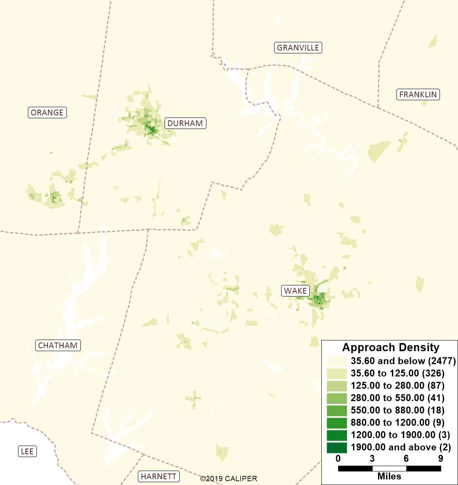
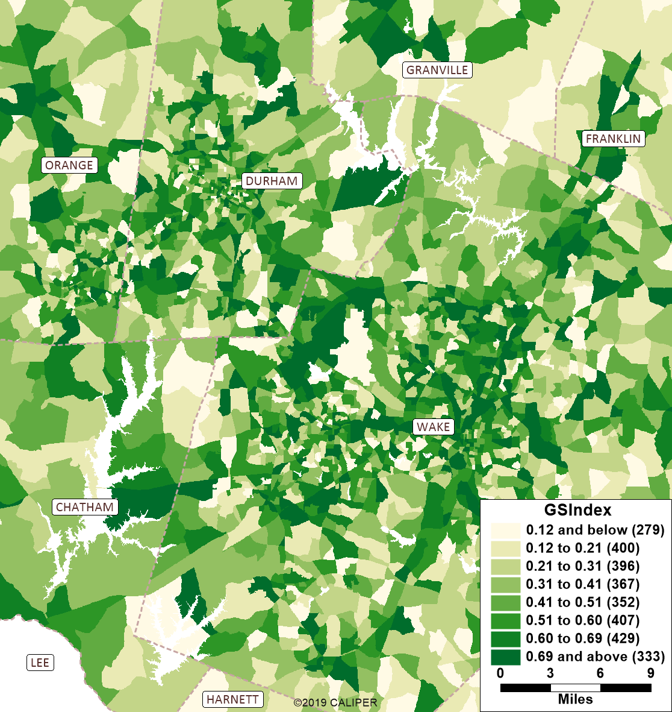
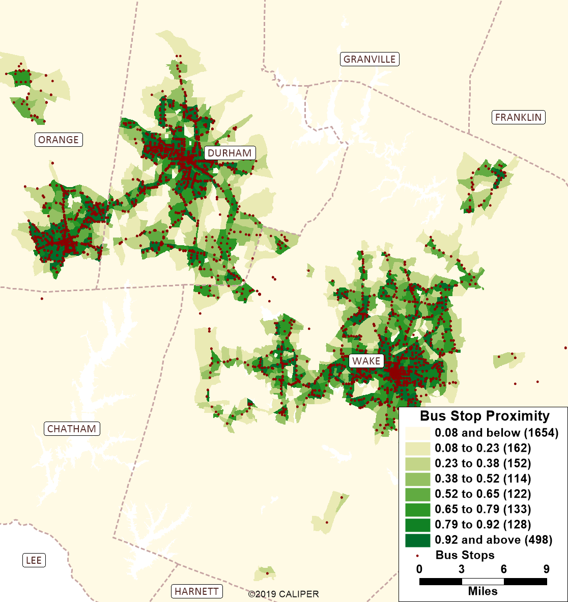
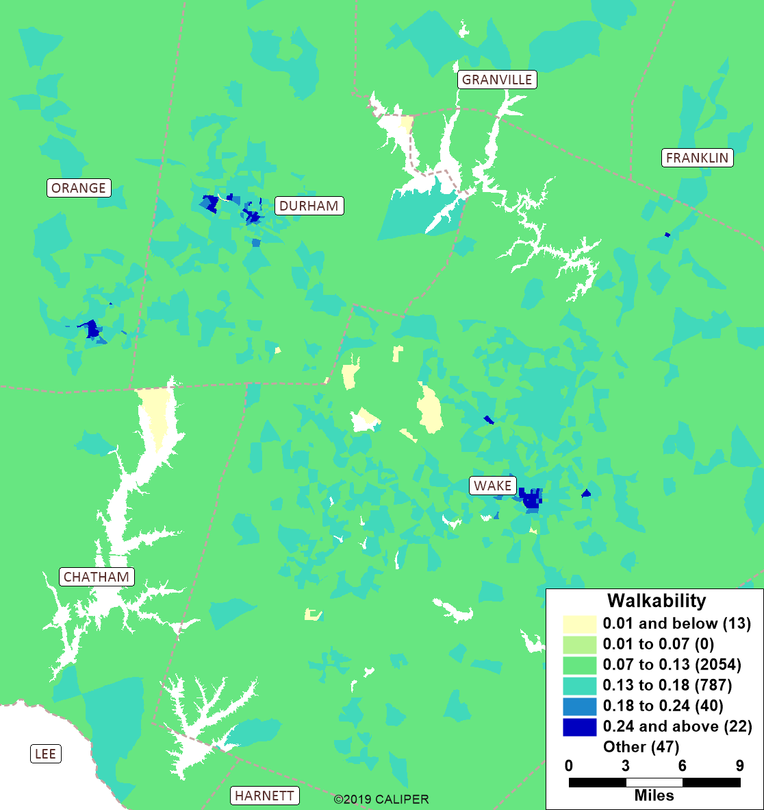
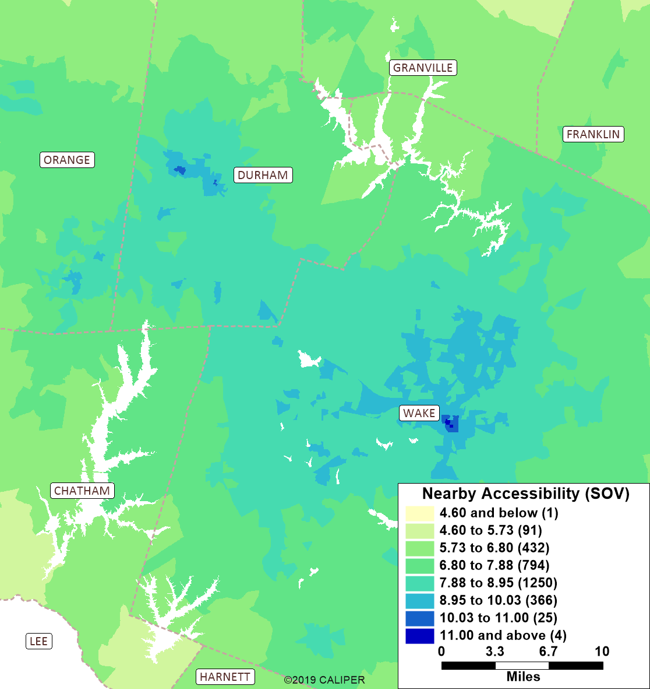
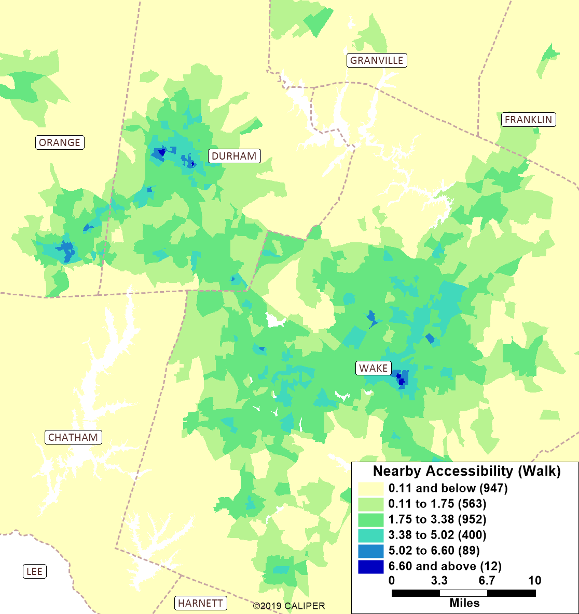
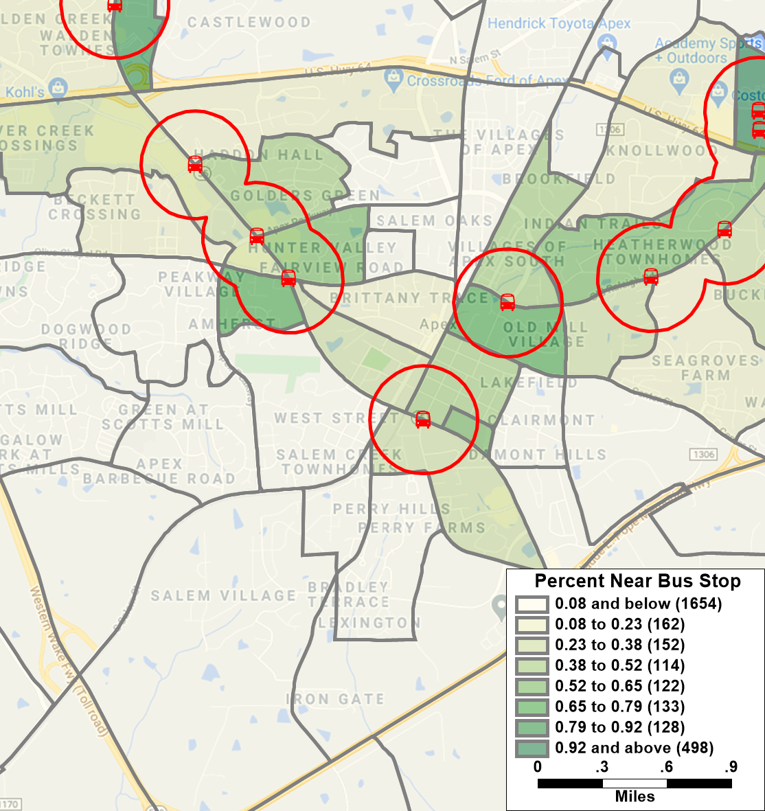

```{r setup, include=FALSE}
knitr::opts_chunk$set(echo = FALSE)
options(dplyr.summarise.inform = FALSE)
options(scipen = 999)

library(tidyverse)
library(knitr)
library(kableExtra)
```

## Introduction

**Vince to add**

## Maps {.tabset}

The maps below show the regional pattern of the various accessibility metrics
used by the model. Below the maps, more details on each metric is provided.

### Approach Density

```{r, out.width="50%", fig.show='hold',fig.align='center'}

```

### GS Index

```{r, out.width="50%", fig.show='hold',fig.align='center'}

```

### Stop Proximity

```{r, out.width="50%", fig.show='hold',fig.align='center'}

```

### Walkability

```{r, out.width="50%", fig.show='hold',fig.align='center'}

```

### Logsum SOV

```{r, out.width="50%", fig.show='hold',fig.align='center'}

```

### Logsum Walk

```{r, out.width="50%", fig.show='hold',fig.align='center'}

```

## Details

### Approach Density

Intersection approach density as a metric recognizes that gridded street systems
are more conducive to walking than suburban development forms. To caluclate this
metric, each node in the network was evaluated to determine how many collector
and arterial streets were connected to it (a minimum of three required to be
an intersection). Each of these connected links is an "approach". Within each
zone, the total number of these approaches was summed and then divided by the
zonal area to arrive at a density.

### Gini-Simpson

**Vince add basic info**

### Stop Proximity

This is a common metric in travel models given it's power at describing zonal
accessibility to transit. In the TRMG2, the percent of each zone within 1/4
mile of a bus stop is computed using a GIS overlay. The map below zooms in to
Apex to give a better idea of how this calculation works.

```{r, out.width="50%", fig.show='hold',fig.align='center'}

```

### Industry density

Industrial employment density is often correlated with lower levels of
accessibility. This is simply the total number of industrial jobs in a zone
divided by the area.

### Walkability

For each zone, a binary choice model was applied to determine the propensity to
talk for trips originating in that zone. Simple by design, it does not consider
skims or other matrix-based attributes. Instead, it uses the metrics above to
make predictions.

- **Approach Density**: Intersection approaches in zone divided by zonal area
- **Attraction Density**: Total attractions divided by zonal area.
- **GS Index**: Gini-Simpson Diversity Index
- **Constant (walk)**: Constant applied to the walk utility equation

Adjusted rho-squared: 0.45

```{r}
model <- tibble(
  Term = c(
    "Approach Density",
    "Attraction Density",
    "GS Index",
    "Constant (walk)"
  ),
  Coeff = c(
    .16,
    .23,
    .12,
    -1.96
  ),
  `T-Stat` = c(
    12.1,
    24.8,
    9.5,
    -141
  )
)

model %>%
  kable() %>%
  kable_styling(full_width = FALSE)
```

### Logsums

Logsums can be considered as a weighted average accessibility. While logsums are
most often discussed in relation to mode choice and destination choice models,
the logsums used in accessibility is from a simpler gravity formulation.

$$A_i = ln(\sum_j S_jt_{ijm}^{\alpha}e^{\beta t^{ijm}})$$

Where:  
$A_i$: Accessibility of zone i  
$t_{ijm}$: Travel time between zone i and j by mode m  
$S_j$: Attractions in zone j (size term)

The primary purpose for these mode-specific accessibility values is to inform
the non-home-based models. For instance, a non-home-based transit trip is likely
to occur in areas with high transit accessibility. More importantly, they cannot
occur in areas with no transit access.

```{r, include=FALSE}
tbl <- read_csv("../master/accessibility/attraction_rates.csv")
```

In addition to calculating accessibilty logsums by mode, three different size
term formulations were used to capture different types of access. Those three
types are:

- General: A balanced accessibility to various land uses
- Nearby: An accessibility that weights land uses more heavily that generate
  shorter trips (e.g. retail)
- Employment: A measure of accessibility to employment/jobs

The rates for the size term in each of the above types of accessibility are
shown in the table below.

```{r}
tbl %>%
  select(Field, General = general_attr, Nearby = nearby_attr, 
         Employment = employment_attr) %>%
  filter(!str_detect(Field, "Building")) %>%
  kable() %>%
  kable_styling(full_width = FALSE)
```


