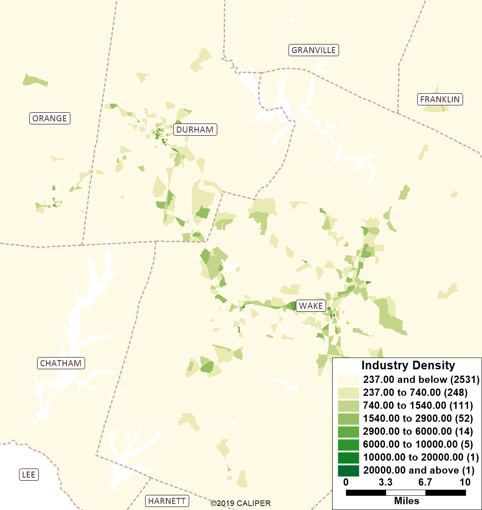

```{r setup, include=FALSE}
knitr::opts_chunk$set(echo = FALSE)
options(dplyr.summarise.inform = FALSE)
options(scipen = 999)

library(tidyverse)
library(knitr)
library(kableExtra)
```

## Introduction

**Vince to add**

## Maps {.tabset}

The maps below show the regional pattern of the various accessibility metrics
used by the model. Below the maps, more details on each metric is provided.

### Approach Density

```{r, out.width="50%", fig.show='hold',fig.align='center'}
knitr::include_graphics("img/accessibility/approach_density.png")
```

### GS Index

```{r, out.width="50%", fig.show='hold',fig.align='center'}
knitr::include_graphics("img/accessibility/gsindex.png")
```

### Stop Proximity

```{r, out.width="50%", fig.show='hold',fig.align='center'}
knitr::include_graphics("img/accessibility/bus_stop_prox.png")
```

### Industry Density

```{r, out.width="50%", fig.show='hold',fig.align='center'}

```

### Walkability

```{r, out.width="50%", fig.show='hold',fig.align='center'}
knitr::include_graphics("img/accessibility/walkability.png")
```

## Details

### Approach Density

Intersection approach density as a metric recognizes that gridded street systems
are more conducive to walking than suburban development forms. To caluclate this
metric, each node in the network was evaluated to determine how many collector
and arterial streets were connected to it (a minimum of three required to be
an intersection). Each of these connected links is an "approach". Within each
zone, the total number of these approaches was summed and then divided by the
zonal area to arrive at a density.

### Gini-Simpson

**Vince add basic info**

### Stop Proximity

This is a common metric in travel models given it's power at describing zonal
accessibility to transit. In the TRMG2, the percent of each zone within 1/4
mile of a bus stop is computed using a GIS overlay. The map below zooms in to
Apex to give a better idea of how this calculation works.

```{r, out.width="50%", fig.show='hold',fig.align='center'}
knitr::include_graphics("img/accessibility/bus_stop_detail.png")
```

### Industry density

Industrial employment density is often correlated with lower levels of
accessibility. This is simply the total number of industrial jobs in a zone
divided by the area.

### Walkability

For each zone, a binary choice model was applied to determine the propensity to
talk for trips originating in that zone. Simple by design, it does not consider
skims or other matrix-based attributes. Instead, it uses the metrics above to
make predictions.

- **Approach Density**: intersection approaches in zone dividied by zonal area
- **GS Attr Density**: The total attractions using the Gini-Simpson rates divided
  by zonal area.
- **GS Index**: This Gini-Simpson Diversity Index
- **Industrial Density**: Density of industrial employment
- **Constant (walk)**: The constant applied to the walk utility equation

*Placeholder Model*

Adjusted rho-squared: 0.50

```{r}
model <- tibble(
  Term = c(
    "Approach Density",
    "GS Attr Density",
    "GS Index",
    "Industrial Density",
    "Constant (walk)"
  ),
  Coeff = c(
    .17,
    .15,
    -.03,
    .02,
    -2.1
  ),
  `T-Stat` = c(
    10.5,
    14.8,
    -2.2,
    1.2,
    -143
  )
)

model %>%
  kable() %>%
  kable_styling(full_width = FALSE)
```

