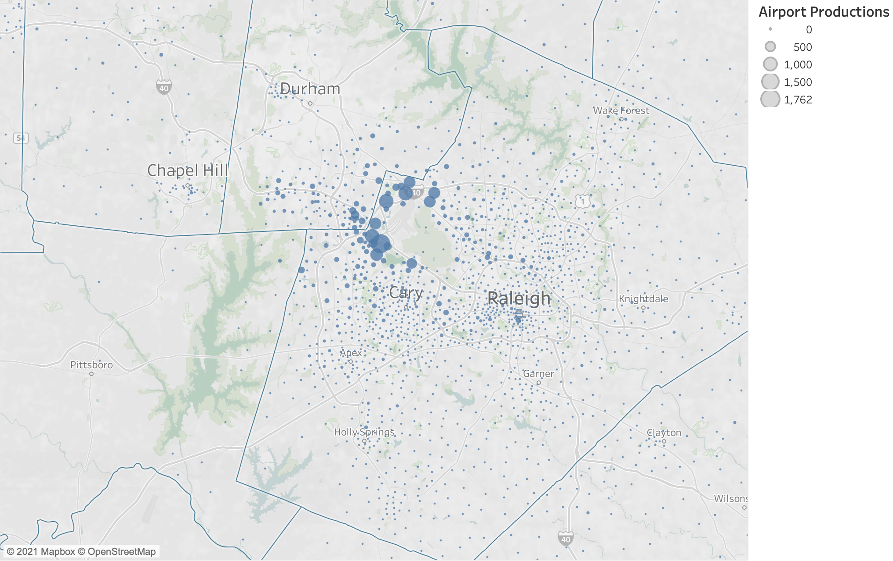
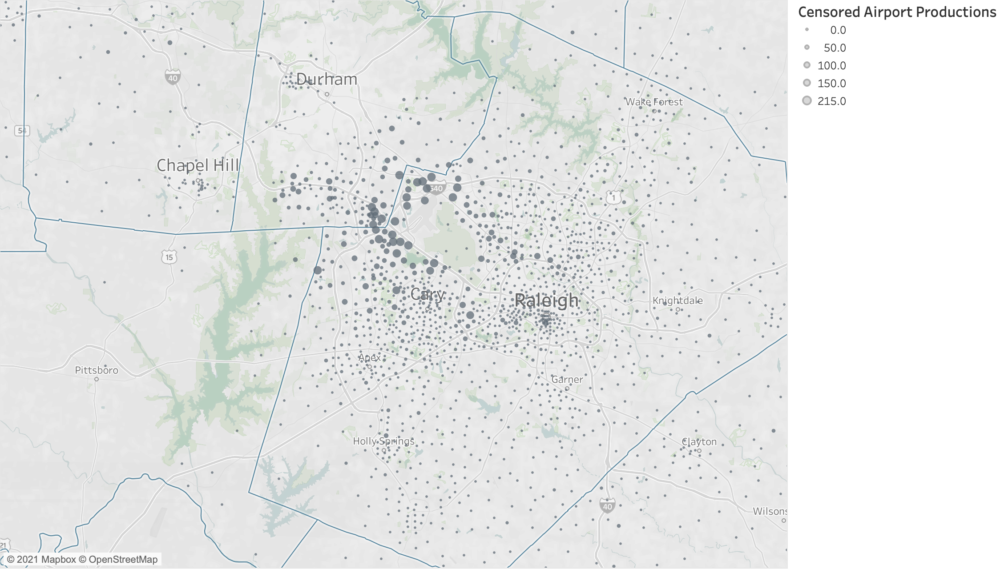

```{r setup, include=FALSE}
source("R/airport.R")

knitr::opts_chunk$set(echo = FALSE)
options(dplyr.summarise.inform = FALSE)
options(scipen = 999)

```

## Introduction

Air passenger travel to/from the Raleigh-Durham International Airport (RDU) is captured
by the air passenger model. 

A limited amount of data on air passengers is available and the modeling approach 
is therefore straightforward and requires a handful of assumptions. 
The available data is passive movements recordedfrom StreetLight Data. The benefits
of this data is they provide a reasonable signal of movements to/from the airport. 
The drawbacks of this data include the following:
* It does not distinguish between airport employees and air passengers. 
* It cannot distinguish between trip legs, for example the movement from home to
an off-airport parking location and the movement from the off-airport parking location
to the airport terminal. 

## StreetLight Data Summaries
The map below shows the distribution of trip productions to RDU per the StreetLight
data. As expected, the data shows large amounts of activity in the zones surrounding
the airport. For an air passenger model, we are less interested in the movement 
from, say, the off-airport parking facility to the airport, than we are the movement
from a home or workplace to the off-airport parking facility. Ideally, an airport
model would explicitly represent each movement. For the simple model being developed
here, we want to focus on the primary (and longer) movement.

### StreetLight "Raw" Productions

```{r, out.width="100%", fig.show='hold',fig.align='center'}

```

To ameliorate the impact of near-airport movements on the estimation of production
models intended to locate the "true" origin of air passenger movements, we censor
the StreetLight productions to a maximum value of `r OUTLIER_MIN`. The map of 
truncated productions is shown in the map below. 

### StreetLight Censored Productions

```{r, out.width="100%", fig.show='hold',fig.align='center'}

```

## Production Modeling
The goal of the air passenger production model is to generate travel from home and
employment locations to the airport. Because all trips are destined to RDU, the 
production model acts as both a trip generation and trip distribution model. 

To begin the data exploration and model estimation stage, we summarize the correlations
between the socio-economic data expected to be relevant and airport productions. These
correlations are shown in the table below. Note that a number of variables that would
be useful to the production model, such as hotel rooms, are not available in the
socio-economic data.

### Correlations
```{r}
correlations_df %>%
  kable(digits = 3) %>%
  kable_styling(full_width = FALSE)
```

The above table shows correlations between airport productions and the variables
we would expect and like to be correlated with airport productions, including workers,
high income persons, and employment. 

Using the correlations as a guide, we estimate a series of linear regression models 
in a search for a parsimonious balance between model fit and logical coefficients. 

### Model Summaries
`Model 01` includes two variables, total employment and number of workers. Both
have positive and significant coefficients. 

```{r}
print_model <- function(model) {
  df <- tibble(variable = colnames(model$model),
               estimate = model$coefficients,
               statistic = coef(summary(model))[, "t value"],
               p.value = coef(summary(model))[, "Pr(>|t|)"]) %>%
    mutate(variable = if_else(variable == "y", "_intercept_", variable)) %>%
    arrange(variable) %>%
    bind_rows(., tibble(variable = c("Adjusted R-squared"),
                        estimate = summary(model)$adj.r.squared,
                        statistic = as.double(NA),
                        p.value = as.double(NA))) %>%
    kable(digits = 4) %>%
    kable_styling(full_width = FALSE)
  
  return(df)
  
}
```


#### Model 01
```{r}
print_model(model_01)
```

`Model 02` adds high earners, which is the number of high earners in each TAZ. A 
second term that interacts high earners with distance to the airport is included
as well, which reduces the number of productions for high earners at greater distances
from the airport. `Model 02` also includes employment by employment category. 

The model includes logical coefficients: all are positive except the interaction
between high earners and distance. Each of the coefficients are significant. The
adjusted R-squared improves from `r round(summary(model_01)$adj.r.squared, 3)` to
`r round(summary(model_02)$adj.r.squared, 3)`.

#### Model 02
```{r}
print_model(model_02)
```

`Model 03` combines employment into a single category and drops the `workers` variable. 
The outcomes are logical, but the adjusted R-squared decreases to `r round(summary(model_03)$adj.r.squared,3)`. 
Dropping `workers` makes the interpretation easier, i.e, you do not need to
know the number of workers in the TAZ to understand the coefficients. 

#### Model 03
```{r}
print_model(model_03)
```

`Model 04` expands the employment categories from `Model 03`. 

#### Model 04
```{r}
print_model(model_04)
```

`Model 03` is selected as the preferred model, primarily due to the non-intuitive
coefficents on employment sectors in `Model 04`. Specifically, it is not obvious
why the `Industry` employment category would generate more air travel than the 
`Office` employment category (comparing `r model_04$coefficients["Industry"]` to
`r model_04$coefficients["Office"]`. 

### Predicted Productions
The map below plots the predicted airport productions. In model application, the
calculated productions will be scaled to airport attractions, which is the number
of enplanements at RDU entered by the model user. The current chart assumes `r RDU_ENPLANEMENTS`
enplanements. It is also possible for the regression model to return a negative
number of enplanements due to the negative coefficient on the high earner and distance
interaction term. These productions have been censored at zero and will need to 
be similarly censored in model application. 

```{r, out.width="100%", fig.show='hold',fig.align='center'}
knitr::include_graphics("img/airport/estimated_productions.png")
```

The chart below plots the adjusted observed productions (truncated at `r OUTLIER_MIN`
times the scaling necessary to matche the target attractions) against the estimated 
productions.

```{r, out.width="80%", fig.show='hold',fig.align='center'}
knitr::include_graphics("img/airport/scatter_plot.png")
```

The chart below shows the adjusted observed and estimated trip length frequency
distributions for movements to the airport. The model estimates slightly
longer trips than the StreetLight data. This is expected because the StreetLight
data will, in many cases, fail to capture the true origin of the movement, misunderstanding
stops at gas stations, cell phone lots, rental car facilities, etc, as the origin.

```{r, out.width="80%", fig.show='hold',fig.align='center'}
knitr::include_graphics("img/airport/trip_length_frequency.png")
```

## Diurnal Factors
The table below summarizes the production to airport and airport to production
trips by time of day, based on the StreetLight data. 

### P to A Diurnal Factors from StreetLight
```{r}
direction <- "To Airport"

df <- diurnal_df %>%
  select(-trips) %>%
  filter(purpose == direction) %>%
  bind_rows(., tibble(purpose = c(direction),
                      day_part = c("All"),
                      share = c(sum(.$share))))

df %>%
  kable(digits = 3) %>%
  kable_styling(full_width = FALSE) 
```


### A to P Diurnal Factors from StreetLight
```{r}
direction <- "From Airport"

df <- diurnal_df %>%
  select(-trips) %>%
  filter(purpose == direction) %>%
  bind_rows(., tibble(purpose = c(direction),
                      day_part = c("All"),
                      share = c(sum(.$share))))

df %>%
  kable(digits = 3) %>%
  kable_styling(full_width = FALSE) 
  
```

The time periods used for the StreetLight extraction do not directly align with
the time periods used for the updated travel model. By assuming a uniform distribution
across the StreetLight time periods, we can create the below diurnal factors using
the StreetLight data and model time periods. 

### P to A Travel Model Diurnal Factors
```{r}
label <- "To Airport"

df <- model_diurnals_df %>%
  filter(purpose == label) %>%
  bind_rows(., tibble(purpose = c(label),
                      direction = c("P to A"),
                      period = c("All"),
                      share = c(sum(.$share))))

df %>%
  kable(digits = 3) %>%
  kable_styling(full_width = FALSE) 
```


### A to P Travel Model Diurnal Factors
```{r}
label <- "From Airport"

df <- model_diurnals_df %>%
  filter(purpose == label) %>%
  bind_rows(., tibble(purpose = c(label),
                      direction = c("A to P"),
                      period = c("All"),
                      share = c(sum(.$share))))

df %>%
  kable(digits = 3) %>%
  kable_styling(full_width = FALSE) 
  
```


## Mode Choice
The StreetLight Data does not provide insight to the mode choice decision made
by air passengers. As such, no information is available to base a mode choice model
on. We therefore will add the airport trips to the home-based other trip purpose
prior to mode choice and use the home-based other model to simulate the mode choice
decision for air passengers.

###


