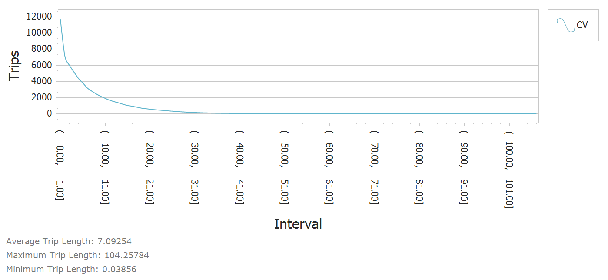
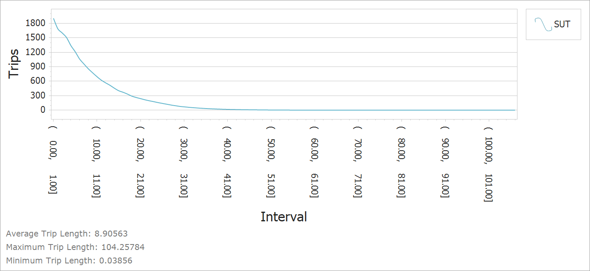

```{r setup, include=FALSE}
knitr::opts_chunk$set(echo = FALSE)
options(dplyr.summarise.inform = FALSE)
options(scipen = 999)

library(tidyverse)
library(broom)
library(sf)
library(knitr)
library(kableExtra)
```

## Introduction

Commercial vehicles and trucks contribute significantly to congestion on
major facilities in an urban area. In most instances, their travel behavior is 
distinct from residents of that urban area. To better capture commercial vehicle 
traffic in TRMG2, a separate set of commercial vehicle models were
developed. These include trip generation, time of day, and distribution for
three commercial vehicle types: commercial autos, vans, and pickups (CV), single
unit trucks (SUT), and multi-unit trucks (MUT).

These classes are defined using the [federal vehicle classification](https://www.fhwa.dot.gov/policyinformation/tmguide/tmg_2013/vehicle-types.cfm).

CV - Classes 1-3  
SUT - Classes 5-7  
MUT - Classes 8-13

The models use the [Quick Response
Freight Manual](https://trid.trb.org/view.aspx?id=859168) (QRFM) approach and
are re-estimated when possible using the Triangle's 2010 Commercial Vehicle
survey.

```{r, include=FALSE}
veh_raw <- read_csv("data/input/_PRIVATE/survey_data/SurveyData_Caliper/2010 Commercial Vehicle Travel/1_Data - Original/vehicles_exported.csv")
trips_raw <- read_csv("data/input/_PRIVATE/survey_data/SurveyData_Caliper/2010 Commercial Vehicle Travel/1_Data - Original/trips_exported.csv")
est_raw <- read_csv("data/input/_PRIVATE/survey_data/SurveyData_Caliper/2010 Commercial Vehicle Travel/1_Data - Original/establishment_export.csv")
```

```{r}
veh_types <- veh_raw %>%
  filter(CTYPE != 2) %>%
  mutate(veh_type = case_when(
    CTYPE == 1 ~ "CV",
    CTYPE == 3 ~ "SUT",
    CTYPE == 4 ~ "MUT"
  )) %>%
  select(SAMPN, veh_type)

add_veh_types <- trips_raw %>%
  left_join(veh_types, by = "SAMPN") %>%
  left_join(est_raw %>% select(SAMPN, EXPWGT), by = "SAMPN")
```

```{r, include=FALSE}
tazs <- st_read("data/input/tazs/master_tazs.shp") %>%
  st_transform(crs = st_crs('+proj=longlat +datum=WGS84'))
se <- read_csv("data/output/se_data/se_2016.csv")
```

```{r}
# Geocoding
pts <- tibble(
  lng = add_veh_types$XCORD,
  lat = add_veh_types$YCORD,
) %>%
  group_by(lng, lat) %>%
  slice(1) %>%
  ungroup() %>%
  filter(lng != "NA") %>%
  st_as_sf(
    coords = c("lng", "lat"), 
    crs = st_crs(tazs),
    remove = FALSE
  )

# # manual check that they overlap
# library(leaflet)
# leaflet() %>%
#   addProviderTiles("Stamen.TonerLite") %>%
#   addPolygons(data = tazs) %>%
#   addMarkers(data = pts[2000:3000, ])
```

```{r, include=FALSE}
geocode_points <- pts %>%
  st_join(tazs %>% select(TAZ = ID, district = DISTRICT)) %>%
  st_drop_geometry() %>%
  group_by(lng, lat) %>%
  slice(1) %>%
  ungroup()
```

```{r}
add_tazs <- add_veh_types %>%
  select(-TAZ) %>% # un-related TAZ field
  left_join(geocode_points, by = c("XCORD" = "lng", "YCORD" = "lat")) %>%
  filter(!is.na(TAZ), !is.na(veh_type))
```

## Trip Rates

Initial estimation attempts led to counter-intuitive coefficeints and poor model
fit statistics. A fundamental problem may have been regressing a 2010 survey
against 2016 land use data. In addition, stakeholders noted some concerns with
the survey. Given these issues, initial rates were borrowed from the New River
Valley MPO travel model.

```{r, eval=FALSE}
rate_est_tbl <- add_tazs %>%
  select(TAZ, district, veh_type, EXPWGT) %>%
  left_join(
    se %>% select(
      TAZ,
      HH,
      Industry,
      Office,
      Retail,
      Service_RateHigh,
      Service_RateLow
    ),
    by = "TAZ"
  ) %>%
  group_by(veh_type, district) %>%
  # group_by(veh_type, TAZ) %>%
  summarize(across(EXPWGT:Service_RateLow, sum)) %>%
  rename(trips = EXPWGT)

cv_model <- lm(
  trips ~ HH + Industry + Retail + Office + Service_RateHigh + Service_RateLow,
  data = rate_est_tbl %>%
    filter(veh_type == "CV") %>%
    mutate(OtherEmp = Retail + Office + Service_RateHigh)
)
cv_rsq <- round(summary(cv_model)$r.squared, 2)

sut_model <- lm(
  trips ~ HH + Retail + OtherEmp + 0,
  data = rate_est_tbl %>%
    filter(veh_type == "SUT") %>%
    mutate(
      OtherEmp = Industry + Office + Service_RateHigh + Service_RateLow
    )
)
sut_rsq <- round(summary(sut_model)$r.squared, 2)

mut_model <- lm(
  trips ~ HH + Industry + OtherEmp + 0,
  data = rate_est_tbl %>%
    filter(veh_type == "MUT") %>%
    mutate(
      OtherEmp = Retail + Office + Service_RateHigh + Service_RateLow
    )
)
mut_rsq <- round(summary(mut_model)$r.squared, 2)
```

```{r, include=FALSE}
rates <- read_csv("data/input/cv/cv_generation_qrfm.csv")
```

```{r}
rates %>%
  select(Variable = Field, CV:MUT) %>%
  kable() %>%
  kable_styling(full_width = FALSE)
```

The initial rates were adjusted by comparing link flows to counts where they
were available by SUT and MUT. Commercial vehicles used the same adjustment
factor as SUT. The final rates are shown below.

```{r}
sut_factor <- .87
cv_factor <- .87 # assume same as sut. can't calculate directly.
mut_factor <- .74
final_rates <- rates %>%
  mutate(across(c(CV, SUT, CVa, SUTa), .fns = ~ round(. * sut_factor, 3))) %>%
  mutate(across(c(MUT, MUTa), .fns = ~ round(. * mut_factor, 3)))
  
final_rates %>%
  select(Variable = Field, CV:MUT) %>%
  kable() %>%
  kable_styling(full_width = FALSE)
```


## Time of Day

The 2010 survey included trip departure time, which was used to categorize trips
by time period. The table below shows the estimated time of day factors ([time of day definitions](time_of_day.html#final_defs)).

```{r}
add_tod <- add_tazs %>%
  mutate(
    dep_mins = DEP_HR * 60 + DEP_MIN,
    tod = case_when(
      dep_mins > 7 * 60 & dep_mins <= 9 * 60 ~ "AM",
      dep_mins > 9 * 60 & dep_mins <= 15 * 60 + 30 ~ "MD",
      dep_mins > 15 * 60 + 30 & dep_mins <= 18 * 60 + 15 ~ "PM",
      TRUE ~ "NT"
    )
  )

tod_tbl <- add_tod %>%
  group_by(veh_type, tod) %>%
  summarize(count = n()) %>%
  mutate(factor = count / sum(count)) %>%
  select(-count)

tod_tbl %>%
  pivot_wider(names_from = tod, values_from = factor) %>%
  mutate(veh_type = factor(veh_type, levels = c("CV", "SUT", "MUT"), ordered = TRUE)) %>%
  arrange(veh_type) %>%
  rename(`Vehicle Type` = veh_type) %>%
  relocate(PM, .before = NT) %>%
  kable(digits = 3) %>%
  kable_styling(full_width = FALSE)
```

The relative distribution between peak and off-peak periods look reasonable, but
the distribution between AM and PM peaks are not. There is almost no traffic in
the PM period and far too much in the AM. This skew looks worse considering
that the PM period is longer than the AM. Based on experience in other regions,
Caliper spread peak demand evenly over the AM and PM periods according to the
hours in each period. The final table is shown below.

```{r}
fix_peak <- tod_tbl %>%
  group_by(veh_type) %>%
  mutate(
    tot_peak = ifelse(tod %in% c("AM", "PM"), factor, 0),
    tot_peak = sum(tot_peak),
    new_fac = case_when(
      tod == "AM" ~ tot_peak * (2/(2 + 2.75)),
      tod == "PM" ~ tot_peak * (2.75/(2 + 2.75)),
      TRUE ~ factor
    ),
    factor = new_fac
  ) %>%
  select(-tot_peak, -new_fac)

fix_peak %>%
  pivot_wider(names_from = tod, values_from = factor) %>%
  mutate(veh_type = factor(veh_type, levels = c("CV", "SUT", "MUT"), ordered = TRUE)) %>%
  arrange(veh_type) %>%
  rename(`Vehicle Type` = veh_type) %>%
  relocate(PM, .before = NT) %>%
  kable(digits = 3) %>%
  kable_styling(full_width = FALSE)
```


Directionality factors are not calculated for commercial vehicles and trucks.
Instead, they are assumed to be evenly split by direction.

## Distribution {.tabset}

Once generated, commercial vehicle and truck trips are distributed among
zones using a [gravity
model](https://tfresource.org/topics/Trip_distribution.html). Unfortunately, the
CV survey did not contain information on both ends of the trip, which meant it
could not be used to estimate model parameters. Model parameters were borrowed
from the NRVMPO travel model and are shown below.

```{r, include=FALSE}
grav_params <- read_csv("../master/cv/cv_gravity_am.csv")
```

```{r}
grav_params %>%
  select(Class = purpose, Constraint = constraint, a:c) %>%
  kable() %>%
  kable_styling(full_width = FALSE)
```

The table below shows the resulting average commercial vehicle trip lengths in
the model.

```{r}
tibble(
  Class = c("CV", "SUT", "MUT"),
  `Average Time (min)` = c(10, 12, 13.3),
  `Averge Distance (mi)` = c(7.1, 8.9, 10.1)
) %>%
  kable() %>%
  kable_styling(full_width = FALSE)
```

The charts below show the trip length frequency distribution graphs (in miles).

### CV

```{r, out.width="100%", fig.show='hold',fig.align='center'}

```

### SUT

```{r, out.width="100%", fig.show='hold',fig.align='center'}

```

### MUT

```{r, out.width="100%", fig.show='hold',fig.align='center'}
knitr::include_graphics("img/cv/mut.png")
```

```{r, eval=FALSE}
write_csv(final_rates, "../master/cv/cv_generation.csv")
```

