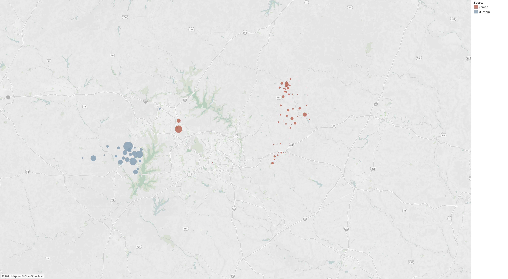

```{r setup, include=FALSE}
# renv::restore()
library(tidyverse)
library(corrr)
library(sf)
library(kableExtra)
library(knitr)

source("R/ieei.R")

knitr::opts_chunk$set(echo = FALSE)
options(dplyr.summarise.inform = FALSE)
options(scipen = 999)

```

## Introduction

Travel from outside the Triangle model's geographic boundary to locations inside
the boundary are referred to as "external-internal" or "EI" trips. Movements
from inside the boundary to outside are "internal-external" or "EI" trips.
Movements through but not stopping within the region are referred to as
"external-external" or "EE" trips. Together, these travel patterns are referred
to here as "EE" and "IE/EI" travel. This document discusses the development of
these components of the regional model.

## Available Data Sources
The two best available data sources for external-related travel are (i)
StreetLight Data provided by the client, and (ii) a sub-area extraction from the
North Carolina Statewide Travel Model (NCSTM v.4.3a). The analysis suggests that the NCSTM data is superior because there *appears* to be an error
with either the StreetLight Data or its extraction. The map below shows
"attractions" for the IE/EI trips from StreetLight. The "E" end of the trip is
asserted to be the production end and the "I" end of the trip is the attraction
end. Finally, the data was aggregated to a 21-district geographies defined by
ITRE. The red dots show data extracted using the CAMPO zone system and the blue
dots show data extracted using the DCHC MPO zone system. The map shows an
illogical outcome of attractions clustered in select locations near the external
stations. Nearly all the DCHC trip ends were in Chatham County while CAMPO trip
ends were predominantly in Franklin County.

### StreetLight Attractions
```{r, out.width="100%", fig.show='hold',fig.align='center'}

```

## EE
The first step is to determine the share of traffic at each external station
that can be attributed to EE travel. This allows the balance of trips to be
attributed to IE and EI travel. The NCSTM data contains flow estimates for each
of the model's `r number_of_external` external stations. These flows are used to
estimate the share of travel using the AWDT estimates derived from the NCSTM. In
addition, the share of commercial vehicles are segmented by single-unit trucks
and multi-unit trucks. The table below summarizes these outcomes.

### EE Traffic Shares
```{r}
ext_shares_ncstm_df %>%
  mutate(adt = format(adt, big.mark = ",", digits = 0, justify = "right")) %>%
  select(Station = ext_station,
         `Avg Weekday Traffic` = adt,
         `Pct EE Automobile` = pct_auto_ee,
         `Pct EE Commercial Vehicles` = pctcv,
         `Pct EE Single-unit Trucks` = pctcv_sut,
         `Pct EE Multi-unit Trucks` = pctcv_mut) %>%
  kableExtra::kable(digits = 0, aligh = "rr") %>%
  kableExtra::kable_styling(full_width = FALSE)
```

### EE Time of Day

The data available was not adequate to calculate time of day shares for the EE
trips. Instead, the commercial vehicle factors were used. Through trips do not
follow the same dual-peak pattern as commuters and occur more often during the
midday in general.

## IE/EI
The number of IE/EI trips are controlled by the volumes at the external station
after external travel has been subtracted. These trips are distributed using a
[gravity model](https://tfresource.org/topics/Trip_distribution.html). For this
model form, attractions and gamma parameters must be estimated.

### IE/EI Attraction Model Estimation
The NCSTM data was aggregated to the 43-district system to support model
estimation. A handful of specifications were tested to determine a useful
attraction model, including segmenting the attraction models for freeway and
non-freeway external stations. These more complicated models generated
coefficients with wrong signs. The final, simple model generated positive
coefficients on the population and employment variables. It does not segment the
stations by roadway type and asserts a Y-intercept of zero.

```{r}
print_model <- function(model, includes_intercept) {

  variable_vector <- colnames(model$model)
  
  if (!includes_intercept) variable_vector = tail(variable_vector, n = -1)
  
  df <- tibble(Variable = variable_vector,
               Estimate = model$coefficients,
               `t-statistic` = coef(summary(model))[, "t value"],
               `p value` = coef(summary(model))[, "Pr(>|t|)"]) %>%
    mutate(Variable = if_else(Variable == "trips", "_intercept_", Variable)) %>%
    arrange(Variable) %>%
    bind_rows(., tibble(Variable = c("Adjusted R-squared"),
                        Estimate = summary(model)$adj.r.squared,
                        `t-statistic` = as.double(NA),
                        `p value` = as.double(NA))) %>%
    mutate(Variable = case_when(
    Variable == "pop" ~ "Population",
    Variable == "emp" ~ "Employment",
    TRUE ~ Variable
  )) %>%
    kable(digits = 4) %>%
    kable_styling(full_width = FALSE)
  
  return(df)
  
}
```

```{r, MODEL_PREFERRED}
print_model(preferred_model, includes_intercept = FALSE)
```

A scatter plot of the NCSTM and estimated attractions by the 43-district system
is shown in the plot below.

### NCSTM and Estimated IE/EI Attractions
```{r, out.width="100%", fig.show='hold',fig.align='center'}
knitr::include_graphics("img/ieei/estimated_attractions.png")
```

### Distance Assessment
The chart below plots the trip length frequency, with the trip length measured from the external station to the internal zone segmenting trips that enter the region at freeways from those at other locations. The plot shows a logical and expected outcome: trips entering the region at freeway external stations travel longer distances than those entering at non-freeway locations. 

#### IE/EI Trip Length Frequency
```{r, out.width="100%", fig.show='hold',fig.align='center'}
knitr::include_graphics("img/ieei/ncstm_tlf.png")
```

The above chart suggests the IE/EI distribution model should be segmented by freeway and non-freeway stations. The estimated gravity parameters are shown below.

```{r, include=FALSE}
grav_df <- read_csv("../master/external/ieei_gravity.csv")
```

```{r}
grav_df %>%
  group_by(filter) %>%
  slice(1) %>%
  ungroup() %>%
  slice(1:2) %>%
  mutate(Type = c("Freeway", "NonFreeway")) %>%
  select(Type, a, b) %>%
  kable() %>%
  kable_styling(full_width = FALSE)
```

The model estimated distances for freeways and non-freeways are plotted against
the observed data in the two following figures.

#### IE/EI Observed and Estimated Trip Length Frequency for Freeway Stations
```{r, out.width="100%", fig.show='hold',fig.align='center'}
knitr::include_graphics("img/ieei/obs_est_freeway_tlf.png")
```

#### IE/EI Observed and Estimated Trip Length Frequency for Non-Freeway Stations
```{r, out.width="100%", fig.show='hold',fig.align='center'}
knitr::include_graphics("img/ieei/obs_est_non_freeway_tlf.png")
```

A table summarizing the mean trip lengths is presented below.

### IE/EI Average Trip Lengths
```{r}
ei_distance_means_df %>%
  select(Category = category,
         Source = source,
         `Mean Distance (miles)` = mean_distance) %>%
  kableExtra::kable(digits = 1) %>%
  kableExtra::kable_styling(full_width = FALSE)
  
```

### Final adjustments

During validation, The IE/EI model was enhanced to allow additional control
of trip lengths. This is due to the existence of some town along the border.
Stations near those towns need even shorter trip lengths. Two additional
sets of gravity parameters were created and the terminology was changed as shown
below.

```{r}
grav_df %>%
  group_by(filter) %>%
  slice(1) %>%
  ungroup() %>%
  mutate(Type = c("Long", "Medium", "Sort", "Very Short")) %>%
  select(Type, a, b) %>%
  kable() %>%
  kable_styling(full_width = FALSE)
```

The first two options ("Long" and "Medium") are the same coefficients as
estimated. The final two coefficients were arrived at through iterative trials
during highway validation.

### IE/EI Time of Day

The data available was not adequate to calculate time of day shares for the
IE/EI trips. Instead, the factors were borrowed from N_HB_OD_Long (similar to
HBO in other models). Compared to using work trips, this shifts demand from the
AM and PM periods into the off peak. These travelers (e.g. with long commutes to
work) need to leave earlier in the day. They cross the model boundary earlier
(and later) than the peaks for internal residents.