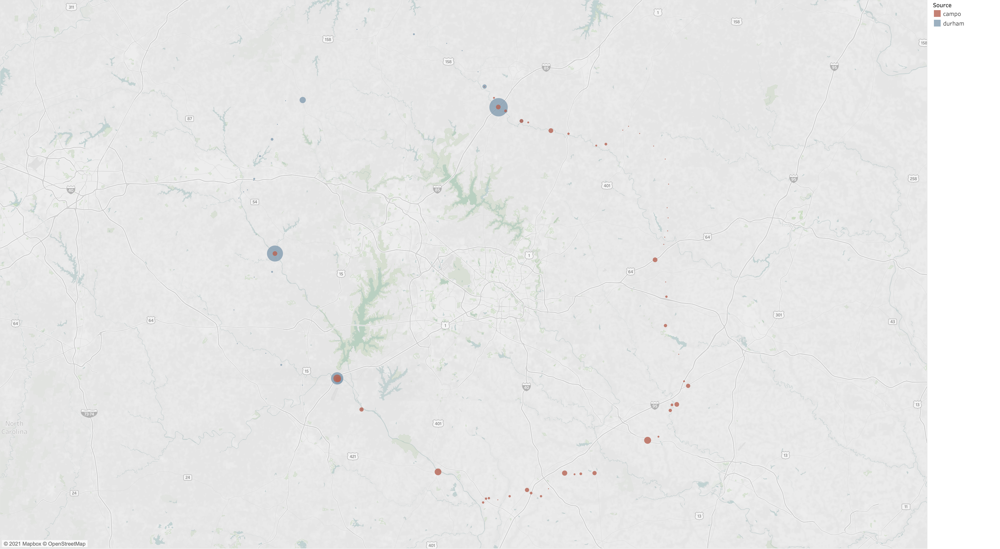
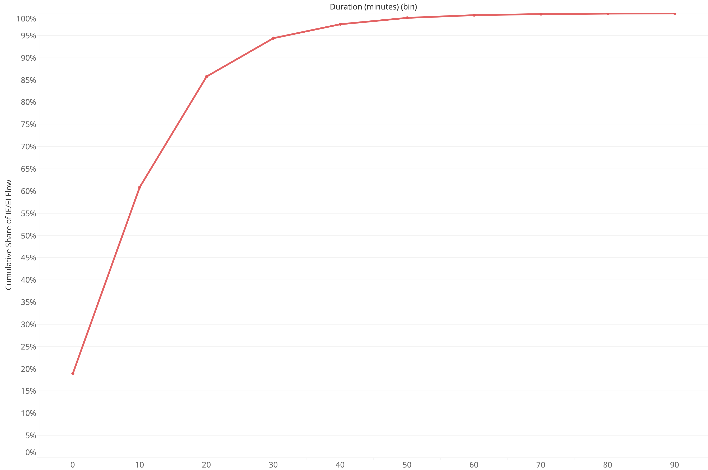

```{r setup, include=FALSE}
# renv::restore()
library(tidyverse)
library(corrr)
library(sf)
library(kableExtra)
library(knitr)

source("R/ieei.R")

knitr::opts_chunk$set(echo = FALSE)
options(dplyr.summarise.inform = FALSE)
options(scipen = 999)

```

## Introduction

Travel from outside the Triangle model's geographic boundaries to locations inside the model's boundaries are referred to as "external-internal" trips; movements from inside the boundary to outside are "internal-external" trips; and movements through the region are referred to as "external-external" trips. Together, these movements are referred to here as "ieei" travel. This document discusses their improvements.

## External-external (EE)
The two best available data sources for movements through the modeling region are (i) StreetLight Data extracted by ITRE and (ii) a sub-area extraction from the North Carolina Statewide Travel Model (NCSTM). 

An important short-coming of the StreetLight data is that it may not always capture the true origin of longer distance movements. Travelers stopping briefly at a stoplight or stop sign, or to use a bathroom at a rest area, may be excluded from the movements we would, ideally, like to represent in an external-to-external trip matrix. 

The first step in the analysis is to determine the share of traffic at each external station that can be attributed to EE movements. This will allow us to attribute the balance of the travel to internal-external (IE) and external-internal (EI) movements, which is needed in the subsequent step. 

The StreetLight Data extracted by ITRE contains flow estimates for the 50 largest EE station pairs (there are `r number_of_external` external stations in the updated model). We use these flows to estimate the share of travel at each of the external stations using the ADT estimates for the external stations stored in the socio-economic data file. The table below shares the estimated shares (`pct_auto_ee`) with the existing shares (`PCTAUTOEE`) stored in the socio-economic data file.The table also includes the StreetLight flow estimate (`sl_ee_flow`) and the share of ADT attributable to personal vehicles (`auto_ee_adt`), which is the `ADT` value less the share of trucks, `PCTCV`. 

### EE Traffic Shares from StreetLight Data
```{r}
ext_shares_sl_df %>%
  kableExtra::kable(digits = 1) %>%
  kableExtra::kable_styling(full_width = FALSE)
```

This exercise was repeated using the sub-area data extracted from the NCSTM. The NCSTM provides estimates of the share of the ADT used by EE vehicles, as with the StreetLight Data. This is shown as `pct_auto_ee` in the table below. The NCSTM can also provide estimates of ADT (`adt` in the table below) and percent of commercial vehicles (`pctcv`). In addition, commercial vehicles can be segmented by single-unit trucks (`sut`) and multi-unit trucks (`mut`). The table below summarizes these outcomes, with the NCTSM outcomes shown in lowercase, and the existing data shown in uppercase.

### EE Traffic Shares and Other Metrics from NCSTM
```{r}
ext_shares_ncstm_df %>%
  kableExtra::kable(digits = 1) %>%
  kableExtra::kable_styling(full_width = FALSE)
```

To use all the available information, the StreetLight Data and NCSTM outcomes can be combined by averaging the `pct_auto_ee` estimates across the data sources. The combined outcomes are shown in the table below. We again show the new estimates in lower case and the existing values in upper case. 

### EE Traffic Shares and Other Metrics from StreetLight Data + NCSTM
```{r}
ext_shares_df %>%
  kableExtra::kable(digits = 1) %>%
  kableExtra::kable_styling(full_width = TRUE)
```

## Internal-external (IE) and External-internal (EI)
The second step in the development process is to see if we can find sufficient patterns in the StreetLight IE and EI data to estimate a regression model that can be generalized across zones. This generalization is necessary because the StreetLight data comprises a small sample of movements in the region. Here we start with StreetLight data extracted separately for IE-EI pairs by CAMPO and the Durham MPO. As such, it represents a sample of movements to/from a set of external stations to CAMPO model zones and from a set of external stations to the Durham model zones. 

The map below shows the coverage of the external stations for the CAMPO and Durham data pulls.

### StreetLight Productions at External Stations by Data Pull
```{r, out.width="100%", fig.show='hold',fig.align='center'}

```

To prepare the data for a regression model, we first aggregate it to the 21-district geographies developed for the model update. The correlations between IE/EI attractions (taking the external station to be the production end of the trip) and population and employment are summarized in the table below. 

### Correlations between IE/EI Attractions and Population and Employment
```{r}
correlations_sl_df %>%
  kableExtra::kable(digits = 3) %>%
  kableExtra::kable_styling(full_width = FALSE)
```

The correlation is negative and the number of districts with non-zero trips is only seven (of 21), which suggests the data is problematic. Below is a plot of the IE/EI productions, which shows a heavy bias towards locations close to the external stations.

### StreetLight Attractions to Internal Stations by Data Pull
```{r, out.width="100%", fig.show='hold',fig.align='center'}
knitr::include_graphics("img/ieei/sl_attractions.png")
```

A plot of the cumulative duration distribution for the IE/EI trips reveals that ~94 percent of the trips have a duration of 30 minutes or less, which seems unlikely for IE/EI flows.

### StreetLight Duration Cumulative Distribution for IE/EI Trips
```{r, out.width="100%", fig.show='hold',fig.align='center'}

```

With the StreetLight Data not able to support estimation of IE/EI production model, we turn to the NCSTM. We again start with correlations between population and employment, which are shown in the table below.


