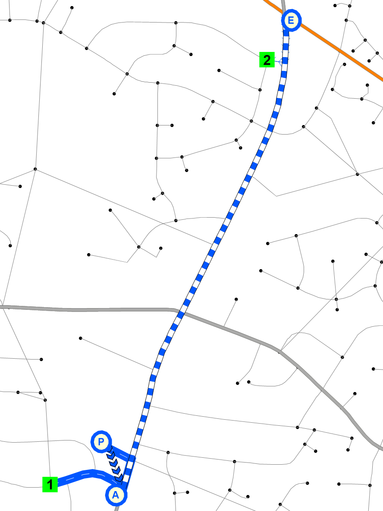

```{r setup, include=FALSE}
knitr::opts_chunk$set(echo = FALSE)
options(dplyr.summarise.inform = FALSE)
options(scipen = 999)

library(tidyverse)
library(knitr)
library(kableExtra)
library(scales)
```

## Introduction

The highway and transit networks are critical inputs for any travel model. They
provide travel time, accessibility, and other impedance information. The Caliper
team used the various existing data sources from the model stakeholders together 
with other sources including the TIGER line files and review with satellite 
imagery in order to fashion a new master layer for both roadways and transit.

This documentation uses the term "network" specifically to refer to the machine-
readable files (.net and .tnw) TransCAD uses for shortest pathing and assignment.
The GIS files that planners and modelers review and edit are referred to as
layers. This language is something Caliper is trying to promote to clarify
which data component is being referenced.

## Roadway Layer

### Creation of the master layer

Like TRMv6, the TRMG2 model uses a master layer that contains all projects
stakeholders might consider during transportation plan development (including
competing ideas). This allows each scenario layer to be exported from the
master with little or no manual editing. Information on using the project
management tool is covered in the user guide.

The previous highway layer made heavy use of numeric codes that translated
into values (e.g. a facility type of 1 might signify interstate). For TRMG2,
these fields now contain the string values directly, which improves
understanding, usability, and maintenance of the layer. It also makes the
model's GISDK code easier to read.

For these same reasons, the previous "Special" field was broken up into new
HOV and Toll-related fields. For example, the "TollType" field includes values
like "Free", "Toll", and "HOT" (for high-occupancy toll lane). It is easier to
understand a query like "TollType = 'Toll'" compared to "Special = 43". For a
full enumeration of field names and meanings, see the user guide.

The Caliper team also updated the master layer to reflect a 2016 base year,
the target year for model estimation (the final layer is a 2020 base year and
will be accompanied by a 2020 year model validation process). In other words, if
you export a scenario layer without any projects it will reflect the 2016 road
system. This was done by permanently modifying the base attributes of the master
layer with any projects scheduled to be complete by the base year date. This
did include some road closures, and those links dropped out of the layer
permanently.

### Update of count data

The count data was provided to Caliper by the Stakeholders. The original source
of this info was NCDOTs 2017 traffic count program along with a special count
collection effort undertaken specifically for model validation. All counts were
factored to an Average Weekday Daily Traffic (AWDT) for April 2017.

The previous model used a separate table to hold count data which then had to be
joined to the layer to make comparisons. For TRMG2, the basic count data
including station ID and daily AWDT were added to the master layer directly.
This makes it easier to compare (either manually or in code) between
model volumes and count data. Additional information (such as hourly counts)
can still be maintained in a separate table and joined to the layer only as
needed. 

### Link layer conflation

Caliper reviewed every link in the road line layer comparing against satellite
imagery. Alignments were adjusted to match the imagery. Many links were adjusted,
but most adjustments were small. The alignment of many ramps were corrected and 
collector/distributor systems were added if they were missing. 

```{r, echo=FALSE,out.width="49%",  out.height="20%",fig.cap="Capital before and after",fig.show='hold',fig.align='center'}
knitr::include_graphics(c("img/networks/capital_before.png","img/networks/capital_after.png"))
``` 

### Adding all streets

After conflating the existing links to improve alignments with aerials, Caliper
upgraded the road layer to include all streets. These additional streets provide
a much better representation of the walk and transit paths travelers actually
take, and are shown in orange below.

```{r, echo=FALSE,out.width="60%",  out.height="40%",fig.cap="All-Streets Network",fig.show='hold',fig.align='center'}
knitr::include_graphics("img/networks/all_streets.png")
``` 

Caliper added a `PrimaryLink` field to the line layer. It can be used to easily
select the gray or orange links depending on what the user wants to do.

- `PrimaryLink = 1`: Gray links
- `PrimaryLink = 0`: Orange links

These queries will also be used to make roadway and transit layer creation
easier. The minor streets do not have attribute information and should not be
included for use by vehicle travel. They will only be used by non-motorized and
transit travelers.

### Review of All Streets

With all the changes mentioned above, it was important to check that the new
master projects remained consistent. To be exhaustive, Caliper wrote code to do
this programmatically. For instance, every project in the old master layer had
its length checked against the new layer. Of the well over 1000 projects,
only 6 had length discrepancies. Each was investigated and corrected as
necessary.

Shortest paths were also built with the TRMv6 and TRMG2 layers using free-flow
times based on posted speeds. Comparison of the resulting matrices showed that
overall the RMSE was only 0.25%, which is very small, indicating close
consistency between the layers. The increased confidence that nothing was
broken. Additionally, every OD pair with an absolute percentage change greater
than 30% was reviewed. The largest relative difference was 62% for one OD pair
(between zone 1535 and 1444); in that case, the review revealed that the new
layer was correct while the original TRMv6 layer allowed a U-turn where it
should not have. See the before and after images below.

```{r, echo=FALSE,out.width="49%",  out.height="20%",fig.cap="Pathing before and after",fig.show='hold',fig.align='center'}
knitr::include_graphics(c("img/networks/path_before.png","img/networks/path_after.png"))
``` 

A small number of OD pairs were reviewed with changes <30%, but each one was
reasonable.

### Posted speed and lanes review

In addition to checks on the conflation and addition of all streets, Caliper
also reviewed the network for attribute correctness. For this review, Caliper
used [NCDOTs Road Characteristics
layer](https://connect.ncdot.gov/resources/gis/Pages/GIS-Data-Layers.aspx). This
was overlaid with the master layer to visually check for discrepancies. Google
Streeview was also used occasionally to check lanes and speed limit signs.

### Tolls

Tolling is an important policy lever for the Triangle. The Triangle Expressway
is an approximately 18 mile long freeway that charges a toll. In addition, the
region is considering additional toll facilities include high-occupancy toll
(HOT) lanes in the future.

Toll rates were collected from the [NC Quick Pass
website](https://www.ncquickpass.com/rates-facilities/Pages/toll-rates.aspx).
The listed prices were used to come up with an average cost per mile for 2-axle
vehicles shown below. 3-axle vehicles pay double while vehicles with 4 or more
axles pay four times that rate.

```{r}
# 2016
tribble(
  ~`Payment Method`, ~Cost, ~`Distance (mi)`, ~Rate,
  "Transponder",    "$3.25", 17.8,             "$0.183",
  "By Mail",        "$5.00", 17.8,             "$0.281"
) %>%
  kable() %>%
  kable_styling(full_width = FALSE)

# TODO: update to 2020 toll rates when updating base year to 2020

# # 2020
# tribble(
#   ~`Payment Method`, ~Cost, ~`Distance (mi)`, ~Rate,
#   "Transponder",    "$3.60", 17.8,             "$0.202",
#   "By Mail",        "$5.52", 17.8,             "$0.310"
# ) %>%
#   kable() %>%
#   kable_styling(full_width = FALSE)
```

The TRMG2 does not model transponder ownership; therefore, a blended rate must
be calculated that accurately represents the mix of vehicles using the facility.
To support that calculation, the stakeholders collected information on total
transactions by transponder and by mail. Caliper used this metric to calculate
the percentage split as shown below. Unfortunately, this info was not available
by class, so the total percentage is used for all axle classes.

```{r}
df <- tibble(
  method = c("Transponder", "By Mail"),
  total_trans = c(26360672, 18883195)
) %>%
  mutate(
    pct = percent(total_trans / sum(total_trans))
  )

df %>%
  rename(
    Method = method,
    `Total Transactions` = total_trans,
    Percent = pct
  ) %>%
  kable(format.args = list(big.mark = ",")) %>%
  kable_styling(full_width = FALSE)
```

The final weighted toll rate for 2-axle vehicles is $0.22/mi.

```{r}
# TODO: update for 2020
# The final weighted toll rate for 2-axle vehicles is $0.25/mi.
```

```{r, include=FALSE}
# Leta provided toll data in May from turnpike. Use it to generate more
# accurate usage rates by period.
toll_csv <- read_csv("data/input/_Private/toll/toll_data.csv")
```

```{r}
toll_summary <- toll_csv %>%
  filter(!(day %in% c("Sun", "Sat"))) %>%
  pivot_longer(prepaid_1:postpaid_3, names_to = "temp", values_to = "count") %>%
  separate(temp, into = c("type", "class")) %>%
  mutate(period = case_when(
    hour < 6 ~ "NT",
    hour <= 9 ~ "AM",
    hour <= 14 ~ "MD",
    hour <= 18 ~ "PM",
    TRUE ~ "NT"
  )) %>%
  # group_by(period, class, type) %>%
  group_by(class, type) %>%
  summarize(count = sum(count)) %>%
  mutate(pct = count / sum(count)) %>%
  filter(type == "prepaid") %>%
  # select(period, class, pct)
  select(class, pct)
```


## Transit Layer

TRMG2 adds a master layer for transit routes along with a project manager
specially designed to transfer routes accurately between line layers. This
enhancement greatly reduces the burden of coding and managing projects between
various base and future year scenarios.

More detail on how to use the new tools are included in the user's guide, but
information on the creation of the master route system requires a basic
understanding of the tool. In short, the transit project manager finds the
shortest path between route stops to reconstruct the route on a new layer. This
approach struggles when route stops are not frequent enough to get an accurate
path, but TRMG2 solves this problem using "shape stops". These are extra stops
along the route that are used to improve alignment, but are then removed.

The maps below give a good example of a potential problem when transferring
routes between layers using only stop locations only. The shortest path between
stops is not always the route a bus takes.

```{r, echo=FALSE,out.width="49%",  out.height="20%",fig.cap="Transferring without shape points",fig.show='hold',fig.align='center'}
knitr::include_graphics(c(
  "img/networks/1 route without shape points.png",
  "img/networks/2 route without shape points result.png"
))
```

The maps below show how a single shape stop solves the alignment problem while
maintaining the correct number of stops.

```{r, echo=FALSE,out.width="49%",  out.height="20%",fig.cap="Transferring with shape points",fig.show='hold',fig.align='center'}
knitr::include_graphics(c(
  "img/networks/3 route with shape points.png",
  "img/networks/4 route with shape points result.png"
))
```

Each time a scenario is created, the transit project manager writes out a file
next to the route system detailing how accurate the transfer went. This is 
achieved by comparing lengths before and after as well as checking for any
missed stops. Shape stops can be added until the match is exact, but minor
differences in route lengths do not have a measurable impact on model results.
The table below provides a sample of the comparison table.

```{r, include=FALSE}
rts_check <- read_csv("data/input/networks/transit/_rts_creation_results.csv")
```

```{r}
rts_check %>%
  filter(projid %in% c(1, 2, 31)) %>%
  head() %>%
  kable(digits = 1) %>%
  kable_styling(full_width = FALSE)
```

### Transit networking checking {.tabset}

Transit networks are the files TransCAD uses for shortest path, assignment, and
other procedures (extension: "tnw"). During the model run, the route system file
is converted into many different networks. In TRMG2, a separate transit network
file is created for each combination of

- Time of Day
  - AM
  - MD
  - PM
  - NT
- Transit Mode
  - Local Bus
  - Express Bus
  - Bus Rapid Transit (if present)
  - Commuter Rail (if present)
  - Light Rail (if present)
- Access Mode
  - Walk
  - Kiss-and-Ride (aka drop off)
  - Park-and-Ride
  
Creating separate files facilitates the critical step of auditing the networks.
The model translates the route, stop, link, and node layers into a transit
network, and it is important to make sure the networks are behaving
appropriately. In the TRMG2, for example, the AM and PM PNR networks behave
differently. In the AM, where trips are primarily from home to destinations like
work, drive access works in the PA direction: 

1. Drive to a PNR lot
2. Walk to the bus access stop
3. Ride the bus to the egress stop
4. Walk to the final destination

In the PM network, trips are primarily back to home. For this reason, the
drive access flow is reversed.

1. Walk to the access stop
2. Ride the bus to the egress stop
3. Walk to the PNR lot
4. Drive home

TransCAD can handle this behavior, but it is always important to check that
the model code is setup correctly. Separate network files allowed the two maps
below to be created quickly to confirm proper behavior.

#### PNR AM

```{r, out.width="50%", fig.show='hold',fig.align='center'}

```

#### PNR PM

```{r, out.width="50%", fig.show='hold',fig.align='center'}
knitr::include_graphics("img/networks/pnr_pm.png")
```