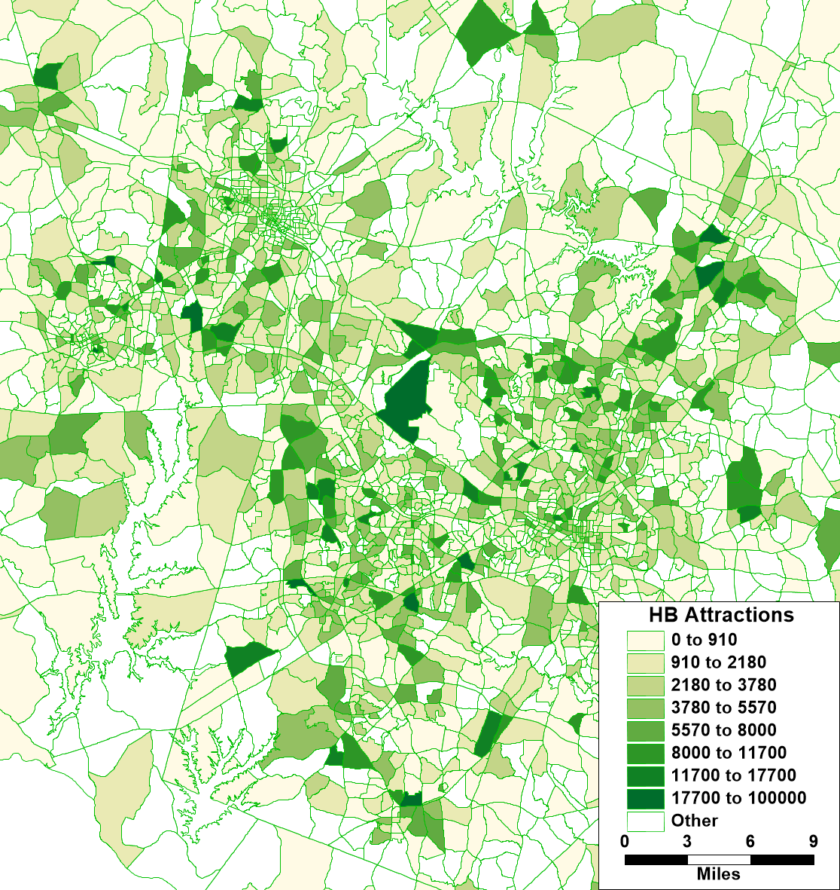
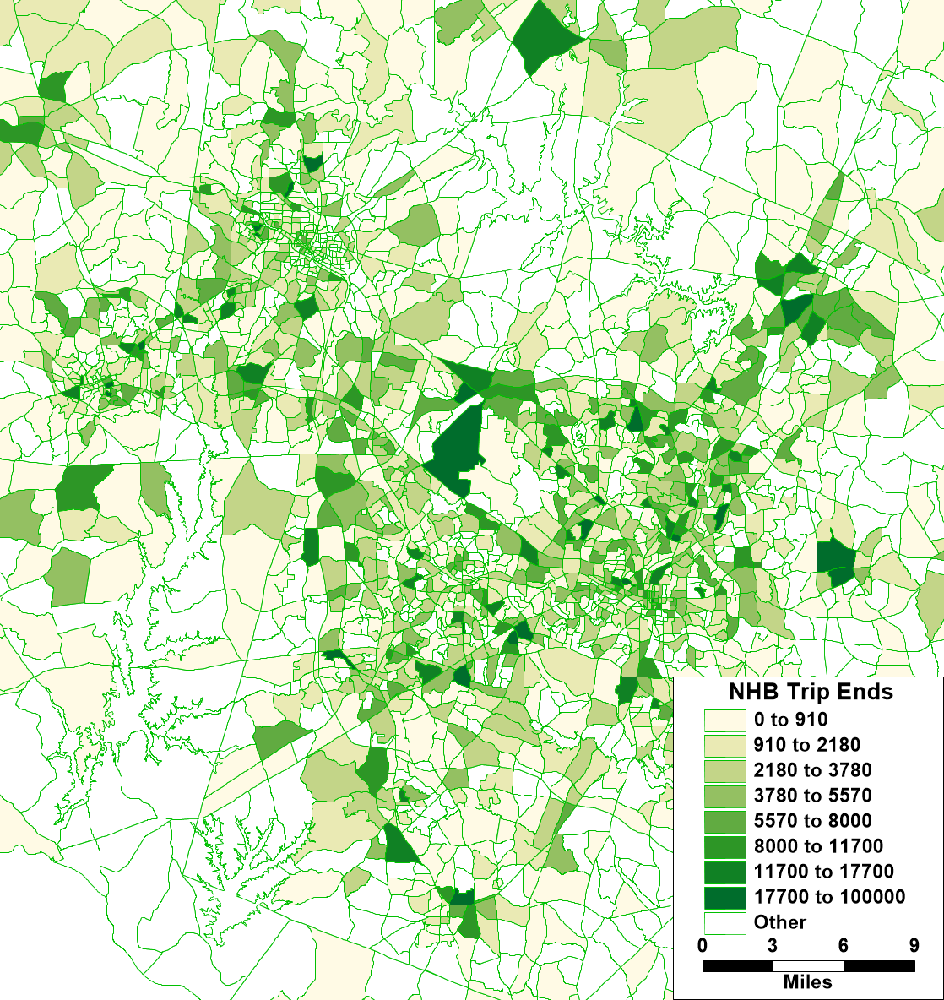

```{r setup, include=FALSE}
knitr::opts_chunk$set(echo = FALSE)
options(dplyr.summarise.inform = FALSE)
options(scipen = 999)

library(tidyverse)
library(knitr)
library(kableExtra)
library(sf)
source("R/estimate_nhb.R")
source("R/utils.R")
```

## Introduction

There are many problems related to non-home-based trips in traditional
trip-based models arising from the fact that they are disconnected from the
home-based trips with which they comprise complete tours. In order to properly
represent non-home-based trips, two spatial distribution or destination/spatial
choice models are required to account for both the trip’s origin location and
destination location. The four-step model architecture is fundamentally flawed
because it produces non-home-based trips from only one trip distribution or
spatial choice model. 

To address these problems, the TRM adopts an alternative approach with a simple
change to the structure of the trip-based model, running the non-home-based
model components after and conditional on the home-based model components
instead of in parallel and independently of them as in the traditional four-step
model. This relatively simple structural change significantly improves the TRM’s
ability to represent non-home-based trips and their response to land use changes
and transportation infrastructure investments. Running a NHB distribution or
destination choice model after and conditional on home-based destination choices
in this approach, provides the required second spatial distribution model to
properly model both the origin and destination of NHB trips.

In this approach, NHB trips are generated separately by mode based on home-based
mode choices. This essentially provides information about whether a traveler has
a car with them and allows the model, despite its trip-based form, to ensure a
reasonable consistency of modes on tour.

Available modes include:

- SOV
- HOV2
- HOV3+
- Auto Pay
- Transit
- Bike
- Walk

The model coefficients below are the result of multiple linear regression with a
forced intercept at zero. In addition, the model estimation will
be scaled up to a predicted regional total. As a result of these two factors,
the displayed r-squared values are not as meaningful. Instead, the value of the
coefficients is in determining the relative effect that various home-based trip
types have on non-home-based trip generation.

When reviewing the coefficients below, note their logical consistency: SOV NHB
trips are most likely to result when the HB trip is SOV or HOV. NHB walk trips
can be made when a person drives from home, but is more much more likely if they
walk. These results greatly improve the TRMG2 NHB models compared to traditional
trip-based construction.

```{r, include=FALSE}
trips_orig <- read_csv(
  "data/output/_PRIVATE/survey_processing/trips_processed.csv")
```


```{r, include = FALSE}
trips <- trips_orig %>%
  mutate(
    mode_nhb = case_when(
      mode_final == "bus" ~ "t",
      TRUE ~ mode_final
    ),
    trip_type = paste0(trip_type, "_", mode_nhb)
  ) %>%
  filter(!is.na(p_taz) & !is.na(a_taz))

# hold all model tables and plots in a list
coeffs_list <- list()
p_tbl_list <- list()
```

```{r}
make_table <- function(tbl) {
  tbl %>%
    arrange(estimated_as) %>%
    kable(digits = 4) %>%
    kable_styling(full_width = FALSE)
}

# unique(trips$mode_nhb)
```

## Work tours

Each trip type below is a non-home-based trip on a work tour. Each tab shows a
mode-specific model that estimates which home-based trips and modes generate that
non-home-based trip and mode combination.

### W_NH_EK12_All {.tabset .W_NH_EK12_All}

These are non-home-based trips made on a work tour before or after dropping a
child off at school. For example, a parent might drop off a child and then get
gas before heading to work. The trip between school and the gas station is a
W_NH_EK12_All trip.

#### SOV

```{r, W_NH_EK12_All_sov}
type <- "W_NH_EK12_All_sov"

# Collapse trip types
equiv <- list(
  "W_HB_W_All_hov2" = "W_HB_W_All_auto",
  "W_HB_W_All_hov3" = "W_HB_W_All_auto",
  "W_HB_W_All_sov" = "W_HB_W_All_auto",
  "W_HB_EK12_All_hov2" = "W_HB_EK12_All_hov",
  "W_HB_EK12_All_hov3" = "W_HB_EK12_All_hov",
  "W_HB_O_All_hov2" = "W_HB_O_All_hov",
  "W_HB_O_All_hov3" = "W_HB_O_All_hov"
)

# Restrict dependent variables
dependent_vars <- c(
  "W_HB_EK12_All_hov",
  "W_HB_O_All_hov",
  "W_HB_O_All_sov",
  "W_HB_O_All_walkbike",
  "W_HB_W_All_auto"
)

# model1 <- estimate_nhb(trips, type)
# model2 <- estimate_nhb(trips, type, equiv = equiv)
model3 <- estimate_nhb(trips, type, equiv = equiv, 
                       dependent_vars = dependent_vars)

zonal_result <- apply_nhb_zonal(trips, type, model3$tbl)
coeff_tbl <- model3$tbl %>%
  add_row(term = "r_sq", estimate = zonal_result$r_sq)
coeffs_list[type] <- list(coeff_tbl)
make_table(coeff_tbl)
p_tbl_list[type] <- list(model3$p_tbl)
```

#### HOV2

```{r, W_NH_EK12_All_hov2}
type <- "W_NH_EK12_All_hov2"

# Collapse trip types
equiv <- list(
  "W_HB_O_All_hov2" = "W_HB_O_All_auto",
  "W_HB_O_All_hov3" = "W_HB_O_All_auto",
  "W_HB_O_All_sov" = "W_HB_O_All_auto",
  "W_HB_EK12_All_hov2" = "W_HB_EK12_All_hov",
  "W_HB_EK12_All_hov3" = "W_HB_EK12_All_hov"
)

# Restrict dependent variables
dependent_vars <- c(
  "W_HB_O_All_auto",
  "W_HB_EK12_All_hov",
  "W_HB_EK12_All_sov",
  "W_HB_O_All_walkbike"
)

# model1 <- estimate_nhb(trips, type)
# model2 <- estimate_nhb(trips, type, equiv = equiv)
model3 <- estimate_nhb(trips, type, equiv = equiv, 
                       dependent_vars = dependent_vars)

zonal_result <- apply_nhb_zonal(trips, type, model3$tbl)
coeff_tbl <- model3$tbl %>%
  add_row(term = "r_sq", estimate = zonal_result$r_sq)
coeffs_list[type] <- list(coeff_tbl)
make_table(coeff_tbl)
p_tbl_list[type] <- list(model3$p_tbl)
```

#### HOV3+

```{r, W_NH_EK12_All_hov}
type <- "W_NH_EK12_All_hov3"

# Collapse trip types
equiv <- list(
  "W_HB_O_All_hov2" = "W_HB_O_All_auto",
  "W_HB_O_All_hov3" = "W_HB_O_All_auto",
  "W_HB_O_All_sov" = "W_HB_O_All_auto",
  "W_HB_EK12_All_hov2" = "W_HB_EK12_All_hov",
  "W_HB_EK12_All_hov3" = "W_HB_EK12_All_hov"
)

# Restrict dependent variables
dependent_vars <- c(
  "W_HB_O_All_auto",
  "W_HB_EK12_All_hov"
)

# model1 <- estimate_nhb(trips, type)
# model2 <- estimate_nhb(trips, type, equiv = equiv)
model3 <- estimate_nhb(trips, type, equiv = equiv, 
                       dependent_vars = dependent_vars)

zonal_result <- apply_nhb_zonal(trips, type, model3$tbl)
coeff_tbl <- model3$tbl %>%
  add_row(term = "r_sq", estimate = zonal_result$r_sq)
coeffs_list[type] <- list(coeff_tbl)
make_table(coeff_tbl)
p_tbl_list[type] <- list(model3$p_tbl)
```

#### Auto Pay

No significant presence of this trip type in the survey (0 samples), and it is
not an important source of travel demand. No model was estimated.

```{r, W_NH_EK12_All_auto_pay}
type <- "W_NH_EK12_All_auto_pay"
n_records <- trips %>%
  filter(trip_type == type) %>%
  nrow()
```

#### Transit

No significant presence of this trip type in the survey (3 samples), and it is
not an important source of travel demand. No model was estimated.

```{r, W_NH_EK12_All_t}
type <- "W_NH_EK12_All_t"
n_records <- trips %>%
  filter(trip_type == type) %>%
  nrow()
```

#### Non-motorized (walk/bike)

```{r, W_NH_EK12_All_walkbike}
type <- "W_NH_EK12_All_walkbike"

# Collapse trip types
equiv <- NULL

# Restrict dependent variables
dependent_vars <- c(
  "W_HB_EK12_All_walkbike"
)

# model1 <- estimate_nhb(trips, type)
# model2 <- estimate_nhb(trips, type, equiv = equiv)
model3 <- estimate_nhb(trips, type, equiv = equiv, 
                       dependent_vars = dependent_vars)

zonal_result <- apply_nhb_zonal(trips, type, model3$tbl)
coeff_tbl <- model3$tbl %>%
  add_row(term = "r_sq", estimate = zonal_result$r_sq)
coeffs_list[type] <- list(coeff_tbl)
make_table(coeff_tbl)
p_tbl_list[type] <- list(model3$p_tbl)
```

```{r, W_NH_EK12_All_bike}
#### Bike

# No significant presence of this trip type in the survey (2 samples), and it is
# not an important source of travel demand. No model was estimated.
# 
# type <- "W_NH_EK12_All_bike"
# n_records <- trips %>%
#   filter(trip_type == type) %>%
#   nrow()
```


### W_NH_WR_All {.tabset .W_NH_WR_All}

These are non-home-based trips made on a work tour where one trip end is related
to work, but not the primary work location. A trip made to attend a business
meeting is a good example.

#### SOV

```{r, W_NH_WR_All_sov}
type <- "W_NH_WR_All_sov"

# Collapse trip types
equiv <- list(
  "W_HB_EK12_All_hov2" = "W_HB_EK12_All_auto",
  "W_HB_EK12_All_hov3" = "W_HB_EK12_All_auto",
  "W_HB_EK12_All_sov" = "W_HB_EK12_All_auto",
  "W_HB_W_All_hov2" = "W_HB_W_All_auto",
  "W_HB_W_All_hov3" = "W_HB_W_All_auto",
  "W_HB_W_All_sov" = "W_HB_W_All_auto"
)

# Restrict dependent variables
dependent_vars <- c(
  "W_HB_EK12_All_auto",
  "W_HB_O_All_sov",
  "W_HB_O_All_walkbike",
  "W_HB_W_All_auto"
)

# model1 <- estimate_nhb(trips, type)
# model2 <- estimate_nhb(trips, type, equiv = equiv)
model3 <- estimate_nhb(trips, type, equiv = equiv, 
                       dependent_vars = dependent_vars)

zonal_result <- apply_nhb_zonal(trips, type, model3$tbl)
coeff_tbl <- model3$tbl %>%
  add_row(term = "r_sq", estimate = zonal_result$r_sq)
coeffs_list[type] <- list(coeff_tbl)
make_table(coeff_tbl)
p_tbl_list[type] <- list(model3$p_tbl)
```

#### HOV2

```{r, W_NH_WR_All_hov2}
type <- "W_NH_WR_All_hov2"

# Collapse trip types
equiv <- list(
  "W_HB_O_All_hov2" = "W_HB_O_All_hov",
  "W_HB_O_All_hov3" = "W_HB_O_All_hov",
  "W_HB_W_All_hov2" = "W_HB_W_All_hov",
  "W_HB_W_All_hov3" = "W_HB_W_All_hov",
  "W_HB_EK12_All_hov2" = "W_HB_EK12_All_hov",
  "W_HB_EK12_All_hov3" = "W_HB_EK12_All_hov"
)

# Restrict dependent variables
dependent_vars <- c(
  'W_HB_O_All_hov',
  'W_HB_W_All_hov',
  'W_HB_O_All_sov',
  'W_HB_EK12_All_hov'
)

# model1 <- estimate_nhb(trips, type)
# model2 <- estimate_nhb(trips, type, equiv = equiv)
model3 <- estimate_nhb(trips, type, equiv = equiv, 
                       dependent_vars = dependent_vars)

zonal_result <- apply_nhb_zonal(trips, type, model3$tbl)
coeff_tbl <- model3$tbl %>%
  add_row(term = "r_sq", estimate = zonal_result$r_sq)
coeffs_list[type] <- list(coeff_tbl)
make_table(coeff_tbl)
p_tbl_list[type] <- list(model3$p_tbl)
```

#### HOV3+

```{r, W_NH_WR_All_hov3}
type <- "W_NH_WR_All_hov3"

# Collapse trip types
equiv <- list(
  "W_HB_O_All_hov2" = "W_HB_O_All_hov",
  "W_HB_O_All_hov3" = "W_HB_O_All_hov",
  "W_HB_W_All_hov2" = "W_HB_W_All_hov",
  "W_HB_W_All_hov3" = "W_HB_W_All_hov",
  "W_HB_EK12_All_hov2" = "W_HB_EK12_All_hov",
  "W_HB_EK12_All_hov3" = "W_HB_EK12_All_hov"
)

# Restrict dependent variables
dependent_vars <- c(
  'W_HB_O_All_hov',
  'W_HB_W_All_hov',
  'W_HB_EK12_All_hov'
)

# model1 <- estimate_nhb(trips, type)
# model2 <- estimate_nhb(trips, type, equiv = equiv)
model3 <- estimate_nhb(trips, type, equiv = equiv, 
                       dependent_vars = dependent_vars)

zonal_result <- apply_nhb_zonal(trips, type, model3$tbl)
coeff_tbl <- model3$tbl %>%
  add_row(term = "r_sq", estimate = zonal_result$r_sq)
coeffs_list[type] <- list(coeff_tbl)
make_table(coeff_tbl)
p_tbl_list[type] <- list(model3$p_tbl)
```

#### Auto Pay

```{r, W_NH_WR_All_auto_pay}
type <- "W_NH_WR_All_auto_pay"

# Collapse trip types
equiv <- NULL

# Restrict dependent variables
dependent_vars <- c(
  'W_HB_O_All_auto_pay',
  'W_HB_O_All_sov'
)

# model1 <- estimate_nhb(trips, type)
# model2 <- estimate_nhb(trips, type, equiv = equiv)
model3 <- estimate_nhb(trips, type, equiv = equiv, 
                       dependent_vars = dependent_vars)

zonal_result <- apply_nhb_zonal(trips, type, model3$tbl)
coeff_tbl <- model3$tbl %>%
  add_row(term = "r_sq", estimate = zonal_result$r_sq)
coeffs_list[type] <- list(coeff_tbl)
make_table(coeff_tbl)
p_tbl_list[type] <- list(model3$p_tbl)
```

#### Transit

```{r, W_NH_WR_All_t}
type <- "W_NH_WR_All_t"

# Collapse trip types
equiv <- list(
  "W_HB_W_All_walkbike" = "W_HB_WO_All_walkbike",
  "W_HB_O_All_walkbike" = "W_HB_WO_All_walkbike",
  "W_HB_W_All_hov2" = "W_HB_W_All_hov",
  "W_HB_W_All_hov3" = "W_HB_W_All_hov"
)

# Restrict dependent variables
dependent_vars <- c(
  "W_HB_WO_All_walkbike",
  "W_HB_O_All_t",
  "W_HB_W_All_t",
  "W_HB_W_All_hov"
)

# model1 <- estimate_nhb(trips, type)
# model2 <- estimate_nhb(trips, type, equiv = equiv)
model3 <- estimate_nhb(trips, type, equiv = equiv, 
                       dependent_vars = dependent_vars)

zonal_result <- apply_nhb_zonal(trips, type, model3$tbl)
coeff_tbl <- model3$tbl %>%
  add_row(term = "r_sq", estimate = zonal_result$r_sq)
coeffs_list[type] <- list(coeff_tbl)
make_table(coeff_tbl)
p_tbl_list[type] <- list(model3$p_tbl)
```

#### Non-motorized

```{r, W_NH_WR_All_walkbike}
type <- "W_NH_WR_All_walkbike"

# Collapse trip types
equiv <- list(
  "W_HB_O_All_hov2" = "W_HB_O_All_hov",
  "W_HB_O_All_hov3" = "W_HB_O_All_hov"
)

# Restrict dependent variables
dependent_vars <- c(
  "W_HB_EK12_All_walkbike",
  "W_HB_O_All_hov",
  "W_HB_O_All_sov",
  "W_HB_O_All_walkbike",
  "W_HB_W_All_sov",
  "W_HB_W_All_t",
  "W_HB_W_All_walkbike"
)

# model1 <- estimate_nhb(trips, type)
# model2 <- estimate_nhb(trips, type, equiv = equiv)
model3 <- estimate_nhb(trips, type, equiv = equiv, 
                       dependent_vars = dependent_vars)

zonal_result <- apply_nhb_zonal(trips, type, model3$tbl)
coeff_tbl <- model3$tbl %>%
  add_row(term = "r_sq", estimate = zonal_result$r_sq)
coeffs_list[type] <- list(coeff_tbl)
make_table(coeff_tbl)
p_tbl_list[type] <- list(model3$p_tbl)
```


```{r, W_NH_WR_All_bike}
#### Bike

# type <- "W_NH_WR_All_bike"
# 
# # Collapse trip types
# equiv <- NULL
# 
# # Restrict dependent variables
# dependent_vars <- c(
#   "W_HB_O_All_bike",
#   "W_HB_O_All_sov",
#   "W_HB_W_All_bike"
# )
# 
# # model1 <- estimate_nhb(trips, type)
# # model2 <- estimate_nhb(trips, type, equiv = equiv)
# model3 <- estimate_nhb(trips, type, equiv = equiv, 
#                        dependent_vars = dependent_vars)
# 
# zonal_result <- apply_nhb_zonal(trips, type, model3$tbl)
# coeff_tbl <- model3$tbl %>%
#   add_row(term = "r_sq", estimate = zonal_result$r_sq)
# coeffs_list[type] <- list(coeff_tbl)
# make_table(coeff_tbl)
# p_tbl_list[type] <- list(model3$p_tbl)
```

### W_NH_O_All {.tabset .W_NH_O_All}

These are non-home-based trips made on a work tour that are not related to work
or dropping off children at school. In effect, these are all other non-home-based
trips made on work tours. This would include stopping to get gas on your way
from home to work.

#### SOV

```{r, W_NH_O_All_sov}
type <- "W_NH_O_All_sov"

# Collapse trip types
equiv <- list(
  "W_HB_EK12_All_hov2" = "W_HB_EK12_All_auto",
  "W_HB_EK12_All_hov3" = "W_HB_EK12_All_auto",
  "W_HB_EK12_All_sov" = "W_HB_EK12_All_auto",
  "W_HB_O_All_hov2" = "W_HB_O_All_hov",
  "W_HB_O_All_hov3" = "W_HB_O_All_hov"
)

# Restrict dependent variables
dependent_vars <- c(
  "W_HB_EK12_All_auto",
  "W_HB_O_All_hov",
  "W_HB_O_All_sov",
  "W_HB_O_All_walkbike"
)

# model1 <- estimate_nhb(trips, type)
# model2 <- estimate_nhb(trips, type, equiv = equiv)
model3 <- estimate_nhb(trips, type, equiv = equiv, 
                       dependent_vars = dependent_vars)

zonal_result <- apply_nhb_zonal(trips, type, model3$tbl)
coeff_tbl <- model3$tbl %>%
  add_row(term = "r_sq", estimate = zonal_result$r_sq)
coeffs_list[type] <- list(coeff_tbl)
make_table(coeff_tbl)
p_tbl_list[type] <- list(model3$p_tbl)
```

#### HOV2

```{r, W_NH_O_All_hov2}
type <- "W_NH_O_All_hov2"

# Collapse trip types
equiv <- list(
  "W_HB_O_All_hov2" = "W_HB_O_All_hov",
  "W_HB_O_All_hov3" = "W_HB_O_All_hov"
)

# Restrict dependent variables
dependent_vars <- c(
  "W_HB_O_All_hov",
  "W_HB_O_All_sov",
  "W_HB_O_All_walkbike",
  "W_HB_W_All_hov2"
)

# model1 <- estimate_nhb(trips, type)
# model2 <- estimate_nhb(trips, type, equiv = equiv)
model3 <- estimate_nhb(trips, type, equiv = equiv, 
                       dependent_vars = dependent_vars)

zonal_result <- apply_nhb_zonal(trips, type, model3$tbl)
coeff_tbl <- model3$tbl %>%
  add_row(term = "r_sq", estimate = zonal_result$r_sq)
coeffs_list[type] <- list(coeff_tbl)
make_table(coeff_tbl)
p_tbl_list[type] <- list(model3$p_tbl)
```


#### HOV3+

```{r, W_NH_O_All_hov3}
type <- "W_NH_O_All_hov3"

# Collapse trip types
equiv <- NULL

# Restrict dependent variables
dependent_vars <- c(
  "W_HB_O_All_hov2",
  "W_HB_O_All_hov3",
  "W_HB_W_All_hov3"
)

# model1 <- estimate_nhb(trips, type)
# model2 <- estimate_nhb(trips, type, equiv = equiv)
model3 <- estimate_nhb(trips, type, equiv = equiv, 
                       dependent_vars = dependent_vars)

zonal_result <- apply_nhb_zonal(trips, type, model3$tbl)
coeff_tbl <- model3$tbl %>%
  add_row(term = "r_sq", estimate = zonal_result$r_sq)
coeffs_list[type] <- list(coeff_tbl)
make_table(coeff_tbl)
p_tbl_list[type] <- list(model3$p_tbl)
```

#### Auto Pay

No significant presence of this trip type in the survey (2 samples), and it is
not an important source of travel demand. No model was estimated.

```{r, W_NH_O_All_auto_pay}
type <- "W_NH_O_All_auto_pay"
n_records <- trips %>%
  filter(trip_type == type) %>%
  nrow()
```

#### Transit

```{r, W_NH_O_All_t}
type <- "W_NH_O_All_t"

# Collapse trip types
equiv <- list(
  "W_HB_W_All_hov2" = "W_HB_W_All_hov",
  "W_HB_W_All_hov3" = "W_HB_W_All_hov"
)

# Restrict dependent variables
dependent_vars <- c(
  "W_HB_O_All_walkbike",
  "W_HB_O_All_t",
  "W_HB_W_All_hov",
  "W_HB_EK12_All_walkbike"
)

# model1 <- estimate_nhb(trips, type)
# model2 <- estimate_nhb(trips, type, equiv = equiv)
model3 <- estimate_nhb(trips, type, equiv = equiv, 
                       dependent_vars = dependent_vars)

zonal_result <- apply_nhb_zonal(trips, type, model3$tbl)
coeff_tbl <- model3$tbl %>%
  add_row(term = "r_sq", estimate = zonal_result$r_sq)
coeffs_list[type] <- list(coeff_tbl)
make_table(coeff_tbl)
p_tbl_list[type] <- list(model3$p_tbl)
```

#### Non-motorized

```{r, W_NH_O_All_walkbike}
type <- "W_NH_O_All_walkbike"

# Collapse trip types
equiv <- list(
  "W_HB_O_All_hov" = "W_HB_O_All_auto",
  "W_HB_O_All_sov" = "W_HB_O_All_auto"
)

# Restrict dependent variables
dependent_vars <- c(
  "W_HB_O_All_auto",
  "W_HB_O_All_walkbike",
  "W_HB_W_All_sov"
)

# model1 <- estimate_nhb(trips, type)
# model2 <- estimate_nhb(trips, type, equiv = equiv)
model3 <- estimate_nhb(trips, type, equiv = equiv, 
                       dependent_vars = dependent_vars)

zonal_result <- apply_nhb_zonal(trips, type, model3$tbl)
coeff_tbl <- model3$tbl %>%
  add_row(term = "r_sq", estimate = zonal_result$r_sq)
coeffs_list[type] <- list(coeff_tbl)
make_table(coeff_tbl)
p_tbl_list[type] <- list(model3$p_tbl)
```


```{r, W_NH_O_All_bike}
#### Bike

# type <- "W_NH_O_All_bike"
# 
# # Collapse trip types
# equiv <- NULL
# 
# # Restrict dependent variables
# dependent_vars <- c(
#   "W_HB_O_All_bike"
# )
# 
# # model1 <- estimate_nhb(trips, type)
# # model2 <- estimate_nhb(trips, type, equiv = equiv)
# model3 <- estimate_nhb(trips, type, equiv = equiv, 
#                        dependent_vars = dependent_vars)
# 
# zonal_result <- apply_nhb_zonal(trips, type, model3$tbl)
# coeff_tbl <- model3$tbl %>%
#   add_row(term = "r_sq", estimate = zonal_result$r_sq)
# coeffs_list[type] <- list(coeff_tbl)
# make_table(coeff_tbl)
# p_tbl_list[type] <- list(model3$p_tbl)
```


## Non-work tours

Each trip type below is a non-home-based trip made on a non-work tour. Each tab
shows a mode-specific model that estimates which home-based trips and modes
generate that non-home-based trip and mode combination.

For many of these trip types, the models have two additional parameters alpha
and beta. These coefficients control the impact of zonal accessibility on the
models and are discussed in detail in the next section.

### N_NH_K12_All {.tabset .N_NH_K12_All}

These are non-home-based trips made on a non-work tour with one trip end at
school (K-12). This includes children attending school and (non-working) parents
dropping off children at school.

#### SOV

```{r, N_NH_K12_All_sov}
type <- "N_NH_K12_All_sov"

# Collapse trip types
equiv <- list(
  "N_HB_OD_Long_sov" = "N_HB_OD_All_sov",
  "N_HB_OD_Short_sov" = "N_HB_OD_All_sov",
  "N_HB_OD_Long_hov2" = "N_HB_OD_All_hov",
  "N_HB_OD_Long_hov3" = "N_HB_OD_All_hov",
  "N_HB_OD_Short_hov2" = "N_HB_OD_All_hov",
  "N_HB_OD_Short_hov3" = "N_HB_OD_All_hov",
  "N_HB_OME_All_hov2" = "N_HB_OME_All_auto",
  "N_HB_OME_All_hov3" = "N_HB_OME_All_auto",
  "N_HB_OME_All_sov" = "N_HB_OME_All_auto",
  "N_HB_OMED_All_hov2" = "N_HB_OME_All_auto",
  "N_HB_OMED_All_hov3" = "N_HB_OME_All_auto",
  "N_HB_OMED_All_sov" = "N_HB_OME_All_auto",
  "N_HB_K12_All_hov2" = "N_HB_K12_All_hov",
  "N_HB_K12_All_hov3" = "N_HB_K12_All_hov"
)

# Restrict dependent variables
dependent_vars <- c(
  "N_HB_K12_All_hov",
  "N_HB_K12_All_sov",
  "N_HB_OD_All_sov"
)

# model1 <- estimate_nhb(trips, type)
# model2 <- estimate_nhb(trips, type, equiv = equiv)
model3 <- estimate_nhb(
  trips, type, equiv = equiv, dependent_vars = dependent_vars,
  boost = TRUE
)

zonal_result <- apply_nhb_zonal(trips, type, model3$tbl)
coeff_tbl <- model3$tbl %>%
  add_row(term = "r_sq", estimate = zonal_result$r_sq)
coeffs_list[type] <- list(coeff_tbl)
make_table(coeff_tbl)
p_tbl_list[type] <- list(model3$p_tbl)
```


#### HOV2

```{r, N_NH_K12_All_hov2}
type <- "N_NH_K12_All_hov2"

# Collapse trip types
equiv <- list(
  "N_HB_OD_Long_hov2" = "N_HB_OD_Long_hov",
  "N_HB_OD_Long_hov3" = "N_HB_OD_Long_hov"
)

# Restrict dependent variables
dependent_vars <- c(
  "N_HB_K12_All_hov2",
  "N_HB_K12_All_hov3",
  "N_HB_OD_Long_hov",
  "N_HB_OD_Short_hov2",
  "N_HB_OD_Short_hov3",
  "N_HB_K12_All_school_bus"
)

# model1 <- estimate_nhb(trips, type)
# model2 <- estimate_nhb(trips, type, equiv = equiv)
model3 <- estimate_nhb(
  trips, type, equiv = equiv, dependent_vars = dependent_vars,
  boost = TRUE
)

zonal_result <- apply_nhb_zonal(trips, type, model3$tbl)
coeff_tbl <- model3$tbl %>%
  add_row(term = "r_sq", estimate = zonal_result$r_sq)
coeffs_list[type] <- list(coeff_tbl)
make_table(coeff_tbl)
p_tbl_list[type] <- list(model3$p_tbl)
```

#### HOV3+

```{r, N_NH_K12_All_hov3}
type <- "N_NH_K12_All_hov3"

# Collapse trip types
equiv <- list(
  "N_HB_K12_All_hov2" = "N_HB_K12_All_hov",
  "N_HB_K12_All_hov3" = "N_HB_K12_All_hov"
)

# Restrict dependent variables
dependent_vars <- c(
  "N_HB_K12_All_hov",
  "N_HB_OD_Long_hov2",
  "N_HB_OD_Long_hov3",
  "N_HB_OD_Short_hov2",
  "N_HB_OD_Short_hov3"
)

# model1 <- estimate_nhb(trips, type)
# model2 <- estimate_nhb(trips, type, equiv = equiv)
model3 <- estimate_nhb(
  trips, type, equiv = equiv, dependent_vars = dependent_vars,
  boost = TRUE
)

zonal_result <- apply_nhb_zonal(trips, type, model3$tbl)
coeff_tbl <- model3$tbl %>%
  add_row(term = "r_sq", estimate = zonal_result$r_sq)
coeffs_list[type] <- list(coeff_tbl)
make_table(coeff_tbl)
p_tbl_list[type] <- list(model3$p_tbl)
```

#### Auto Pay

No significant presence of this trip type in the survey (1 sample), and it is
not an important source of travel demand. No model was estimated.

```{r, N_NH_K12_All_auto_pay}
type <- "N_NH_K12_All_auto_pay"
#Only 1 record
n_records <- trips %>%
  filter(trip_type == type) %>%
  nrow()
```

#### Transit

No significant presence of this trip type in the survey (5 samples), and it is
not an important source of travel demand. No model was estimated.

```{r, N_NH_K12_All_t}
type <- "N_NH_K12_All_t"
n_records <- trips %>%
  filter(trip_type == type) %>%
  nrow()
```

#### Non-motorized

```{r, N_NH_K12_All_walkbike}
type <- "N_NH_K12_All_walkbike"

# Collapse trip types
equiv <- list(
  "N_HB_K12_All_sov" = "N_HB_K12_All_auto",
  "N_HB_K12_All_hov2" = "N_HB_K12_All_auto",
  "N_HB_K12_All_hov3" = "N_HB_K12_All_auto",
  "N_HB_OD_Short_hov2" = "N_HB_OD_Short_hov",
  "N_HB_OD_Short_hov3" = "N_HB_OD_Short_hov"
)

# Restrict dependent variables
dependent_vars <- c(
  "N_HB_K12_All_auto",
  "N_HB_K12_All_school_bus",
  "N_HB_K12_All_walkbike",
  "N_HB_OD_Short_hov",
  "N_HB_OD_Short_walkbike"
)

# model1 <- estimate_nhb(trips, type)
# model2 <- estimate_nhb(trips, type, equiv = equiv)
model3 <- estimate_nhb(
  trips, type, equiv = equiv, dependent_vars = dependent_vars,
  boost = TRUE
)

zonal_result <- apply_nhb_zonal(trips, type, model3$tbl)
coeff_tbl <- model3$tbl %>%
  add_row(term = "r_sq", estimate = zonal_result$r_sq)
coeffs_list[type] <- list(coeff_tbl)
make_table(coeff_tbl)
p_tbl_list[type] <- list(model3$p_tbl)
```

```{r, N_NH_K12_All_bike}
#### Bike
# 
# No significant presence of this trip type in the survey (1 sample), and it is
# not an important source of travel demand. No model was estimated.
# 
# type <- "N_NH_K12_All_bike"
# n_records <- trips %>%
#   filter(trip_type == type) %>%
#   nrow()
```

### N_NH_OME_All {.tabset .N_NH_OME_All}

These are non-home-based trips made on a non-work tour where neither trip end is
a K12 school and at least one end is an "OME" activity type. This includes the
most common reasons people spend money: shopping, dining, and maintenance
activities.

#### SOV

```{r, N_NH_OME_All_sov}
type <- "N_NH_OME_All_sov"

# Collapse trip types
equiv <- list(
  "N_HB_OD_Long_hov2" = "N_HB_OD_All_hov",
  "N_HB_OD_Long_hov3" = "N_HB_OD_All_hov",
  "N_HB_OD_Short_hov2" = "N_HB_OD_All_hov",
  "N_HB_OD_Short_hov3" = "N_HB_OD_All_hov",
  "N_HB_OME_All_hov2" = "N_HB_OME_All_hov",
  "N_HB_OME_All_hov3" = "N_HB_OME_All_hov",
  "N_HB_OMED_All_hov2" = "N_HB_OME_All_hov",
  "N_HB_OMED_All_hov3" = "N_HB_OME_All_hov"
)

# Restrict dependent variables.
dependent_vars <- c(
  # K12 removed to preserve consistency (they generate N_NH_K12)
  # "N_HB_K12_All_hov",
  # "N_HB_K12_All_sov",
  "N_HB_OD_All_hov",
  "N_HB_OD_Long_sov",
  "N_HB_OD_Short_sov",
  "N_HB_OME_All_sov",
  "N_HB_OMED_All_sov"
  # "N_HB_OME_All_hov"
)

# model1 <- estimate_nhb(trips, type)
# model2 <- estimate_nhb(trips, type, equiv = equiv)
model3 <- estimate_nhb(
  trips, type, equiv = equiv, dependent_vars = dependent_vars,
  boost = TRUE
)

zonal_result <- apply_nhb_zonal(trips, type, model3$tbl)
coeff_tbl <- model3$tbl %>%
  add_row(term = "r_sq", estimate = zonal_result$r_sq)
coeffs_list[type] <- list(coeff_tbl)
make_table(coeff_tbl)
p_tbl_list[type] <- list(model3$p_tbl)
```

#### HOV2

```{r, N_NH_OME_All_hov2}
type <- "N_NH_OME_All_hov2"

# Collapse trip types
equiv <- list(
  "N_HB_OD_Long_sov" = "N_HB_OD_All_sov",
  "N_HB_OD_Short_sov" = "N_HB_OD_All_sov",
  "N_HB_OD_Long_bike" = "N_HB_All_All_nonauto",
  "N_HB_OD_Long_t" = "N_HB_All_All_nonauto",
  "N_HB_OD_Long_walkbike" = "N_HB_All_All_nonauto",
  "N_HB_OD_Short_bike" = "N_HB_All_All_nonauto",
  "N_HB_OD_Short_t" = "N_HB_All_All_nonauto",
  "N_HB_OD_Short_walkbike" = "N_HB_All_All_nonauto",
  "N_HB_OME_All_bike" = "N_HB_All_All_nonauto",
  "N_HB_OME_All_t" = "N_HB_All_All_nonauto",
  "N_HB_OME_All_walkbike" = "N_HB_All_All_nonauto",
  "N_HB_OMED_All_t" = "N_HB_All_All_nonauto",
  "N_HB_OMED_All_walkbike" = "N_HB_All_All_nonauto",
  "N_HB_OME_All_hov2" = "N_HB_OME_All_hov",
  "N_HB_OME_All_hov3" = "N_HB_OME_All_hov"
)

# Restrict dependent variables
dependent_vars <- c(
  # K12 removed due to preserve consistency
  # "N_HB_K12_All_hov",
  # "N_HB_K12_All_sov",
  "N_HB_OD_All_sov",
  "N_HB_OD_Long_hov2",
  "N_HB_OD_Short_hov2",
  "N_HB_OME_All_hov",
  "N_HB_OME_All_sov",
  "N_HB_OMED_All_hov2"
)

# model1 <- estimate_nhb(trips, type)
# model2 <- estimate_nhb(trips, type, equiv = equiv)
model3 <- estimate_nhb(
  trips, type, equiv = equiv, dependent_vars = dependent_vars,
  boost = TRUE
)

zonal_result <- apply_nhb_zonal(trips, type, model3$tbl)
coeff_tbl <- model3$tbl %>%
  add_row(term = "r_sq", estimate = zonal_result$r_sq)
coeffs_list[type] <- list(coeff_tbl)
make_table(coeff_tbl)
p_tbl_list[type] <- list(model3$p_tbl)
```

#### HOV3+

```{r, N_NH_OME_All_hov3}
type <- "N_NH_OME_All_hov3"

# Collapse trip types
equiv <- list(
  "N_HB_OD_Long_bike" = "N_HB_All_All_nonauto",
  "N_HB_OD_Long_t" = "N_HB_All_All_nonauto",
  "N_HB_OD_Long_walkbike" = "N_HB_All_All_nonauto",
  "N_HB_OD_Short_bike" = "N_HB_All_All_nonauto",
  "N_HB_OD_Short_t" = "N_HB_All_All_nonauto",
  "N_HB_OD_Short_walkbike" = "N_HB_All_All_nonauto",
  "N_HB_OME_All_bike" = "N_HB_All_All_nonauto",
  "N_HB_OME_All_t" = "N_HB_All_All_nonauto",
  "N_HB_OME_All_walkbike" = "N_HB_All_All_nonauto",
  "N_HB_OMED_All_t" = "N_HB_All_All_nonauto",
  "N_HB_OMED_All_walkbike" = "N_HB_All_All_nonauto"
)

# Restrict dependent variables
dependent_vars <- c(
  # K12 removed due to preserve consistency
  # "N_HB_K12_All_hov",
  # "N_HB_K12_All_sov",
  "N_HB_OD_Long_hov3",
  "N_HB_OD_Short_hov2",
  "N_HB_OD_Short_hov3",
  "N_HB_OME_All_hov2",
  "N_HB_OME_All_hov3",
  "N_HB_OME_All_sov",
  "N_HB_OMED_All_hov3"
  # "N_HB_All_All_nonauto"
)

# model1 <- estimate_nhb(trips, type)
# model2 <- estimate_nhb(trips, type, equiv = equiv)
model3 <- estimate_nhb(
  trips, type, equiv = equiv, dependent_vars = dependent_vars,
  boost = TRUE
)

zonal_result <- apply_nhb_zonal(trips, type, model3$tbl)
coeff_tbl <- model3$tbl %>%
  add_row(term = "r_sq", estimate = zonal_result$r_sq)
coeffs_list[type] <- list(coeff_tbl)
make_table(coeff_tbl)
p_tbl_list[type] <- list(model3$p_tbl)
```

#### Auto Pay

```{r, N_NH_OME_All_auto_pay}
type <- "N_NH_OME_All_auto_pay"

# Collapse trip types
equiv <- NULL

# Restrict dependent variables
dependent_vars <- c(
  "N_HB_OD_Short_auto_pay",
  "N_HB_OME_All_auto_pay"
)

# model1 <- estimate_nhb(trips, type)
# model2 <- estimate_nhb(trips, type, equiv = equiv)
model3 <- estimate_nhb(
  trips, type, equiv = equiv, dependent_vars = dependent_vars,
  boost = FALSE
)

zonal_result <- apply_nhb_zonal(trips, type, model3$tbl)
coeff_tbl <- model3$tbl %>%
  add_row(term = "r_sq", estimate = zonal_result$r_sq)
coeffs_list[type] <- list(coeff_tbl)
make_table(coeff_tbl)
p_tbl_list[type] <- list(model3$p_tbl)
```

#### Transit

```{r, N_NH_OME_All_t}
type <- "N_NH_OME_All_t"

# Collapse trip types
equiv <- NULL

# Restrict dependent variables
dependent_vars <- c(
  # K12 removed due to preserve consistency
  # "N_HB_K12_All_t",
  "N_HB_OD_Long_t",
  "N_HB_OD_Short_t",
  "N_HB_OME_All_t",
  "N_HB_OME_All_walkbike"
)

# model1 <- estimate_nhb(trips, type)
# model2 <- estimate_nhb(trips, type, equiv = equiv)
model3 <- estimate_nhb(
  trips, type, equiv = equiv, dependent_vars = dependent_vars,
  boost = FALSE
)

zonal_result <- apply_nhb_zonal(trips, type, model3$tbl)
coeff_tbl <- model3$tbl %>%
  add_row(term = "r_sq", estimate = zonal_result$r_sq)
coeffs_list[type] <- list(coeff_tbl)
make_table(coeff_tbl)
p_tbl_list[type] <- list(model3$p_tbl)
```

#### Non-motorized

```{r, N_NH_OME_All_walkbike}
type <- "N_NH_OME_All_walkbike"

# Collapse trip types
equiv <- c(
  "N_HB_OME_All_auto_pay" = "N_HB_O_All_auto_pay",
  "N_HB_OMED_All_auto_pay" = "N_HB_O_All_auto_pay",
  "N_HB_OD_Long_auto_pay" = "N_HB_O_All_auto_pay",
  "N_HB_OD_Short_auto_pay" = "N_HB_O_All_auto_pay",
  "N_HB_OD_Long_hov2" = "N_HB_OD_All_hov",
  "N_HB_OD_Long_hov3" = "N_HB_OD_All_hov",
  "N_HB_OD_Short_hov2" = "N_HB_OD_All_hov",
  "N_HB_OD_Short_hov3" = "N_HB_OD_All_hov",
  "N_HB_OD_Short_t" = "N_HB_OD_All_t",
  "N_HB_OD_Long_t" = "N_HB_OD_All_t",
  "N_HB_OMED_All_walkbike" = "N_HB_OME_All_walkbike",
  "N_HB_OME_All_walkbike" = "N_HB_OME_All_walkbike",
  "N_HB_OMED_All_hov2" = "N_HB_OMED_All_hov",
  "N_HB_OMED_All_hov3" = "N_HB_OMED_All_hov",
  "N_HB_OME_All_hov2" = "N_HB_OME_All_hov",
  "N_HB_OME_All_hov3" = "N_HB_OME_All_hov"
)

# Restrict dependent variables
dependent_vars <- c(
  "N_HB_K12_All_t",
  "N_HB_OD_All_t",
  "N_HB_OD_Long_walkbike",
  "N_HB_OD_Short_sov",
  "N_HB_OD_Short_walkbike",
  "N_HB_O_All_auto_pay",
  "N_HB_OME_All_hov",
  "N_HB_OME_All_sov",
  "N_HB_OME_All_t",
  "N_HB_OME_All_walkbike",
  "N_HB_OMED_All_hov"
)

# model1 <- estimate_nhb(trips, type)
# model2 <- estimate_nhb(trips, type, equiv = equiv)
model3 <- estimate_nhb(
  trips, type, equiv = equiv, dependent_vars = dependent_vars,
  boost = TRUE
)

zonal_result <- apply_nhb_zonal(trips, type, model3$tbl)
coeff_tbl <- model3$tbl %>%
  add_row(term = "r_sq", estimate = zonal_result$r_sq)
coeffs_list[type] <- list(coeff_tbl)
make_table(coeff_tbl)
p_tbl_list[type] <- list(model3$p_tbl)
```


```{r, N_NH_OME_All_bike}
#### Bike

# type <- "N_NH_OME_All_bike"
# 
# # Collapse trip types
# equiv <- NULL
# 
# # Restrict dependent variables
# dependent_vars <- c(
#   # K12 removed due to preserve consistency
#   # "N_HB_K12_All_bike",
#   "N_HB_OD_Long_bike",
#   "N_HB_OD_Long_t",
#   "N_HB_OD_Short_bike",
#   "N_HB_OME_All_bike"
# )
# 
# # model1 <- estimate_nhb(trips, type)
# # model2 <- estimate_nhb(trips, type, equiv = equiv)
# model3 <- estimate_nhb(
#   trips, type, equiv = equiv, dependent_vars = dependent_vars,
#   boost = FALSE
# )
# 
# zonal_result <- apply_nhb_zonal(trips, type, model3$tbl)
# coeff_tbl <- model3$tbl %>%
#   add_row(term = "r_sq", estimate = zonal_result$r_sq)
# coeffs_list[type] <- list(coeff_tbl)
# make_table(coeff_tbl)
# p_tbl_list[type] <- list(model3$p_tbl)
```

### N_NH_O_All {.tabset .N_NH_O_All}

These non-home-based trips are those where neither end is a K12 school or
a shopping/dining/maintenance activity (OME). In effect, these are all other
non-home-based trips made on non-work tours. Visiting friends or family at their
home is an example of this trip type.

#### SOV

```{r, N_NH_O_All_sov}
type <- "N_NH_O_All_sov"

# Collapse trip types
equiv <- c(
  "N_HB_K12_All_hov2" = "N_HB_K12_All_auto",
  "N_HB_K12_All_hov3" = "N_HB_K12_All_auto",
  "N_HB_K12_All_sov" = "N_HB_K12_All_auto",
  "N_HB_OD_Long_hov2" = "N_HB_OD_All_hov",
  "N_HB_OD_Long_hov3" = "N_HB_OD_All_hov",
  "N_HB_OD_Short_hov2" = "N_HB_OD_All_hov",
  "N_HB_OD_Short_hov3" = "N_HB_OD_All_hov",
  "N_HB_OD_Long_sov" = "N_HB_OD_All_sov",
  "N_HB_OD_Short_sov" = "N_HB_OD_All_sov",
  "N_HB_OMED_All_hov2" = "N_HB_OME_All_hov",
  "N_HB_OMED_All_hov3" = "N_HB_OME_All_hov",
  "N_HB_OME_All_hov2" = "N_HB_OME_All_hov",
  "N_HB_OME_All_hov3" = "N_HB_OME_All_hov",
  "N_HB_OMED_All_sov" = "N_HB_OME_All_sov",
  "N_HB_OME_All_sov" = "N_HB_OME_All_sov"
)

# Restrict dependent variables
dependent_vars <- c(
  # K12 removed due to preserve consistency
  # "N_HB_K12_All_auto",
  "N_HB_OD_All_hov",
  "N_HB_OD_All_sov",
  "N_HB_OME_All_sov"
)

# model1 <- estimate_nhb(trips, type)
# model2 <- estimate_nhb(trips, type, equiv = equiv)
model3 <- estimate_nhb(
  trips, type, equiv = equiv, dependent_vars = dependent_vars,
  boost = TRUE
)

zonal_result <- apply_nhb_zonal(trips, type, model3$tbl)
coeff_tbl <- model3$tbl %>%
  add_row(term = "r_sq", estimate = zonal_result$r_sq)
coeffs_list[type] <- list(coeff_tbl)
make_table(coeff_tbl)
p_tbl_list[type] <- list(model3$p_tbl)
```

#### HOV2

```{r, N_NH_O_All_hov2}
type <- "N_NH_O_All_hov2"

# Collapse trip types
equiv <- c(
  "N_HB_K12_All_hov2" = "N_HB_K12_All_auto",
  "N_HB_K12_All_hov3" = "N_HB_K12_All_auto",
  "N_HB_K12_All_sov" = "N_HB_K12_All_auto",
  "N_HB_OD_Long_hov2" = "N_HB_OD_Long_auto",
  "N_HB_OD_Long_hov3" = "N_HB_OD_Long_auto",
  "N_HB_OD_Long_sov" = "N_HB_OD_Long_auto",
  "N_HB_OMED_All_hov2" = "N_HB_OMED_All_hov",
  "N_HB_OMED_All_hov3" = "N_HB_OMED_All_hov",
  "N_HB_OD_Short_hov2" = "N_HB_OD_Short_hov",
  "N_HB_OD_Short_hov3" = "N_HB_OD_Short_hov",
  "N_HB_OME_All_hov2" = "N_HB_OME_All_hov",
  "N_HB_OME_All_hov3" = "N_HB_OME_All_hov"
)

# Restrict dependent variables
dependent_vars <- c(
  "N_HB_OD_Long_auto",
  "N_HB_OD_Short_hov",
  "N_HB_OD_Short_sov",
  # "N_HB_K12_All_auto",
  "N_HB_OMED_All_hov",
  "N_HB_OME_All_sov",
  "N_HB_OME_All_hov"
)

# model1 <- estimate_nhb(trips, type)
# model2 <- estimate_nhb(trips, type, equiv = equiv)
model3 <- estimate_nhb(
  trips, type, equiv = equiv, dependent_vars = dependent_vars,
  boost = TRUE
)

zonal_result <- apply_nhb_zonal(trips, type, model3$tbl)
coeff_tbl <- model3$tbl %>%
  add_row(term = "r_sq", estimate = zonal_result$r_sq)
coeffs_list[type] <- list(coeff_tbl)
make_table(coeff_tbl)
p_tbl_list[type] <- list(model3$p_tbl)
```

#### HOV3+

```{r, N_NH_O_All_hov3}
type <- "N_NH_O_All_hov3"

# Collapse trip types
equiv <- c(
  "N_HB_K12_All_hov2" = "N_HB_K12_All_auto",
  "N_HB_K12_All_hov3" = "N_HB_K12_All_auto",
  "N_HB_K12_All_sov" = "N_HB_K12_All_auto",
  "N_HB_OD_Long_hov2" = "N_HB_OD_Long_auto",
  "N_HB_OD_Long_hov3" = "N_HB_OD_Long_auto",
  "N_HB_OD_Long_sov" = "N_HB_OD_Long_auto",
  "N_HB_OME_All_sov" = "N_HB_OME_All",
  "N_HB_OME_All_hov2" = "N_HB_OME_All",
  "N_HB_OME_All_hov3" = "N_HB_OME_All"
)

# Restrict dependent variables
dependent_vars <- c(
  "N_HB_OD_Long_auto",
  "N_HB_OD_Short_hov2",
  "N_HB_OD_Short_hov3",
  "N_HB_OME_All",
  "N_HB_OD_Short_sov",
  "N_HB_K12_All_auto"
)

# model1 <- estimate_nhb(trips, type)
# model2 <- estimate_nhb(trips, type, equiv = equiv)
model3 <- estimate_nhb(
  trips, type, equiv = equiv, dependent_vars = dependent_vars,
  boost = TRUE
)

zonal_result <- apply_nhb_zonal(trips, type, model3$tbl)
coeff_tbl <- model3$tbl %>%
  add_row(term = "r_sq", estimate = zonal_result$r_sq)
coeffs_list[type] <- list(coeff_tbl)
make_table(coeff_tbl)
p_tbl_list[type] <- list(model3$p_tbl)
```


#### Auto Pay

```{r, N_NH_O_All_auto_pay}
type <- "N_NH_O_All_auto_pay"

# Collapse trip types
equiv <- NULL

# Restrict dependent variables
dependent_vars <- c(
  "N_HB_OD_Short_sov",
  "N_HB_OD_Long_auto_pay",
  "N_HB_OD_Short_auto_pay"
)

# model1 <- estimate_nhb(trips, type)
# model2 <- estimate_nhb(trips, type, equiv = equiv)
model3 <- estimate_nhb(
  trips, type, equiv = equiv, dependent_vars = dependent_vars,
  boost = FALSE
)

zonal_result <- apply_nhb_zonal(trips, type, model3$tbl)
coeff_tbl <- model3$tbl %>%
  add_row(term = "r_sq", estimate = zonal_result$r_sq)
coeffs_list[type] <- list(coeff_tbl)
make_table(coeff_tbl)
p_tbl_list[type] <- list(model3$p_tbl)
```


#### Transit

```{r, N_NH_O_All_t}
type <- "N_NH_O_All_t"

# Collapse trip types
equiv <- NULL

# Restrict dependent variables
dependent_vars <- c(
  "N_HB_OD_Long_t",
  "N_HB_OD_Short_t",
  "N_HB_OMED_All_t",
  # K12 removed due to preserve consistency
  # "N_HB_K12_All_walkbike",
  "N_HB_OME_All_t",
  "N_HB_OD_Short_walkbike",
  "N_HB_OD_Short_sov"
)

# model1 <- estimate_nhb(trips, type)
# model2 <- estimate_nhb(trips, type, equiv = equiv)
model3 <- estimate_nhb(
  trips, type, equiv = equiv, dependent_vars = dependent_vars,
  boost = FALSE
)

zonal_result <- apply_nhb_zonal(trips, type, model3$tbl)
coeff_tbl <- model3$tbl %>%
  add_row(term = "r_sq", estimate = zonal_result$r_sq)
coeffs_list[type] <- list(coeff_tbl)
make_table(coeff_tbl)
p_tbl_list[type] <- list(model3$p_tbl)
```


#### Non-motorized

```{r, N_NH_O_All_walkbike}
type <- "N_NH_O_All_walkbike"

# Collapse trip types
equiv <- c(
  "N_HB_OME_All_sov" = "N_HB_OD_OME_sov",
  "N_HB_OD_Short_sov" = "N_HB_OD_OME_sov"
)

# Restrict dependent variables
dependent_vars <- c(
  "N_HB_OD_Short_hov2",
  "N_HB_OD_Short_hov3",
  "N_HB_OD_OME_sov",
  "N_HB_OD_Short_walkbike",
  "N_HB_OME_All_walkbike",
  "N_HB_OD_Long_walkbike"
)

# model1 <- estimate_nhb(trips, type)
# model2 <- estimate_nhb(trips, type, equiv = equiv)
model3 <- estimate_nhb(
  trips, type, equiv = equiv, dependent_vars = dependent_vars,
  boost = TRUE
)

zonal_result <- apply_nhb_zonal(trips, type, model3$tbl)
coeff_tbl <- model3$tbl %>%
  add_row(term = "r_sq", estimate = zonal_result$r_sq)
coeffs_list[type] <- list(coeff_tbl)
make_table(coeff_tbl)
p_tbl_list[type] <- list(model3$p_tbl)
```

```{r, N_NH_O_All_bike}
#### Bike

# type <- "N_NH_O_All_bike"
# 
# # Collapse trip types
# equiv <- NULL
# 
# # Restrict dependent variables
# dependent_vars <- c(
#   "N_HB_OD_Long_bike",
#   "N_HB_OD_Short_bike",
#   "N_HB_OME_All_bike"
# )
# 
# # model1 <- estimate_nhb(trips, type)
# # model2 <- estimate_nhb(trips, type, equiv = equiv)
# model3 <- estimate_nhb(
#   trips, type, equiv = equiv, dependent_vars = dependent_vars,
#   boost = FALSE
# )
# 
# zonal_result <- apply_nhb_zonal(trips, type, model3$tbl)
# coeff_tbl <- model3$tbl %>%
#   add_row(term = "r_sq", estimate = zonal_result$r_sq)
# coeffs_list[type] <- list(coeff_tbl)
# make_table(coeff_tbl)
# p_tbl_list[type] <- list(model3$p_tbl)
```

## Boosting charts

"Boosting" is an approach borrowed from machine learning where the errors of a
previous model used to estimate a second model. The models shown above
illustrate the link between home- and non-home-based trips by mode, but
intuition and experience tells us that accessibility should also influence NHB
trip making. Travel to a central business district is more likely to lead to
further trips compared to traveling to a rural zone.

The chart below shows how accessibility impacts each trip type and mode
combination. The y-axis is a simple factor. When the factor is 1, the trip rates
will be the same as displayed in the tables above. A y-value of 0.5 means the
trip rates will be reduced by 50 percent. Conversely, a y-value of 1.5 means
that trip rates are increased by 50 percent. With this additional factor, the
TRMG2 will understand the role that accessibility plays in NHB trip generation.

While no zone in the Triangle region has an auto accessibility below four, walk
accessibilities can approach zero. If a zone has limited walk accessibility, the
boosted model will ensure that few (if any) NHB walk trips are produced. 

This same approach was attempted for transit, but was discarded after it
returned spurious results. These counter-intuitive results are likely due to the
nature of the transit production models, which are driven almost entirely by
home-based transit trips. These can only occur where transit access exists. By
contrast, walk production models are influenced heavily by drive modes, which
are common in all zones regardless of walk accessibility. This is why the walk
models benefit from accessibility boosting while transit do not.

For NHB auto trips, the slope of the line indicates the sensitivity to
accessibility. For example, the least sensitive trip is the K12 SOV trip, which
can be made after a parent drops a child off at school. For these trips, the
accessibility of the school zone is not as important. On the other hand, group
shopping trips (OME HOV) are the most sensitive to accessibility. These
relationships between trip type and sensitivity to accessibility are intuitive.

```{r}
tbl <- bind_rows(p_tbl_list)
ggplot(tbl) +
  geom_point(aes(x = logsum, y = y, color = trip_type)) +
  labs(
    title = "NHB Trip-Making and Accessibility",
    y = "Effect on NHB Trip Rate",
    x = "Nearby Accessibility",
    color = "Trip Type"
  ) +
  theme(plot.title = element_text(hjust = 0.5))
```

## Chained NHB Trips {.tabset}

```{r, include=FALSE}
tazs <- read_sf("data/input/tazs/master_tazs.shp") %>%
  st_drop_geometry() %>%
  select(TAZ = ID)
```

```{r}
# distribution patterns
hb_dist <- trips_orig %>%
  filter(homebased == "HB") %>%
  group_by(a_taz) %>%
  summarize(weight = sum(trip_weight_combined, na.rm = TRUE))

nh_dist <- bind_rows(
  trips_orig %>%
    filter(homebased == "NH") %>%
    select(taz = p_taz, weight = trip_weight_combined),
  trips_orig %>%
    filter(homebased == "NH") %>%
    select(taz = a_taz, weight = trip_weight_combined)
) %>%
  group_by(taz) %>%
  summarize(weight = sum(weight, na.rm = TRUE))

tbl <- tazs %>%
  left_join(hb_dist, by = c("TAZ" = "a_taz")) %>%
  rename(hb_trips = weight) %>%
  replace_na(list(hb_trips = 0)) %>%
  mutate(hb_trips = hb_trips / sum(hb_trips)) %>%
  left_join(nh_dist, by = c("TAZ" = "taz")) %>%
  rename(nh_trips = weight) %>%
  replace_na(list(nh_trips = 0)) %>%
  mutate(nh_trips = nh_trips / sum(nh_trips))

corel <- round(cor(tbl$hb_trips, tbl$nh_trips), 3)
```

```{r}
seq_check <- trips_orig %>%
  group_by(personid, tour_num) %>%
  mutate(is_seq_nhb = case_when(
    homebased == "HB" ~ 0,
    lag(homebased) == "HB" ~ 0,
    lead(homebased) == "HB" ~ 0,
    TRUE ~ 1
  )) %>%
  group_by(trip_type, is_seq_nhb) %>%
  summarize(count = n()) %>%
  mutate(pct = round(count / sum(count) * 100, 1)) %>%
  # filter(is_seq_nhb == 1) %>%
  arrange(trip_type, is_seq_nhb)


```

The models above predict non-home-based trips using home-based trip ends;
however, multiple NHB trips can be chained together. Three NHB trips in a row
result in a middle trip where neither trip end is coincident with a home-based
attraction from the same tour. If these chained NHB trips have a different
distribution pattern, then home-based attractions would not be sufficient to
predict the full range of NHB behavior.

In previous work, Caliper tested this question and repeatedly found that the
pattern of the chained NHB trip ends are not significantly different in
distribution compared to home-based trip ends. Caliper used the Triangle survey
to confirm this assumption for the TRMG2. To do this, the HB attractions and NHB
trip ends were aggregated to the TAZ and correlation was computed. The
correlation value of `r corel` confirms that these chained trips ends are highly
correlated with home-based trip attractions. Their patterns can be adequately
captured by the NHB models already estimated. Other than calibration to ensure
accurate NHB trip totals, no special handling is needed.

The two maps below show this correlation visually.

### HB Attractions

```{r, out.width="70%", fig.show='hold',fig.align='center'}

```

### NH Trip Ends

```{r, out.width="70%", fig.show='hold',fig.align='center'}

```


```{r write_output, eval=FALSE}
output_dir <- "data/output/nhb/"
for (i in 1:length(coeffs_list)) {
  name <- names(coeffs_list)[i]
  df <- coeffs_list[[i]]
  write_csv(df, paste0(output_dir, name, ".csv"))
}
```

