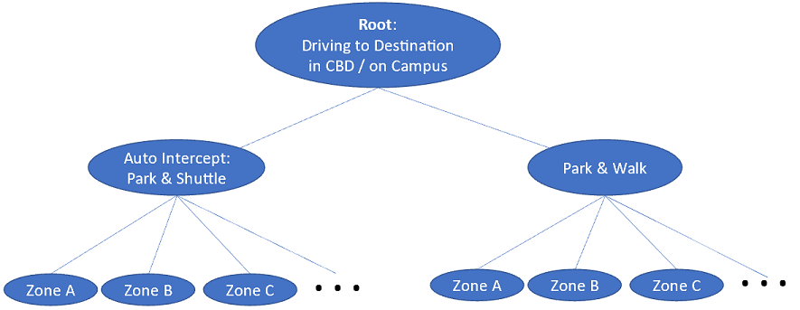
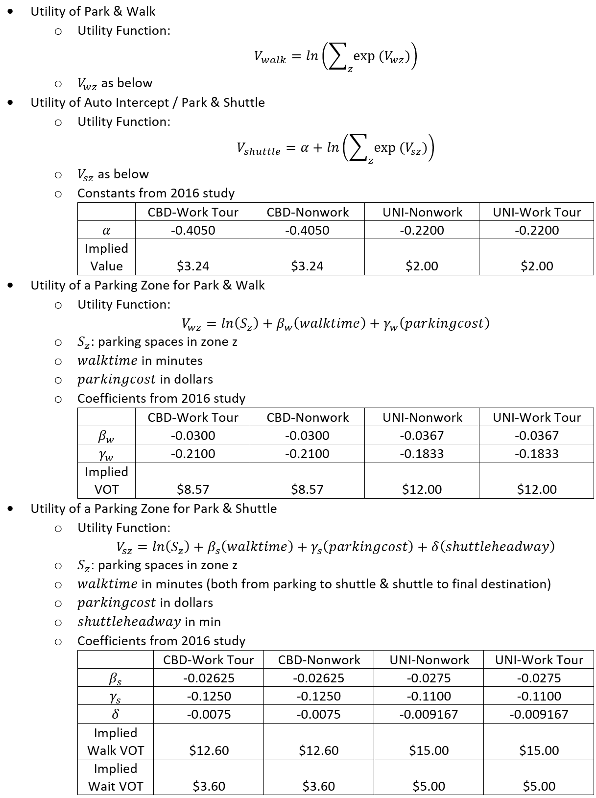

```{r setup, include=FALSE}
knitr::opts_chunk$set(echo = FALSE)
options(dplyr.summarise.inform = FALSE)
options(scipen = 999)

library(knitr)
library(kableExtra)
```

## Introduction

The parking model component of the TRMG2 determines where auto travelers will
park and either walk or take transit to their ultimate destination.  The model
is only applied to CBD and campus areas where parking is generally limited and
paid for.

In the TRMG2, the results of the parking model influence both mode and
destination choices, which means travelers react realistically to changes in
both parking availability and price. The advanced non-home-based model also
means that a zone with severely limited parking cannot generate many auto
non-home-based trips. This increases model accuracy in parking-constrained areas
like Chapel Hill.

## Design

The parking model is applied at the end of the demand model stream, just before
assignment. Trip matrices in origin-destination format from the preceding
demand models are combined across purposes maintaining only segmentation between
trips on work tours and trips on non-work tours (and maintaining SOV and HOV for
assignment classes – but applying the same models to them).

The model is adapted from the one estimated as part of the 2016 Triangle Region
Parking Behavior Study but reformulated for application in the regional model.
The estimated model did not include the lowest level choices of parking zone,
which Caliper has added. In addition, the TRMG2 model only includes "Park and
Walk" and "Auto Intercept" options ("Drive and Park" and "Drive, Park & Shuttle"
in the 2016 study). The regional model handles transit upstream in the mode
choice model. However, for the auto intercept mode, the modeled transit system
is used directly for path building. This ensures travelers see accurate options
rather than asserted average headways and fares.

This design is a departure from the previous generation of the TRM in grouping
the Auto Intercept mode as part of the parking choices at the end of the model
stream rather than as part of the main mode choice model. The 2016 study
supports this structure as evidenced by nesting parameters less than one for its
Auto nest which included both the "Drive and Park" and the "Drive, Park &
Shuttle" modes. This structure and original nesting coefficient in the 2016
study imply that travelers view the auto intercept mode as a parking strategy
and not a main mode choice.

```{r, out.width="75%", fig.show='hold',fig.align='center'}

```

The applied parking model in the TRM is a two-level, nested logit combined
parking mode and destination choice model. Various coefficient values and
implied values of time differ from those in the 2016 report for a number of
reasons including that the RP to SP scaling has been applied here, these numbers
correct an error in one table in the 2016 report, and because the values of time
reported in the 2016 report were generally scaled in comparison to willingness
to pay transit fare.

```{r, out.width="90%", fig.show='hold',fig.align='center'}

```

