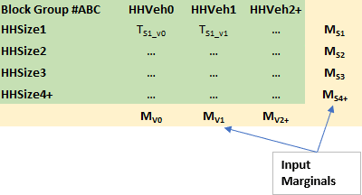

Background and Literature Review
================================

Creating a synthetic population, or in other words, enumerating a complete set
of households and persons (with key attributes) for a modeling region is a
necessary first step for the application of advanced travel models such as
hybrid trip-based models and Activity Based Models (ABM).

The synthesized household and person characteristics reflect the distribution of 
key variables in the study region and match observed marginal distributions at 
an aggregate level.

Having access to detailed person and household characteristics in the model
opens the door for model estimation to include a range of variables that define
trip and travel making behavior. Even for traditional trip-based models,
development of a synthetic population and household database can help generate
various cross-tabulations at desired geographic levels that may not be available
otherwise.

For the TRM, a population synthesis forms the core basis for applying a
state-of-the-art hybrid travel demand model. The aim of the synthesis is focused
on matching both household and person marginals at the Traffic Analysis Zone
(TAZ) level. Another crucial requirement is a solution that is practical to
apply and runs in minutes without sacrificing accuracy of the results. To that
end, the updated population synthesis procedure in TransCAD 9.0 is employed.

This documentation briefly summarizes the basic idea of population synthesis,
some of the advancements made in recent years and points the reader to published
literature for additional details. It also details the creation of disaggregate
curves, which convert aggregate zonal data into targets for the synthesis
process. The technical approach for population synthesis in the TRM is briefly
illustrated, following details regarding the application. Finally, the results
of the application are demonstrated.

Basic Idea (Simple IPF)
----------

The basic idea of population synthesis is best illustrated by Figure 1. In
simple forms of population synthesis, there are two inputs: disaggregate
household (HH) and person seed tables and HH marginals summarizing the
distribution of key characteristics of HH at some aggregate level of geography.

The seed data tables consist of a sample of household (HH) and person records,
typically obtained from a survey of the study region, and tagged to a high-level
geography such as Public Use Microdata Areas (PUMAs). Public Use Microdata
Sample (PUMS) data from the American Community Survey (ACS) typically forms this
seed, although this sample can be enhanced by incorporating data from a travel
survey and reweighing the combined records.

Various aggregate marginals, typically ACS marginals at the census block or
block group level in the base year or sometimes at higher levels of geography
for future years provide control totals that the synthesized databases must
match. It is also a well-accepted practice to fit curves using the census
marginal distributions, which can then be applied to generate marginals at a
TAZ level for example. These TAZs are usually smaller
than census block groups but larger than census blocks.


**Figure 1 Simple population synthesis process flow diagram**

An Iterative Proportional Fitting (IPF) step then estimates the number of each
type of household (identified in the seed) to be generated for each of the
smallest geographic entities. This is achieved by identifying the number of
households of each type that will add up to various household marginals. This is
best illustrated for a single block group using the schematic in Figure 2. In
this example, the two classifications of interest are HH by Size and HH by
Number of Vehicles. The row and column marginals highlighted in yellow are the
input control totals and the goal of the process is to fill in the cells of the
matrix (i.e. the values TS1_V0 etc.) such that the row and column totals are
respected. The value TS1_V0 represents the number of single person, zero car HHs
that need to be synthesized for this block group.



**Figure 2 IPF**

The term “Nested” in Figure 1 indicates that the household marginals may
themselves be specified at different (but nested) geographies: for example, the
vehicle ownership marginals may be at the traffic analysis zone (TAZ) level
while the income marginals may be at the level of Census blocks or block groups.
Nested synthesis will drill all the marginals down to a common geography
(usually the smallest/finest among all input geographies.

Finally, for each smallest geographic entity, the required number of households
of each type determined by IPF are sampled or drawn from the surveyed (seed)
households using externally supplied (initial) weights (generally based on the
survey sampling). The selected households are accumulated in a HH output file,
and all persons living within each sampled household are automatically copied
into a person output file. Together, the HH and person files comprise the
synthetic population once the sampling is complete.

The most important drawback of this process is the lack of control on person
marginals. Since the algorithm only controls for household variables, the
obtained distribution of person attributes in any given zone is largely a
lottery. There is no guarantee that the chosen households will yield, for
instance, the correct distribution of age, gender, etc., in the synthetic
population. This can have adverse effects from a modeling application
perspective, for example if the distributions of working-age persons, students
or seniors are incorrect.  

Person Marginals and Iterative Proportional Updating (IPU)
--------------------------------------------------------

The Iterative Proportional Updating (IPU) process (Xe et al, 2009) has been
proposed and applied (most notably in PopGen) as a way of matching person
marginals while essentially retaining the simplicity of the IPF framework. In
this approach, before sampling households for a particular geographic entity
(zone) using the initial weights in the seed, these sampling weights are first
adjusted (or raked) to explicitly match both household and person marginals for
the zone. In this process, note that the same seed household(s) may be weighted
differently for different zones, which adds precision compared to the use of *a
priori* weights supplied externally. Further, this household re-weighting may be
applied at a different (usually more aggregate) geography than that used for
simulating the population. A modified version of the published approach in the
literature using IPU is applied to the TRM region and is discussed in detail in
the next section.

Other Techniques
----------------

Several optimization methods have also been published in the literature. For a
general literature review, see Ramadan and Sisiopiku, 2019. While these methods
might tackle certain issues of the IPU approach, these methods tend to be
customized. Owing to the nonlinear and non-convex nature of the resulting
formulation, the performance can be problem dependent and can result in long run
times, local optima, and sensitivity to the scale of the objective function.

# Disaggregate Curves

```{r setup, include=FALSE}
knitr::opts_chunk$set(echo = FALSE)
options(dplyr.summarise.inform = FALSE)
options(scipen = 999)

library(tidyverse)
library(plotly)
library(knitr)
library(kableExtra)
source("R/load_census_data.R")
source("R/calc_shares.R")
```

```{r load census data, include=FALSE}
shapes <- load_census_data()

acs_bg <- shapes$acs_bg
acs_tract <- shapes$acs_tract
dec_bg <- shapes$dec_bg

taz <- sf::read_sf("data/input/tazs/master_tazs.shp") %>%
  st_transform(crs = st_crs('+proj=longlat +datum=WGS84'))
taz <- st_transform(taz, st_crs(acs_bg)) %>% st_make_valid()
```

The first step in synthesizing the population of residents in the TRMG2 is to 
develop univariate or one-dimensional marginal distributions describing the 
population in each zone based on the limited demographic variables forecast 
for each zone, typically averages. In other words, the model starts by 
determining the number of single person, two person, three person, etc., 
households in each zone based on the average household size in the zone. 

Rather than use stratification curves to convert simple zonal input variables
such as average household size into a distribution of households by size, 
some travel model population synthesizers require the user to supply the 
number of households by size. However, this puts a considerable burden on 
data development for future year scenarios which is difficult for agencies 
lacking staff dedicated to demographic forecasting. 

Therefore, to keep the data development burden as light as possible, Caliper has
retained the approach of using stratification curves in the TRMG2, although the
specific implementation has changed. These curves simply encode information on
the extent to which, for example, a zone with 3.5 persons-per-household on
average will have a high percentage of 3- and 4-person households and a zone
with an average of 1.5 persons-per- household will have more 1- and 2-person
households.

In the Triangle, the marginal distribution curves estimated are:

  * Size (1-4+)
  * Income
    * Low: \$0 - \$24,999
    * Medium-Low: \$25,000 - \$74,999
    * Medium-High: \$75,000 - \$149,999
    * High: \$150,000 and above
  * Workers (0-3+)
  
These curves are estimated from Census data, and the data is taken from
different data products and geographies depending on availability. For example,
the data needed to estimate the worker curve is only available from the American
Community Survey (ACS) product known as the Census Transportation Planning
Package (CTPP). Vehicle and income information is available from the ACS 5-year
file directly, and size information is available from multiple products.

```{r, include=FALSE}
# Read in worker data from CTPP table A112109 at the TAZ level.
# It isn't available from the ACS at anything below tract, which is too coarse.
ctpp_tbl <- read_csv(
  "data/input/census_data/2012_2016_ctpp_workers.csv", skip = 2
) %>%
  rename(variable = `Number of Workers in Household 6`, value = Households) %>%
  select(RESIDENCE, variable, value) %>%
  mutate(
    variable = case_when(
      variable == "Total, number of workers in household" ~ "hh_tot",
      variable == "0 workers" ~ "wrk0",
      variable == "1 worker" ~ "wrk1",
      variable == "2 workers" ~ "wrk2",
      variable == "3 workers" ~ "wrk3", 
      variable == "4-or-more workers" ~ "wrk4"
    )
  ) %>%
  filter(!is.na(variable)) %>%
  spread(key = variable, value = value) %>%
  filter(hh_tot > 0)
```

## Household Size

The base year zonal SE data contains a range of zonal average household sizes,
as shown by the blue histogram bars below. The Census block group histogram,
shown in orange, has a similar range of household sizes which makes it a good 
candidate for model estimation. Although the differing level of aggregation 
between block groups and zones results in the distribution having different 
dispersion or variance, the fact that both distributions are centered on the 
regional average of 2.5 persons per household implies their consistency. 

```{r size range, warning=FALSE}
se_tbl <- read_csv(
  "data/output/se_data/se_2016.csv",
  col_types = cols(
    .default = col_double(),
    Type = col_character()
  )
) %>%
  filter(Type == "Internal")

# se data
se_tbl <- se_tbl %>%
  mutate(pph = HH_POP / HH)

# census
size <- dec_bg %>%
  as.data.frame() %>%
  filter(hh_tot > 0) %>%
  select(GEOID, hh_tot, hh_pop, siz1:siz7) %>%
  mutate(
    avg_size = hh_pop / hh_tot,
    siz4 = siz4 + siz5 + siz6 + siz7
  ) %>%
  select(-c(siz5, siz6, siz7)) %>%
  gather(key = size, value = n, siz1:siz4) %>%
  mutate(share = n / hh_tot)

plot_ly() %>%
  add_trace(
    data = se_tbl, x = ~pph, type = "histogram", name = "Model",
    alpha = .6, bingroup = 1, nbinsx = 50
  ) %>%
  add_trace(
    data = size, x = ~avg_size, type = "histogram", name = "Census",
    alpha = .6, bingroup = 1
  ) %>%
  layout(
    title = "Average Household Size",
    xaxis = list(
      title = "Persons per Household"
    ),
    yaxis = list(
      title = "Count"
    ),
    barmode = "overlay"
  )
```

```{r mean_size}
# calculate
mean_size <- calc_mean_share(size, "avg_size", "size", bin = 0.1) %>%
  spread(group, share) %>%
  rename(avg_size = bin) %>%
  ungroup() %>%
  mutate(avg_size = round(avg_size, 1))

# Manual adjustments
adjustment_table <- tribble(
  ~avg_size, ~siz1, ~siz2, ~siz3, ~siz4,
  1,         1,     0,     0,     0
)
mean_size <- bind_rows(mean_size, adjustment_table) %>%
  arrange(avg_size)

mean_size <- mean_size %>% gather(size, share, -avg_size)

# smooth and predict
size_min <- 1
size_max <- 4
size_functions <- fit_models(
  mean_size, "avg_size", "size", 
  x = seq(size_min, size_max, 0.01),  degree = 3
) %>%
  rename(avg_size = avg, size = group)

# Check that the shares of each bin add to 1, which they will not after 
# rounding. Adjust the category with the largest share to correct.
size_functions <- size_functions %>%
  group_by(avg_size) %>%
  mutate(
    max = ifelse(share == max(share), 1, 0),
    diff = 1 - sum(share),
    share = round(share + diff * max, 4)
  ) %>%
  select(-c(max, diff)) %>%
  ungroup()

spread_size <- size_functions %>%
  pivot_wider(names_from = size, values_from = share)

# vars for bullet list below
siz1 <- round(
  mean_size %>% filter(avg_size == 2.3, size == "siz1") %>% .$share, 2)
siz2 <- round(
  mean_size %>% filter(avg_size == 2.3, size == "siz2") %>% .$share, 2)
siz3 <- round(
  mean_size %>% filter(avg_size == 2.3, size == "siz3") %>% .$share, 2)
siz4 <- round(
  mean_size %>% filter(avg_size == 2.3, size == "siz4") %>% .$share, 2)
```

<p>
In the graph below, each green dot is the share of 1-person households in a
block group based on the block group's average household size. (Click on the 
siz2, siz3, and siz4 entries in the legend to the right of the chart to turn 
them off and focus on the green, 1-person households.) Multiple block groups 
that have the same average household size will usually have slight differences 
in their shares of 1-person households. For example, block groups with an 
average household size of 2.0 generally have 37-47% 1-person households; 
whereas, block groups with close to 3.5 persons per household on average 
typically have only 5-15% 1-person households. The same is true of the dots 
of different colors representing 2-, 3-, and 4+ households. A polynomial 
equation is fit to each set of colored dots. For any average household size, 
these polynomials can be evaluated to determine the percent of households in
each size category.

For example, for a zone with an average household size of 2.3, the percent of
households by size would be:

- 1-person: `r siz1` (green curve)
- 2-person: `r siz2` (orange curve)
- 3-person: `r siz3` (purple curve)
- 4-person: `r siz4` (pink curve)

```{r fig_size, echo=FALSE, warning=FALSE}
p <- ggplot(data = NULL, aes(x = avg_size, y = share, color = size)) +
  geom_point(data = size, alpha = 0.5) +
  geom_line(data = size_functions, size = 2) +
  xlab("Average Household Size") +
  scale_color_brewer("Size", type = "qual", palette = "Dark2") +
  scale_x_continuous(lim = c(1, 3.5)) +
  theme_bw()

ggplotly(p) %>%
  layout(
    title = "Persons by Average Size",
    margin = list(t = 50)
  )
```

<p>
At the extremes of average household size, manual edits were required to adjust
curve behavior due to the low number of observations in
these ranges. This same treatment was applied to create all marginal tables.

The model implements the curves above using a look-up table. The table below
shows a segment of rows from the look-up table the model uses to dis-aggregate
zonal data into households by size.

```{r show_size_lookup, results = "asis", achor = "table"}
a <- size_functions %>%
  mutate(
    size = gsub("siz", "", size),
    size = paste(size, "-person", sep = "")
  ) %>%
  rename(`Average Household Size` = avg_size) %>%
  spread(size, share)

a %>%
  filter(`Average Household Size` %in% seq(2.00, 2.06, .01)) %>%
  kable(caption = "Household Size Lookup Table, Sample Rows") %>%
  kable_styling()
```

## Household Workers

The chart below shows the model and Census distributions of workers per
household. The Census Transportation Planning Program (CTPP) data was used at
the TAZ level, which contains more than enough observations to estimate a robust
curve across the entire range of zonal values. The distribution of workers per
household in the zonal data (developed from ACS) has a slightly different
distribution from the older CTPP data set. However, the difference is small
enough (1.2 vs 1.3 workers per household) that the CTPP data is deemed suitable
for use.

```{r worker range, warning=FALSE}
# se data distribution
se_tbl <- se_tbl %>%
  mutate(
    Workers = Pct_Worker / 100 * HH_POP,
    wph = Workers / HH
  )

# census distribution
workers <- ctpp_tbl %>%
  mutate(
    avg_workers = (wrk0 * 0 + wrk1 * 1 + wrk2 * 2 + wrk3 * 3 + wrk4 * 4) / hh_tot,
    wrk3 = wrk3 + wrk4
  ) %>%
  select(-wrk4) %>%
  filter(hh_tot > 0) %>%
  select(RESIDENCE, avg_workers, hh_tot, wrk0:wrk3) %>%
  group_by(RESIDENCE) %>%
  gather(key = workers, n, wrk0:wrk3) %>%
  mutate(share = n / hh_tot)

plot_ly() %>%
  add_trace(
    data = se_tbl, x = ~wph, type = "histogram", alpha = .6,
    name = "Model", bingroup = 1, nbinsx = 50
  ) %>%
  add_trace(
    data = workers, x = ~avg_workers, type = "histogram", alpha = .6,
    name = "Census", bingroup = 1
  ) %>%
  layout(
    title = "Average Workers per Household",
    xaxis = list(
      title = "Workers per Household"
    ),
    yaxis = list(
      title = "Count"
    ),
    barmode = "overlay"
  )
```

```{r mean_workers}
# calculate
mean_workers <- calc_mean_share(
  workers, "avg_workers", "workers", bin_width = 0.1
) %>%
  spread(group, share) %>%
  rename(avg_workers = bin)

# manual adjustments
adjustment_table <- tribble(
  ~avg_workers, ~wrk0, ~wrk1, ~wrk2, ~wrk3,
  0,            1,     0,     0,     0
)
mean_workers <- bind_rows(mean_workers, adjustment_table) %>%
  arrange(avg_workers)

mean_workers <- mean_workers %>% gather(workers, share, -avg_workers)

# smooth and predict
min = 0
max = 2
workers_functions <- fit_models(mean_workers, "avg_workers", "workers", 
                             x = seq(min, max, 0.01),  degree = 3) %>%
  rename(avg_workers = avg, workers = group)

# Check that the shares of each bin add to 1, which they will not after 
# rounding. Adjust the category with the largest share to correct.
workers_functions <- workers_functions %>%
  group_by(avg_workers) %>%
  mutate(
    max = ifelse(share == max(share), 1, 0),
    diff = 1 - sum(share),
    share = round(share + diff * max, 4)
  ) %>%
  select(-c(max, diff)) %>%
  ungroup()

spread_workers <- workers_functions %>%
  pivot_wider(names_from = workers, values_from = share)
```

<p>
Similar to the household size curve, Census data tables were
used to calculate the share of households by number of workers at different
levels of zonal average workers per household. The chart below shows the raw data from CTPP TAZ as well as the fitted curves.

```{r fig_worker, warning=FALSE}
p <- ggplot(data = NULL, aes(x = avg_workers, y = share, color = workers)) +
  geom_point(data = workers, alpha = 0.5) +
  geom_line(data = workers_functions, size = 2) +
  xlab("Average Household workers") +
  scale_color_brewer("Workers", type = "qual", palette = "Dark2") +
  scale_x_continuous(lim = c(0, 2)) +
  theme_bw()

ggplotly(p) %>%
  layout(
    title = "Workers by Average Workers",
    margin = list(t = 50)
  )
```

## Household Income

Before developing curves for median income, Caliper had to determine appropriate income groups. ACS data is already grouped to some extent,
which limits the possible breakpoints in the final grouping. The histogram
below shows the final income grouping and count of households in each group.

```{r, fig.height=4}
inc_histo <- acs_bg %>%
  summarize(across(starts_with("inc"), sum)) %>%
  st_drop_geometry() %>%
  select(-inc_med) %>%
  pivot_longer(cols = everything(), names_to = "inc", values_to = "count") %>%
  mutate(
    inc = gsub("inc", "", inc),
    inc = gsub("p", "", inc),
    inc = as.numeric(inc),
    inc = case_when(
      inc <= 25 ~ "0-25",
      inc <= 75 ~ "25-75",
      inc <= 150 ~ "75-150",
      TRUE ~ "150+",
    ),
    inc = factor(
      inc,
      levels = c("0-25", "25-75", "75-150", "150+"),
      ordered = TRUE
    )
  ) %>%
  group_by(inc) %>%
  summarize(count = sum(count))
  

plot_ly() %>%
  add_trace(
    data = inc_histo, x = ~inc, y = ~count, type = "bar", name = "Model",
    alpha = .6
  ) %>%
  layout(
    xaxis = list(title = "Income Range"),
    yaxis = list(title = "Households")
  )
  
```

```{r}
# regional median income
# source: https://data.census.gov/cedsci/table?q=median%20income&g=0500000US37063,37135,37183&tid=ACSST1Y2019.S1901&hidePreview=true
regional_median <- 65317

se_tbl <- se_tbl %>%
  mutate(inc_ratio = Median_Inc / regional_median)

# census distribution
income <- acs_bg %>%
  as.data.frame() %>%
  filter(hh_tot > 0, !is.na(inc_med)) %>%
  mutate(
    inc_ratio = inc_med / regional_median,
    incL = inc10 + inc15 + inc20 + inc25,
    incML = inc30 + inc35 + inc40 + inc45 + inc50 + inc60 + inc75,
    incMH = inc100 + inc125 + inc150,
    incH =  inc200 + inc200p
  ) %>%
  select(GEOID, hh_tot, inc_ratio, incL:incH) %>%
  group_by(GEOID) %>%
  gather(key = income, value = n, incL:incH) %>%
  mutate(share = n / hh_tot)
```

The prediction metric used for income is the median income of the zone divided
by the regional median (`r paste0("$", format(regional_median, big.mark =
","))`). This provides an estimation range on a similar scale as the other
variables for convenience ( e.g. 0.2 - 3.0 instead of \$0 - \$250,000).

The chart below shows the distribution of model and Census data. The model has
zones without households (and thus zero median income), but otherwise the
distributions are similar, particularly allowing for the slightly different
levels of aggregation.

```{r}
plot_ly() %>%
  add_trace(
    data = se_tbl, x = ~inc_ratio, type = "histogram", name = "Model",
    alpha = .6, bingroup = 1, nbinsx = 50
  ) %>%
  add_trace(
    data = income, x = ~inc_ratio, type = "histogram", name = "Census",
    alpha = .6, bingroup = 1
  ) %>%
  layout(
    title = "Model TAZ Income Ratio",
    xaxis = list(
      title = "Zonal Median Income / MSA Median Income"
    ),
    yaxis = list(
      title = "Count"
    ),
    barmode = "overlay"
  )
```


```{r}
# calculate
mean_income <- calc_mean_share(income, "inc_ratio", "income", bin_width = 0.1) %>%
  spread(group, share) %>%
  rename(inc_ratio = bin) %>%
  filter(!is.na(inc_ratio)) %>%
  ungroup() %>%
  mutate(inc_ratio = round(inc_ratio, 1))

# manual adjustments
# adjustment_table <- tribble(
#   ~inc_ratio, ~incH, ~incL, ~incMH, ~incML,
#   0,          1,     0,     0,      0
# )
# mean_income <- bind_rows(mean_income, adjustment_table) %>%
#   arrange(avg_vehicles)

mean_income <- mean_income %>% gather(income, share, -inc_ratio)

# smooth and predict
inc_min <- .22
inc_max <- 2.5
income_functions <- fit_models(mean_income, "inc_ratio", "income", 
                             x = seq(inc_min, inc_max, 0.01),  degree = 4) %>%
  rename(inc_ratio = avg, income = group)

# Check that the shares of each bin add to 1, which they will not after 
# rounding. Adjust the category with the largest share to correct.
income_functions <- income_functions %>%
  group_by(inc_ratio) %>%
  mutate(
    share = round(share, 4),
    max = ifelse(share == max(share), 1, 0),
    diff = 1 - sum(share),
    share = round(share + diff * max, 4)
  ) %>%
  select(-c(max, diff)) %>%
  ungroup()

spread_income <- income_functions %>%
  pivot_wider(names_from = income, values_from = share) %>%
  relocate(incL, .after = inc_ratio) %>%
  relocate(incML, .after = incL) %>%
  relocate(incMH, .after = incML)
```
 
<p>
The chart below shows the raw observations and fitted curves.

```{r}
p <- ggplot(data = NULL, aes(x = inc_ratio, y = share, color = income)) +
  geom_point(data = income, alpha = 0.5) +
  geom_line(data = income_functions, size = 2) +
  xlab("Ratio of Median Income to Regional Median Income") +
  scale_color_brewer("Income", type = "qual", palette = "Dark2") +
  scale_x_continuous(lim = c(inc_min, inc_max)) +
  theme_bw()

ggplotly(p) %>%
  layout(title = "Income by Proportion of Regional Income") %>%
  layout(margin = list(t = 30))
```

## Household Vehicles

The TRMG2 model utilizes an auto-ownership model, and as a result does
not require disaggregation by household vehicles.

```{r write_output, eval=FALSE}
write_csv(spread_size, "data/output/disagg_model/size_curves.csv")
write_csv(spread_workers, "data/output/disagg_model/worker_curves.csv")
write_csv(spread_income, "data/output/disagg_model/income_curves.csv")
```

IPU Approach for TRM
====================

The population synthesis for TRM is based on an updated algorithm in TransCAD 9.
While earlier versions of TransCAD did have a population synthesis procedure, it
was based on basic IPF as illustrated in the previous section without explicit
control of person marginals. The IPU based enhancements provide a natural
framework for incorporating person marginals.

Figure 3 shows the general schematic of the IPU enhancement over IPF. Note the
additional inserted steps which creates the loop. As mentioned earlier, the
HH seed weights are adjusted for each zone to match HH and person marginals for
that zone.


**Figure 3: Population Synthesis with IPU**

The weight adjustment for each zone is performed using an incidence table shown
in Figure 4. The rows in the table are HHs from the seed database. This can
include either all the HHs in the seed or only include those that belong to the
parent geography (PUMA) of the zone. The latter is used in TransCAD.

The columns represent the various marginal categories. For each row (HH), the
values in the corresponding column indicates which category the HH belongs to or
how many people in the household belong to the category. For instance, assume
one HH category with 2 marginal columns (HH Veh 0 and HH Veh 1+) and one person
category with three age marginals, then the HH with ID 5 has 1+ vehicles and has
three persons (two in age category 2 and one in age category 3). Multiplying the
‘HH Veh 0’ column vector (cell by cell) with a corresponding weight vector will
yield the number of HHs with zero vehicles in the zone. This is indicated in the
‘Column Sum’ row. The ‘Marginals’ row consists of the target values for this
zone.


**Figure 4: Incidence Table and IPU Adjustment**

One iteration of the IPU consists of a complete set of column adjustments from
left to right, one at a time. During each adjustment of the IPU, an adjustment
factor is calculated as a simple ratio of the marginal total divided by the
column total. This adjustment factor is used to multiply the current weight of
all HHs that contributed to the total in the column. The weights of the other
HHs are left unmodified.

For instance, the column sum for the first column is 3 whereas the desired
marginal is 35. Thus, a factor of 35/3 = 11.67 is applied to the first three
households that contributed totals to the first column. After the first column
adjustment, HHs 1, 2 and 3 have a weight of 11.67 while the other HHs have a
weight of 1. In the second iteration, the column sum (using the current weights
is 5) and the marginal is 65. Thus, the adjustment factor of 13 (=65/5) is used
to multiply the weights of the last five HHs to bring them up to 13. After this
adjustment, HHs 1 to 3 still have a weight of 11.67 as they did not contribute
to the second column sum. This mechanism is repeated for one column at a time.

Once a single iteration across all the columns is complete, an objective
function is calculated and checked for convergence. The objective function
calculations are general and can take many forms. For example, the fit
$\delta_{j}$ for column $j$ may be computed as:


$$\delta_{j} = \frac{\sum_{i}^{}\left\lbrack w_{i}d_{\text{ij}} \right\rbrack - m_{j}}{m_{j}}$$

where $w_{i}$ is the weight of household $i$; $d_{\text{ij}}$ is the
contribution of household $i$ to column $j$; and $m_{j}$ is the marginal
for column $j$. The overall objective function $\delta$ could then be
expressed as:

$$
\begin{matrix}
\delta = \sum_{j}^{}\left( \delta_{j} \right)^{2}
\end{matrix}
$$

In the incidence table above, $\delta = (3 - 35)/35$ for the first column and
its absolute value is 0.914. After obtaining the $\delta$ values for each
column, the second equation then can be used to determine the objective function
as 4.563.

The adjustment continues from left to right starting at the first column if the
desired convergence metric has not been achieved.

Key Differences between TransCAD’s IPU and existing IPU approaches (PopGen)
---------------------------------------------------------------------------

The originally published IPU method in the literature was implemented in the
PopGen software. In this original IPU algorithm, two separate IPFs are run, one
on the HH marginals and one on the person marginals. The results of the second
IPF on the person marginals are used to populate detailed person-level columns
in the incidence table that specify the full, joint distribution of person  
attributes. So, if there are multiple marginals to match such as HHs by Size
(1,2,3,4+), number of vehicles (0,1,2,3+) and number of workers (1,2,3,4+) and
Persons by Age (assume 5 categories) and Gender, then the incidence table has 64
HH columns, one for each combination of size, vehicles and workers and 10 person
columns, one for each age category and gender combination. Since only
one-dimensional marginals are typically known, the marginal values in the
incidence tables come from the IPF run and the second IPF must be performed on
the person characteristics to populate the person columns.  

This version of IPU has several drawbacks. One, the process is slow, especially
if there are a lot of marginals and the process can take hours. Second, the
solution introduces a couple of other issues that must be dealt with and these
issues have garnered significant attention in literature. One of these issues is
a zero-cell problem, where the seed data is stretched thin and certain
combinations may not be present in the seed. The second issue is a zero-marginal
problem, but this can be solved by replacing the zero in the marginal row with
epsilon values. There are several techniques to address these issues, which have
been implemented in PopGen, but addressing these issues adds further runtime.

In the TransCAD approach, for want of minimizing these issues and at the behest
of maintaining fast run times, only the one-dimensional marginals are used to
form the incidence table. Thus, in the hypothetical example, the incidence table
has 12 HH columns (as opposed to 64) and 7 person columns (as opposed to 10).

The enhanced TransCAD IPU method has been applied successfully for
the Las Vegas RTC model as well as the California Central Coast ABM model. In
both cases, not only was the match to the one-dimensional marginals (especially
the persons) very close but the joint distribution observed from the synthesis
was also very reasonable. These applications take a fraction of time compared
to that reported on similar sized problems with the original IPU method or
optimization methods.

The next few sections discuss the application of the procedure to the TRM and 
the results.

Application for the TRM
=======================

For the TRM region, several marginals have been synthesized at the zone layer.
These marginals at the HH level include:

-   HHs by Size (1, 2, 3 and 4+)

-   HHs by number of workers (0, 1, 2 and 3+)

-   HHs by Income

    -   Low [0, 35000)

    -   Medium Low [35000, 75000)

    -   Medium High [75000, 150000)

    -   High 150000+

Several disaggregate curves developed from the ACS 2014-2018 data are used to
obtain these marginals from zonal average values which are more easily supplied
for future scenarios than full distributions. The curves determine the
respective marginal splits based on average HH size, ratio of TAZ income to
regional income and average number of workers in the TAZ.

Person marginals matched include

-   Persons by Age Group

    -   Children (0 < age <= 18)

    -   Adults under 65 (18 < age < 65)

    -   Seniors (age >= 65)

The zone socio economic data contains derived percentages of kids, adults under
65 and seniors (from ACS data). These are used to compute the three age
classifications above that serve as person marginals.

The seed HH and person data come from ACS PUMS that have 45,825 and 110,146
records respectively. The seed data has the necessary fields to generate
indicators for the various dimensions being matched using the fields NP (Number
of persons in the HH), HHINC and ADJINC (to compute the income classification)
in the HH database; and the fields Age and ESR (Employment Status) in the person
database to compute the age classification and the number of workers in the HH.

There are 18 PUMA zones in the TRM region and Figure 5 highlights some key data.
The TAZ boundaries are shown in green and the colored areas are the PUMA zones.


**Figure 5: PUMAs in the TRM region**

The running time of the entire population synthesis for the TRM (with the IPU)
is **2 minutes**. These running times represent a small fraction of running
times reported for similar problems in the literature.

Results
=======

The population synthesis on TRM generates 731,913 HHs and 1,783,548 persons. The
number of HHs in the SE data is 731,875 and the population in households is
1,826,973. The percentage errors are 0.005% on the HHs and 2.38% on the overall
population. 

The fit to various marginals is illustrated in the following charts. The input
SE marginals (by TAZ) are on the x-axis while the synthesized marginals
(aggregated to TAZ) are plotted on the y-axis. Each graph also includes the
regression line equation, R-squared and the percent RMSE.


**Figure 6: Comparison of HH Size Marginals**


**Figure 7: Comparison of HH Workers Marginals**


**Figure 8: Comparison of HH Income Marginals**

As expected, the fit to the HH marginals shown in Figures 6, 7 and 8 are pretty
much spot on. This is testament to the IPF procedure having converged
successfully.

The subsequent charts show fit to person marginals. Figures 9 and 10 show fit to
total HH population and the fit to total number of workers. Since the HH
marginals match HH by size and HH by number of workers, these charts are also
expected to show a great fit.


**Figure 8: Comparison of total HH population**


**Figure 9: Comparison of workers**

Note that for a run without the IPU option, the fit to the marginals in Figures
6 to 9 are pretty similar.

Figures 10 to 12 show the fit of population in three age categories. Unlike the
previous figures, the incorporation of the IPU here makes a significant
difference. In these graphs, the orange line and the orange points represent the
fit of the TRM population synthesis with the IPU option enabled. The blue line
and the blue points represent the fit of a similar population synthesis without
the IPU options. These graphs are produced to illustrate both the good fit of
the final TRM synthesis and illustrate the efficacy of the IPU.


**Figure 10: Comparison of Number of Kids (IPU vs Non-IPU)**


**Figure 11: Comparison of Adults Under 65 (IPU vs Non-IPU)**


**Figure 12: Comparison of Seniors (IPU vs Non-IPU)**

Conclusion
==========

The updated population synthesis for the TRM is based on the improved population
synthesis available in TransCAD 9, which is a variant of the population
synthesis with IPU published in the literature. The TAZ marginals are derived by
fitting curves on the ACS 2014-2018 data. The ACS PUMS for these years form the
seed databases for the synthesis procedure. The marginals matched include HH by
Size, HH by Number of Workers, HH by Income Group and Persons by Age. The
population synthesis is extremely fast with a run time of 2 minutes and the fit
to the marginals is great. The resulting synthesis is demonstrative of the
person and HH characteristic distribution in the TRM region and can be
confidently used in the application of the state-of-the-art hybrid model for the
Triangle Region.

References
==========

Balakrishna, R., S. Sundaram and J. Lam. An Enhanced and Efficient Population
Synthesis Approach to Support Advanced Travel Demand Models. Presented at the
99th TRB Annual Meeting.

Ye., X., K. Konduri, R.M. Pendyala, B. Sana and P. Waddell. A methodology to
match distributions of both household and person attributes in the generation
of synthetic populations. Presented at the TRB annual meeting, 2009.

Ramadan, O.E., and V.P. Sisiopiku. A Critical Review on Population Synthesis for
Activity- and Agent-Based Transportation Models. Transportation Systems Analysis
and Assessment, IntechOpen, 2019.