```{r setup, include=FALSE}
knitr::opts_chunk$set(echo = FALSE)
options(dplyr.summarise.inform = FALSE)
options(scipen = 999)

library(tidyverse)
library(caliperR)
library(sf)
library(knitr)
library(kableExtra)
```

## Intro

This document summarizes the destination choice (DC) models estimated using the
household travel survey and other data from the Triangle region. These models
are a part of the G2 hybrid travel demand model. Within the hybrid framework,
destination choice is modeled in the aggregate for each of several trip
purposes. Vehicle sufficiency and income are used to further refine the market
segments.

General modeling aspects:

- Destinations are predicted at the zone (TAZ) level. 
- Based on an analysis of the region, the zones were logically grouped into the following clusters:

```{r, out.width= "100%", out.height="80%"}
knitr::include_graphics("img/dc/clusters.png")
```

- Nested Logit (NL) models were estimated for the home-based trip purposes while
multinomial logit (MNL) models were estimated for non-home-based trip purposes.
NL models were attempted for the latter set of purposes but did not provide
justifiably better models.
- All models were estimated using Larch (Newman, 2021).

### A Note on Model Fit

While the fit of a discrete choice model is popularly assessed through the
rho-squared and asymptotic rho-squared statistics, they are tricky to interpret
in the context of destination choice. The presence of the size term complicates
the calculation of the base log-likelihood, LL(0), which forms the reference for
the rho-squared calculation. LL(0) is based on the assumption that all
alternatives are equally likely. However, the zone alternatives in destination
choice are not truly elemental alternatives but are themselves rather the
collection of individual destinations available within that zone, in practice
measured by employment. The size variable with its default coefficient of 1 must
therefore be included when determining LL(0). This provides an automatic
“improvement” of LL(0) over the case where the size variable is not included.
Consequently, rho-squared falls. This should not be taken as automatic evidence
of a poorer model. Another important consideration is that the rho-squared
statistic decreases as the region is divided into more zones, but it is not
reasonable to prefer models with fewer zones over models with more zones. The
selection of the model should still (as always) be based on the reasonableness
of its coefficients, their statistical significance, and model sensitivities.

### Distance Terms

Destination choice models in practice sometimes include distance and its
mathematical transforms as part of each zone’s utility function. While these
terms might improve statistical fit, they can cause unintended sensitivities
that are counter-intuitive. These effects stem from the non-monotonic shape of
the combined distance effect, as illustrated by the example below. Taken from a
real-world model, this graph clearly shows how farther zones are less attractive
only up to a certain threshold. Beyond that distance, the effect is reversed so
that the farthest zones become more attractive (all else being equal).

```{r, out.width= "115%", out.height="115%"}
knitr::include_graphics("img/dc/distance_poly.png")
```

Such models only remain valid for the range of distances observed in the survey
data used for model estimation. Scenarios involving longer distances will
produce unintuitive model sensitivities.

Another concern with distance variables is their static nature. Since they are
not responsive to congestion, they cannot capture destination choice sensitivity
to this key real-world and policy-relevant aspect.

In addition, distance is highly correlated with travel times so that the
inclusion of both variables often causes difficulties in model estimation as the
algorithm struggles to uniquely split the effects between them.

For the above reasons, the destination choice models for TRM rely on travel
times, logsums by mode type, and other skims rather than distance-based
variables.

## Home-Based Trips

The TRM region features eight home-based trip types as determined by an analysis
of the survey. Each type's destination choice model is a nested logit model
with zone clusters as nests. Each cluster has its constituent zones under it:

```{r, out.width= "115%", out.height="115%"}
knitr::include_graphics("img/dc/model_structure.png")
```

Various model structures and specifications were tried:

- FLAT: No nesting
- SEQUENTIAL CHOICE OF CLUSTER + WITHIN-CLUSTER ZONE
  - Sub-model approach 1: Separate sub-model for each cluster
  - Sub-model approach 2: Common model across all clusters (with appropriate availabilities)
- NESTED (simultaneous choice of cluster and zone)

The nested specification outperformed all other approaches.

### Utility Specification

The utility specification for the DC models consisted of the following set of
variables. Not all these variables are present in every specification since
variables are retained depending on the significance of their estimated
coefficients or owing to strong a priori assumptions.

#### Size Term

This is the natural logarithm of the attractions at a destination zone, which
itself is a linear combination of employment variables and their coefficients.
These coefficients are simultaneously estimated with other parameters. Since it
is required that these coefficients be positive, the utility formulation
specifies coefficients that are then exponentiated. Successful estimation
requires that one of these attraction variable coefficients is fixed. The
estimation also provides a coefficient for the size variable, which
theoretically should be between 0 and 1.

#### Mode Choice Logsums

Using mode choice root logsums typically presents a problem in destination
choice. The root logsum value is dominated by the auto nest which washes out
effects from non-dominant modes. For example, drastically improving the
transit accessibility to a particular zone will not affect the probability of
choosing that zone if the transit logsums are dwarfed by the auto logsums. To
circumvent this issue, separate auto, transit, and non-household auto logsums
from the respective nests are used in the TRM specifications. The logsums are
segmented by vehicle sufficiency market segments for added explanatory power.
Work trip logsums are further distinguished by high- and low-income segments.
Finally, note that there is no auto logsum component for the zero-vehicle
households market segment.

#### Others

- **4D measures**: Several 4D measures such as transit accessibility, hospital
accessibility, walk accessibility, employment densities are considered.
- **Time Coefficient(s)**: The auto times corresponding to the latest model
skims are attached depending upon the time of day the respondent made the trip.
A time coefficient is estimated in each specification.
- **Intra-Cluster effects**: Intra-Cluster coefficients are estimated if the
home and the chosen zone are within the same cluster (nest).
- **Intra-Zonal effect**: A coefficient is estimated to boost the utility of
choosing the same zone as the origin.
- **Cluster Nest coefficients**: A nest coefficient for each of the 12 clusters
is estimated.
- **Cluster ASCs**: Likewise, alternative specific constants (ASCs) are
  estimated for each cluster.

The rich utility specification allows the model to capture the decision-making
process of choosing destination zones and capturing cluster-to-cluster flows.

### General Estimation Observations

ASCs were estimated for all but one of the clusters, but only the significant
ASCs were kept for each model purpose. The ASCs with poor significance generally
had values close to zero. Further, these ASCs are very small in magnitude,
confirming that the model’s explanatory power is derived from other variables
with the ability to capture location choice behavior.

Intrazonal effects were strong for a few of the purposes, but intra-cluster
effects were very strong implying that there is a tendency to choose locations
that belong in the same cluster as the home zone.

Mode choice logsums for the auto model (and for vehicle sufficient
segments) caused unrealistic signs as well as much poorer model fit. This can be
explained by the fact that these logsums are primarily driven by auto skims,
which are already a part of the utility equation. Hence most specifications do
not have an auto logsum.


### W_HB_W

W_HB_W corresponds to trips that are part of a work tour, have one end at home,
and the other end at work. This segment captures trips that directly connect the
home and work locations and translates to the HBW trip purpose in traditional
models. Destination choice in this context relates to the long-term decision of
work location, to which work trips are made with regularity.

#### Estimated coefficients and t statistics

```{r, fig.align='center', out.width="90%"}
knitr::include_graphics("img/dc/w_hb_w_all1.png")
knitr::include_graphics("img/dc/w_hb_w_all2.png")
```

```{r, fig.align='center', out.width="60%"}
knitr::include_graphics("img/dc/w_hb_w_all3.png")
knitr::include_graphics("img/dc/w_hb_w_all4.png")
```

ASCs were estimated for all but one of the clusters. Several had values close to
zero with poor significance and were dropped. The ASCs are very small in
magnitude, confirming that the model’s explanatory power is derived from other
variables and is sensitive to changes in model inputs.

Intrazonal and home cluster effects are strong. Residents of Cary, Durham,
Chapel Hill, and Garner often live and work in the same cluster. Similar effects
are also observed for the peripheral clusters toward the northeast and south.

Root mode choice logsums are significant for workers from zero-auto households,
capturing a coupling with access to public transit modes. Using root mode choice
logsums for the other auto sufficiency markets caused unrealistic signs as well
as much poorer model fit. This can be explained by the fact that these logsums
are primarily driven by auto skims, which are already a part of the utility
equation (the "Time" term).

Hospitals are major sources of employment in the region, and accessibility to
hospital jobs helps drive work destination attractiveness. Transit and walk
accessibilities are also drivers of a zone’s attractiveness for work tours.

Most of the cluster nest coefficients are significantly different from 1, which
means the nested structure is justified. Research Triangle Park is a special
cluster (very low residential land use, very high technology employment, etc.).
It's coefficient is effectively 1, which implies an MNL-type sub-nest.

The size variables are stratified by income using the percentage of low and high
paying jobs in each zone. This is how the model pairs high-income workers (e.g.
in the Regency area of Cary) with high-paying jobs in RTP. This stratification
is critical for accurate work flows in the region.

#### Double constraint and attraction model

All trip types (other than work) are singly-constrained. This means that the row
sums of the resulting trip table will match starting productions, but column
sums will not necessarily be proportional to the amount of employment in each
zone. As an example, for two zones with the same employment, the more accessible
zone will attract more trips.

For work trips, a traditional assumption to make is that each job of the same
type must attract the same work trips - even if the zone is in a remote
location. The justification for this assumption has weakened in recent years
with the rise in telecommuting, flex schedules, and other changes, but the TRMG2
model still implements double constraint for work trips. In the context of
destination choice models, this is achieved by assigning each zone a "shadow
price". This extra term in the utility equation is adjusted in an iterative
fashion to match predicted attractions.

These predicted attractions come from a regression model estimated from the
survey data.

```{r, include=FALSE}
trips_raw <- read_csv("data/output/_PRIVATE/survey_processing/trips_processed.csv")
se_raw <- read_csv("data/input/dc/se_2016.csv")
se_raw$TAZ <- unclass(se_raw$TAZ)
taz_raw <- st_read("data/input/tazs/master_tazs.shp")
```

```{r}
trips <- trips_raw %>%
  filter(tour_type != "H", !is.na(a_taz), !is.na(p_taz)) %>%
  select(trip_type, a_taz, choice_segment, weight = trip_weight_combined) %>%
  mutate(choice_segment = ifelse(grepl("ih", choice_segment), "ih", "il")) %>%
  group_by(trip_type, choice_segment, a_taz) %>%
  summarize(trips = sum(weight, na.rm = TRUE)) %>%
  pivot_wider(names_from = trip_type, values_from = trips) %>%
  mutate(across(everything(), ~replace_na(., 0)))

taz_features <- se_raw %>%
  mutate(
    UnivStudents = StudGQ_NCSU + StudGQ_UNC + StudGQ_DUKE + StudGQ_NCCU,
    UnivBuildingS = BuildingS_NCSU + BuildingS_UNC + BuildingS_DUKE + BuildingS_NCCU,
    IsUniv = ifelse(UnivStudents > 0 | UnivBuildingS > 0, 1, 0),
    Industry_EH = Industry * PctHighPay/100,
    Industry_EL = Industry * (1 - PctHighPay/100),
    Office_EH = Office * PctHighPay/100,
    Office_EL = Office * (1 - PctHighPay/100),
    Service_RL_EH = Service_RateLow * PctHighPay/100,
    Service_RL_EL = Service_RateLow * (1 - PctHighPay/100),
    Service_RH_EH = Service_RateHigh * PctHighPay/100,
    Service_RH_EL = Service_RateHigh * (1 - PctHighPay/100),
    Service = Service_RateLow + Service_RateHigh,
    Retail_EH = Retail * PctHighPay/100,
    Retail_EL = Retail * (1 - PctHighPay/100),
  ) %>%
  select(
    TAZ, HH, HH_POP,
    Industry, Office, Service_RateLow, Service_RateHigh, Retail,
    Industry_EH,
    Industry_EL,
    Office_EH,
    Office_EL,
    Service,
    Service_RL_EH,
    Service_RL_EL,
    Service_RH_EH,
    Service_RH_EL,
    Retail_EH,
    Retail_EL,
    IsUniv, UnivStudents, UnivBuildingS, CollegeOn,
    K12, Hospital, EmpSpaces, StudSpaces, OtherSpaces
  ) %>%
  left_join(trips, by = c("TAZ" = "a_taz")) %>%
  filter(!is.na(choice_segment))

dist_equiv <- taz_raw %>%
  select(TAZ = ID, district = DISTRICT) %>%
  mutate(TAZ = as.numeric(TAZ)) %>%
  st_drop_geometry()
district_features <- taz_features %>%
  left_join(dist_equiv, by = "TAZ") %>%
  select(-TAZ, -IsUniv, district, everything()) %>%
  group_by(district, choice_segment) %>%
  summarize(across(everything(), ~sum(., na.rm = TRUE))) %>%
  filter(!is.na(district)) %>%
  ungroup()
```

```{r}
w_hb_w <- taz_features %>%
  select(choice_segment, W_HB_W_All, HH:OtherSpaces, Service) %>%
  filter(W_HB_W_All > 0)

il <- w_hb_w %>%
  filter(choice_segment == "il")

ih <- w_hb_w %>%
  filter(choice_segment == "ih")
```

```{r}
# combined model
model <- lm(
  W_HB_W_All ~ Industry + Office_EL + Retail + I(Service_RH_EL + Service_RL_EL) +
    Office_EH + I(Service_RH_EH + Service_RL_EH) + 0,
  data = w_hb_w
)


# Calibration: all rates multiplied by 2.45 after seeing total Ps and As
broom::tidy(model) %>%
  mutate(
    estimate = estimate * 2.45,
    term = case_when(
      term == "Office_EL" ~ "Low-Pay Office",
      term == "Office_EH" ~ "High-Pay Office",
      term == "I(Service_RH_EL + Service_RL_EL)" ~ "High-Pay Service",
      term == "I(Service_RH_EH + Service_RL_EH)" ~ "Low-Pay Service",
      TRUE ~ term
    ),
    term = factor(
      term,
      levels = c(
        "Industry",
        "High-Pay Office",
        "Low-Pay Office",
        "High-Pay Service",
        "Low-Pay Service",
        "Retail"
      ),
      ordered = TRUE
    ),
    estimate = round(estimate, 2),
    std.error = round(std.error, 2),
    statistic = round(statistic, 2)
  ) %>%
  arrange(term) %>%
  kable() %>%
  kable_styling(full_width = FALSE)
# summary(model)
```

During model application, predicted attractions are always scaled to match
predicted productions before applying double constraint. As a consequence, the
attraction model should predict total attractions that is close to predicted
productions. This is referred to as PA balance ("production/attraction balance").
If it does not, adding employment to a zone will have unexpectedly high (or low)
impacts on total zonal attractions.

The coefficients in the table above were multiplied by 2.45 during model
calibration to achieve the appropriate PA balance of 1.0. 

### W_HB_O

W_HB_O trips are part of a work tour, have one end at home,
and the other end at a non-work location. This segment captures trips that
directly connect the home to an intermediate stop on the way to or from work and
is part of the HBO trip purpose in traditional models. Destination choice in
this context relates to a short-term decision of intermediate stop location.

#### Estimated coefficients and t statistics

```{r, fig.align='center', out.width="90%"}
knitr::include_graphics("img/dc/w_hb_o_all1.png")
knitr::include_graphics("img/dc/w_hb_o_all2.png")
```

```{r, fig.align='center', out.width="60%"}
knitr::include_graphics("img/dc/w_hb_o_all3.png")
```

ASCs were estimated for all but one of the clusters, but only the significant
ones were retained. These ASCs are very small in magnitude, confirming that the
model’s explanatory power is derived from other variables and is sensitive to
changes in model inputs.

The model has a sophisticated approach to travel time. Travel time is more
important up to the first 30 minutes. Excess time beyond this threshold is gets
a slight discount. This reflects a difference in the behavior for these longer
trips, which are dominated more by what is at the destination rather than the
time to get there.

Home cluster effects are strong for residents of Cary, Garner, Raleigh, Southern
Durham and the southeastern periphery. People in these clusters often stop in
the same cluster for their intermediate activities.

The public transit mode choice logsum is significant for certain segments like
zero-vehicle households. Non-household auto logsums (primarily taxis and TNCs)
are also significant.

The number of households is a major factor in the calculation of the size
variable, reflecting the inclusion of personal visits in this trip purpose.
Logically, the retail and service employment also help drive trips to specific
destinations. Income-based stratification of employment did not make a
difference in model performance.

Most cluster nest coefficients are significantly different from 1, so the
nested structure is justified. As with W_HB_W, RTP is an exception to this.

### W_HB_EK12

W_HB_EK12 corresponds to trips that are part of a work tour, have one end at
home, and the other end at a school. This segment captures trips that directly
connect the home to school on the way to or from work and translates to the HB
School trip purpose in traditional models. It includes workers dropping
off/picking up children on the way to/from work, and young workers who attend
school.

#### Estimated coefficients and t statistics

```{r, fig.align='center', out.width="90%"}
knitr::include_graphics("img/dc/w_hb_ek12_all1.png")
```

```{r, fig.align='center', out.width="60%"}
knitr::include_graphics("img/dc/w_hb_ek12_all2.png")
```

School location choice is driven by travel time and school enrollment. Some of
the cluster nest coefficients are significantly different from 1, so the nested
structure is justified for those clusters. The remaining zones are treated as
top-level choices (MNL).

### N_HB_OME

N_HB_OME corresponds to trips that are not part of a work tour, have one end at
home, and the other end at an “other” activity that involved the spending of
money whether shopping, eating out, or personal business. This segment is close
to the HBO (Home-Based Other) trip purpose in traditional models.

#### Estimated coefficients and t statistics

```{r, fig.align='center', out.width="90%"}
knitr::include_graphics("img/dc/n_hb_ome_all1.png")
knitr::include_graphics("img/dc/n_hb_ome_all2.png")
```

```{r, fig.align='center', out.width="60%"}
knitr::include_graphics("img/dc/n_hb_ome_all3.png")
```

As with the previous models, cluster-based ASCs are small and only applied to
a few clusters, which implies a model that is appropriately sensitive. Travel
time is again more important up to the first 30 minutes. Excess time beyond this
threshold is perceived as being less onerous.

Attractions are driven by retail and service employment, which is appropriate
for shopping/maintenance trips.

### N_HB_OMED

N_HB_OMed corresponds to trips that are not part of a work tour, have one end at
home, and the other end at a medical-related activity. This segment would have
been rolled into the HBO (Home-Based Other) trip purpose in traditional models.

#### Estimated coefficients and t statistics

```{r, fig.align='center', out.width="90%"}
knitr::include_graphics("img/dc/n_hb_omed_all1.png")
knitr::include_graphics("img/dc/n_hb_omed_all2.png")
```

```{r, fig.align='center', out.width="60%"}
knitr::include_graphics("img/dc/n_hb_omed_all3.png")
```

A zone's accessibility to a hospital is a strong predictor in this model. This
captures the important clustering of doctor's offices, clinics, and pharmacies
around major hospitals.

Travel time above 30 minutes has almost no impact on desintation choice. This is
an encouraging result. People traveling long distances to see a specialist are
not impacted by travel time in a major way.

Attractions are driven by retail and service employment, with an added boost
from service employment related to the presence of hospitals.

### N_HB_K12

N_HB_K12 corresponds to trips that are not part of a work tour, have one end at
home, and the other end at a school. This segment would have been part of the HB
School trip purpose in traditional models.

#### Estimated coefficients and t statistics

```{r, fig.align='center', out.width="90%"}
knitr::include_graphics("img/dc/n_hb_k12_all1.png")
```

```{r, fig.align='center', out.width="60%"}
knitr::include_graphics("img/dc/n_hb_k12_all2.png")
```

This model has a strong fit and is primarily based on K12 enrollment and travel
time (as expected). Additionally, the negative coefficient on the Durham and
Northeast clusters means that (all else equal) zones in that cluster are less
likely to be chosen. The positive intrazonal coefficient is expected given
the tendency for people to attend schools near their home.

### N_HB_OD_Long

N_HB_ODLong corresponds to trips that are not part of a work tour, have one end
at home, and the other end at an “other” activity that is at least 30 minutes
long. Visiting a friend is one example of this trip type. This segment would
have been rolled into the HBO (Home-Based Other) trip purpose in traditional
models.

#### Estimated coefficients and t statistics

```{r, fig.align='center', out.width="90%"}
knitr::include_graphics("img/dc/n_hb_od_long1.png")
knitr::include_graphics("img/dc/n_hb_od_long2.png")
```

```{r, fig.align='center', out.width="60%"}
knitr::include_graphics("img/dc/n_hb_od_long3.png")
```

The penalty on travel time above 30 minutes is reduced as seen in multiple trip
types. The positive coefficient on walk accessibility means that these trips
are more attracted to zones in areas that are more dense. Home cluster effects
are strong, meaning that most of these trips stay within the home cluster.
Employment, school enrollment, and residential population all are significant
components of the size term. This reflects the catch-all nature of this trip
type.

### N_HB_OD_Short

N_HB_OD_Short corresponds to trips that are not part of a work tour, have one end
at home, and the other end at an “other” activity shorter than 30 minutes in
duration. This segment would have been rolled into the HBO (Home-Based Other)
trip purpose in traditional models.

#### Estimated coefficients and t statistics

```{r, fig.align='center', out.width="90%"}
knitr::include_graphics("img/dc/n_hb_od_short1.png")
knitr::include_graphics("img/dc/n_hb_od_short2.png")
```

```{r, fig.align='center', out.width="60%"}
knitr::include_graphics("img/dc/n_hb_od_short3.png")
```


The attenuation on for drive time above 20 minutes is not as strong as other
trip types. This indicates that these trips are likely just trying to reach the
nearest attraction that satisfies the trip purpose. Similarly, home cluster
effects and the intrazonal term are strong meaning that people stay nearby.
These effects are reasonable, reflecting that people are not inclined to travel
longer distances for short activities.

Logsums for household auto, non-household auto, and transit all play an important
role in determining where someone travels. Similar to the N_HB_OD_Long trip,
the size term is made up of employment, enrollment, and household population.

## Non-Home-Based trips

The non-home-based trip purposes are multinomial logit (MNL) specifications. The
cluster-based nesting structure did not improve model results and was not
adopted for these purposes. Even so, the cluster-level alternative-specific
constants (ASCs) are included to help capture cluster-level preferences.

The non-home-based trip purposes consist of:

- Work tours
  - W_NH_EK12
  - W_NH_O
  - W_NH_WR
- Non-work tours
  - N_NH_K12
  - N_NH_OME
  - N_NH_O

Recall that non-home-based trips are generated by mode based on the results of
the home-based models. Given this, separate destination choice models have
been estimated by mode. For simplicity and statistical efficiency of model
estimation, the above trip purposes were combined into the following four
categories that combine trip purpose with travel mode:

- NHB Work Tours by Auto
- NHB Non-work Tours by Auto
- NHB Trips by Public Transit
- NHB Trips by Bike/Walk

### NHB Work Auto

This segment corresponds to trips that are part of a work tour, do not have
either end at home, and are associated with the auto mode. Most of this segment
would have been rolled into the NHBW (Non-Home-Based Work) trip purpose in
traditional models.

#### Estimated coefficients and t statistics

```{r, fig.align='center', out.width="90%"}
knitr::include_graphics("img/dc/w_nhb_auto1.png")
```

```{r, fig.align='center', out.width="60%"}
knitr::include_graphics("img/dc/w_nhb_auto2.png")
```

Drive time has the expected negative sensitivity, with times above 30 minutes
penalized to a lesser extent than the first 30 minutes. The generic
intra-cluster effect is strong, which is expected given shorter trip lengths of
NHB trips. Attractions are driven by a variety of employment as well as
school enrollment.

### NHB NonWork Auto

This segment corresponds to trips that are part of a non-work tour, do not have
either end at home, and use the auto mode. This segment would have been rolled
into the NHBO (Non-Home-Based Other) trip purpose in traditional models.

#### Estimated coefficients and t statistics

```{r, fig.align='center', out.width="90%"}
knitr::include_graphics("img/dc/n_nhb_auto1.png")
```

```{r, fig.align='center', out.width="60%"}
knitr::include_graphics("img/dc/n_nhb_auto2.png")
```

The non-work auto trip model looks similar to work, but the inclusion of parking
logsums captures a major difference between the two trip types: work trips are
not impacted by parking variables while non-work trips are.

### NHB Transit

All NHB transit trips are handled with a single destination choice model.

#### Estimated coefficients and t statistics

```{r, fig.align='center', out.width="90%"}
knitr::include_graphics("img/dc/nhb_transit1.png")
```

```{r, fig.align='center', out.width="60%"}
knitr::include_graphics("img/dc/nhb_transit2.png")
```

Both the total time of the trip and the number of transfers are significant
predictors in the attractiveness of destinations accessible by public transit
modes. Transit accessibility of the destination also positively impacts
destination choice, which matches expectations.

### NHB NonMotorized

All NHB non-motorized trips are handled with a single destination choice model.

#### Estimated coefficients and t statistics

```{r, fig.align='center', out.width="90%"}
knitr::include_graphics("img/dc/nhb_nonmoto1.png")
```

```{r, fig.align='center', out.width="60%"}
knitr::include_graphics("img/dc/nhb_nonmoto2.png")
```

As expected, walk distance poses a highly significant deterrent to destinations
that are farther away from the origin. An extra penalty is imposed on
destinations that are more than a mile away. This captures the sharp drop off in
trip lengths beyond one mile in the survey.

Intra-zonal and intra-cluster effects are strong, which also reflects the
short-range nature of non-motorized trips. Finally, the walk accessibility of
the destination is important for zero vehicle households. This captures an
important reality: these households cannot use autos to make trips.

## DC Model Adjustments

During the model calibration stage, further updates to the DC models were
performed to match the model cluster to cluster patterns to the weighted
patterns from the survey. These adjustments can be thought of as the adjustment
to the ASCs of a mode choice model to match aggregated shares.

Given the nested destination choice approach and the assumption behind the
structure, the model lends itself very well to such post process adjustments.
The following parameters were adjusted to try and match the survey patterns. It
is worth mentioning that these post process adjustments turned out to be rather
small, thereby inspiring additional confidence in the estimation results:

- **Cluster ASC values**: For a given purpose, the percent of trips attracted to
each cluster can be determined (both from the model and the survey). The cluster
ASC values can be adjusted to match the aggregated survey percentages. This
additional adjustment for each cluster is the natural logarithm of the ratio of
the target percentage to the model percentage.
- **Intra-Cluster Constants**: The model has provisions for intra cluster
dummies. These dummies can likewise be adjusted to match the normalized
intra-cluster totals from the survey.
- **Intra-Zonal Dummy**: Finally, the specific intra zonal dummy was adjusted
for a few purposes to match the intra-zonal percentages.

While this model form has additional levers to control behavior, the adjustments
made were small and do not meaningfully reduce model sensitivity.

## DC Application

This section is a short note on the application of the destination choice
models in the TRM model framework. In the TRM model, the destination choice is
the higher-level choice which is then followed by the mode choice for a given
purpose, market segment and period. However, the utility equation for the DC
models contains mode choice logsums. Therefore, a three-step process is followed
for each combination of purpose, segment and time period:

- The mode choice model is run for the given purpose, segment and time period,
taking care to use the appropriate time period skim matrices. The output logsum
matrix (by mode, segment and period) and the output mode choice probability
matrix are stored.
- The DC nested choice is run, which produces a zone-zone probability matrix,
such that for each row (zone), the destination probabilities sum to 1. The
determination of this probability matrix itself is the result of the nested DC,
implemented as a two-stage destination choice model with a zone level model and
cluster level model informed by zone-zone DC logsums.
- The trip productions are applied to each row to produce a PA matrix, which are
then further multiplied by the stored mode choice probabilities to produce PA
matrices by mode, purpose, segment and period. The matrices are then combined as
required.

## Validation

### Trip Lengths
The model average trip lengths (miles and minutes) by purpose are compared
against the survey in the tables below. The survey trip lengths and model trip
lengths are computed using the final model skim data for the motorized trips.
The survey trip lengths are computed as weighted averages using trip weights.

```{r, fig.align='center', out.width="90%"}
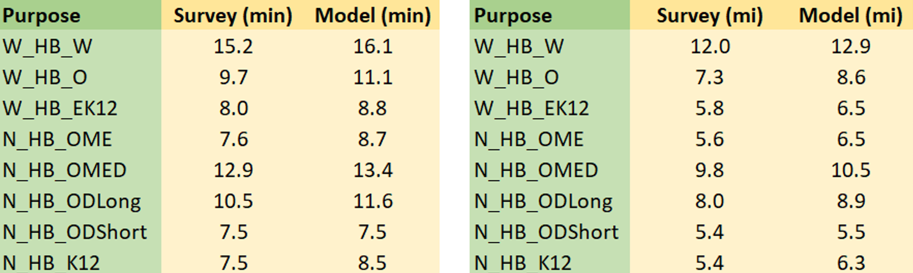
```

The model trip lengths compare favorably with the survey. Note that the
destination choice model predict probability to all zones irrespective of the
distance from the origin and therefore model levers are used to limit the choice
set by purpose based on a threshold time. These levers are input to the model
and may be modified/removed for future scenarios as required.

### Intra-Zonal Percentages

The table below show the intrazonal percentages by purpose for the model and the
survey, which indicates pretty much a spot-on match.

```{r, fig.align='center', out.width="55%"}
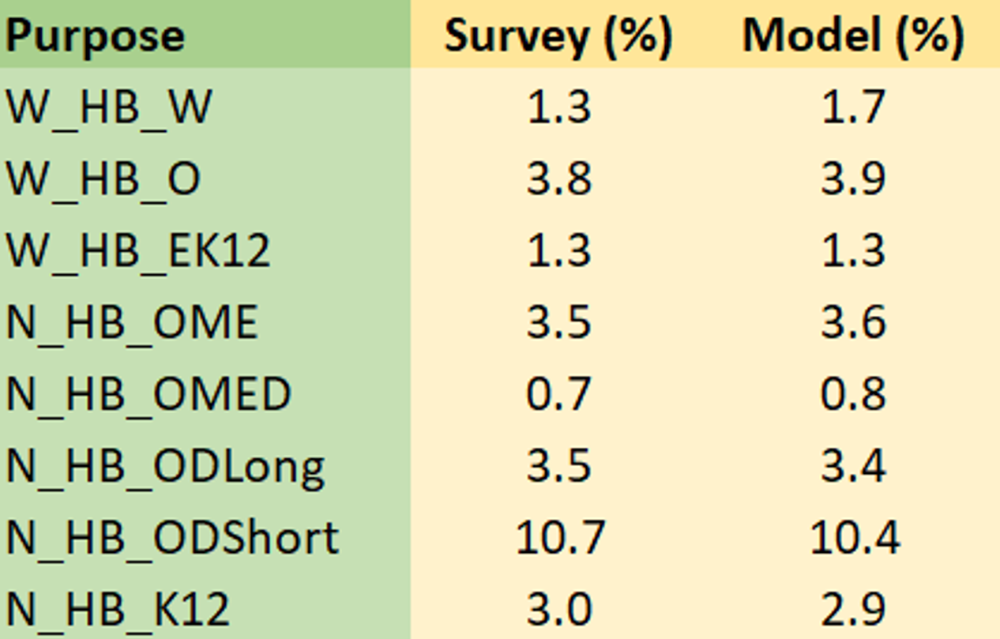
```

### Cluster-to-Cluster Flows

The success of a travel demand model and its usefulness towards meaningful
scenario analysis relies heavily on trip distribution and particularly on the
validity of the cluster-to-cluster flows (or district to district flows). A
model that matches observed cluster to cluster flows generally is successful in
capturing the travel trends in the region and tends itself well to scenario
analysis. Recall that in TRMG2, the top-level choice in the destination choice
model is the choice of the cluster (where the home cluster is favored often) and
then the second level is the choice of the zone within the cluster.

The structure as well as the rich utility specification of the two stage DC
nested model in TRMG2 was instrumental in matching the observed
cluster-to-cluster flows from the survey, thereby inspiring a great deal of
confidence in the model. The following table and charts illustrate the fit of
the model to the observed cluster-to-cluster flows.

#### W_HB_W

The W_HB_W purpose is unique because of shadow pricing employed in the model
application. Regression models were estimated for the trip attractions that are
then used to compute the shadow prices. Therefore, it is expected that the
percentage of trips attracted to each cluster match between the model and the
input attractions as shown below. The small values of the shadow prices however
indicate that the original model without these shadow prices was also reasonably
accurate.

```{r, fig.align='center', out.width="50%"}
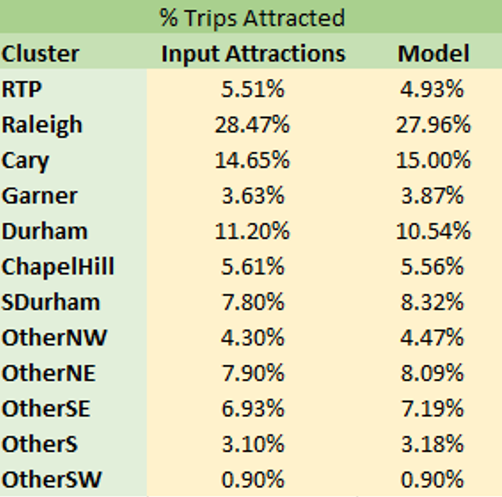
```

The following tables show the cluster-to-cluster percentage comparisons between
the model and the survey. For estimation, only the home to work leg of the trip
was used in the dataset, whereas the model PA totals consist of both the forward
and return trips (in PA format). Therefore, it is not possible to compare exact
numbers but rather look at the percentages of flows from cluster-to-cluster.

The three tables below show the survey cluster-to-cluster percentages, the model
percentages and the differences between the survey and the model respectively in
a matrix format. Note that the last row in each table shows the percent of trips
attracted to each cluster. There are differences for ‘w_hb_w’ because the shadow
pricing matches the attractions derived from the attractions model as opposed to
the survey numbers themselves. For a couple of the clusters, the survey
attractions are different from the input attractions. For instance, the input
attractions indicate that 5.51% of trips are attracted to the RTP cluster
whereas the survey indicates that 7.84% of trips are attracted to the RTP
cluster.

Despite the shadow pricing showing a deviation from the raw survey numbers, the
cluster-to-cluster percentages between the model and survey match very well, and
the differences are small. This is further illustrated in the chart, where each
point represents a cluster pair. The survey percentages and model percentages
from the tables below are used for the x and y axis respectively. Most of the
points are close to the 45-degree line. The regression  line is also plotted,
with a slope of 0.96, an intercept of nearly 0 and a R-squared of 0.94,
indicating an excellent match. Note that only points that were observed in the
survey are plotted.

```{r, fig.align='center', out.width="100%"}
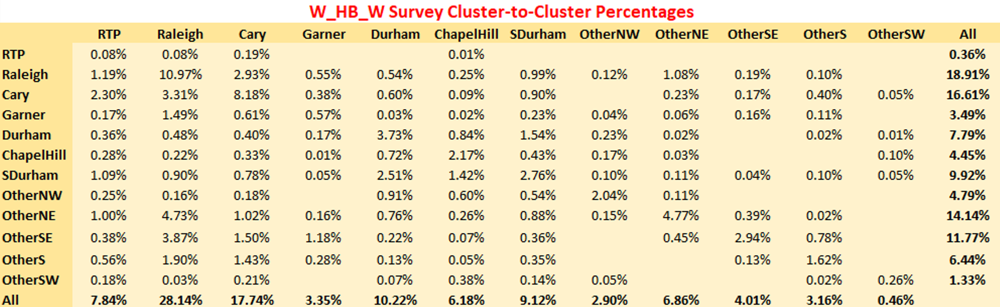
```

```{r, fig.align='center', out.width="100%"}
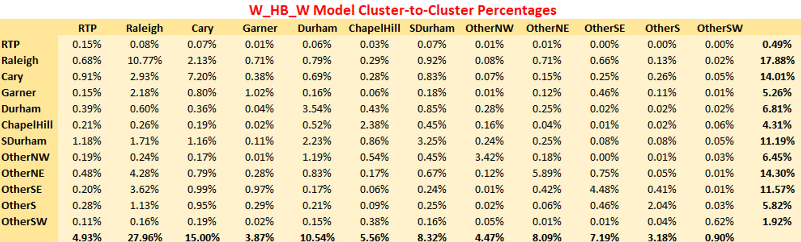
```

```{r, fig.align='center', out.width="100%"}
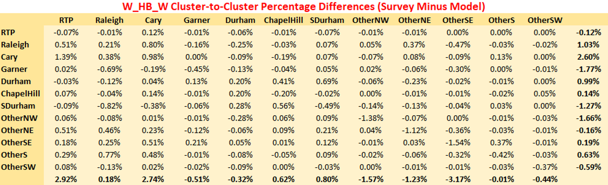
```

```{r, fig.align='center', out.width="100%"}
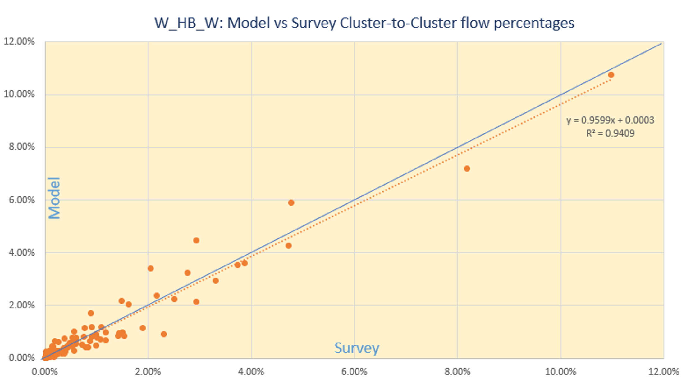
```

#### W_HB_O

Similar plots are shown for W_HB_O. This purpose has no shadow pricing and the
match to the survey cluster-to-cluster flow is excellent.

```{r, fig.align='center', out.width="100%"}
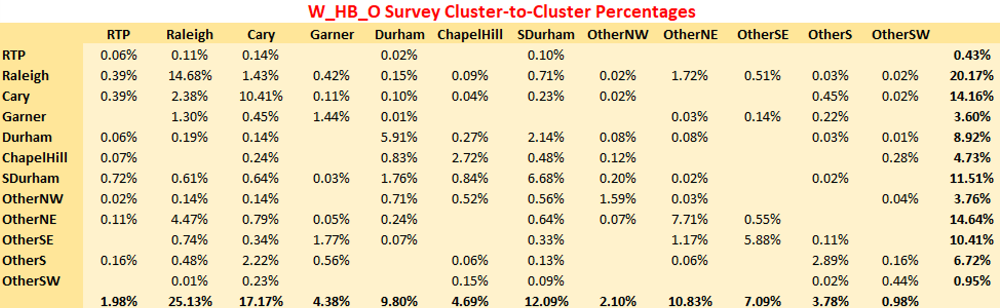
```

```{r, fig.align='center', out.width="100%"}
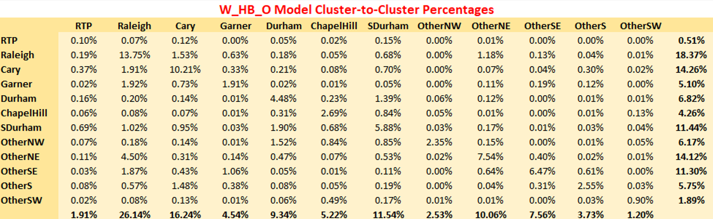
```

```{r, fig.align='center', out.width="100%"}
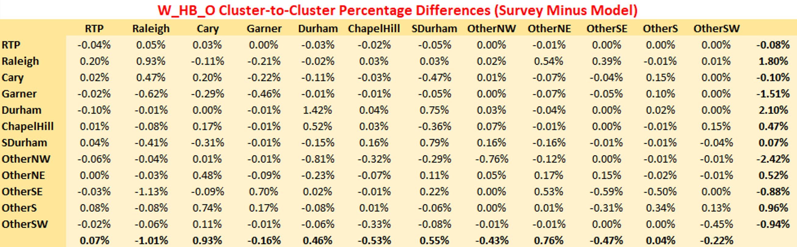
```

```{r, fig.align='center', out.width="100%"}
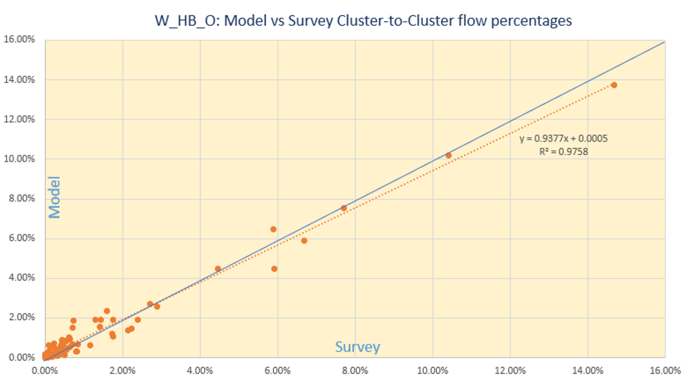
```

#### W_HB_EK12

The model cluster-to-cluster flow patterns match the survey closely for the rest
of the purposes and only the charts are shown. In each chart, each point
represents one cluster pair.

```{r, fig.align='center', out.width="100%"}
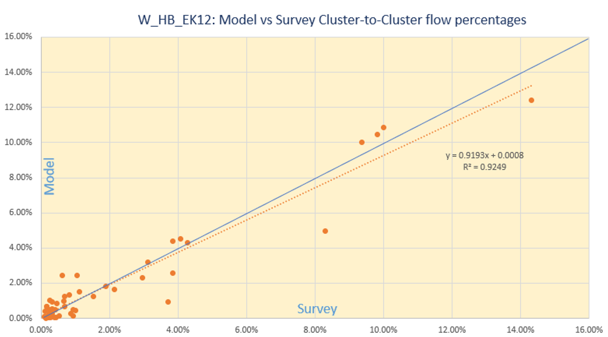
```

#### N_HB_OME

```{r, fig.align='center', out.width="100%"}
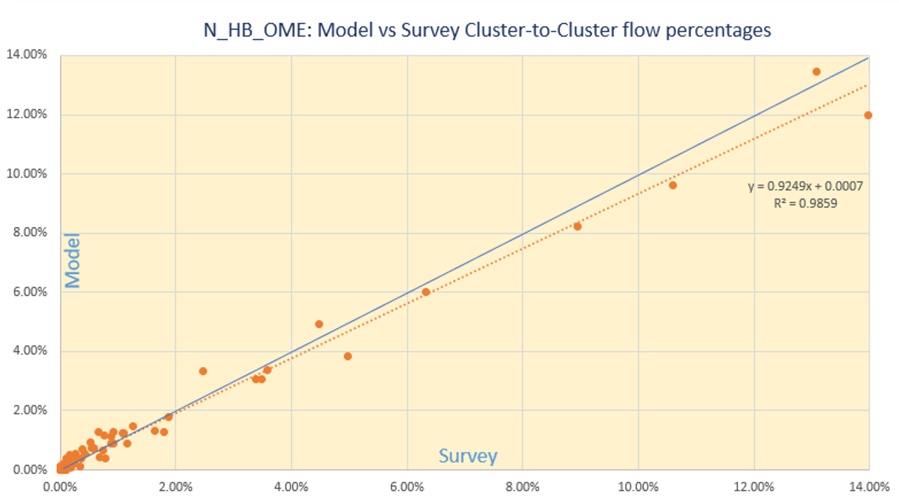
```

#### N_HB_OMED

```{r, fig.align='center', out.width="100%"}
knitr::include_graphics("img/dc/validation/nhbomed_scatter.png")
```

#### N_HB_K12

```{r, fig.align='center', out.width="100%"}
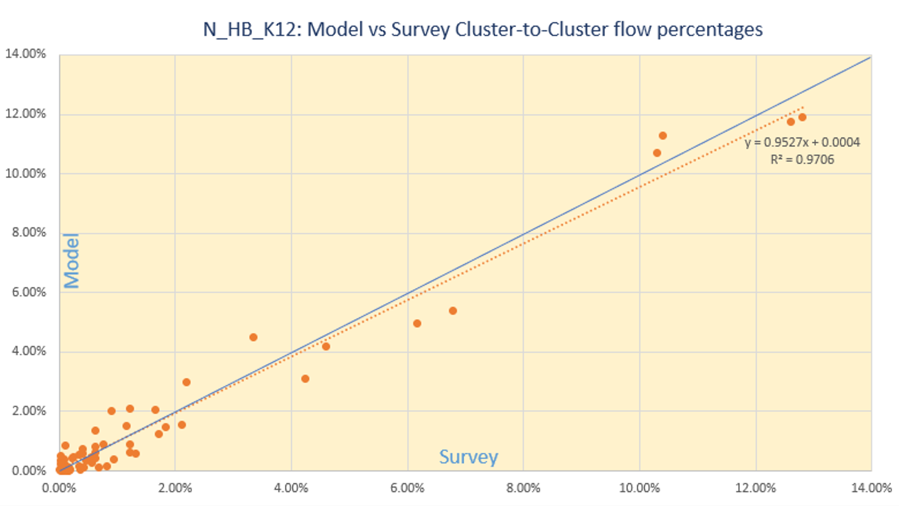
```

#### N_HB_OD_Short

```{r, fig.align='center', out.width="100%"}
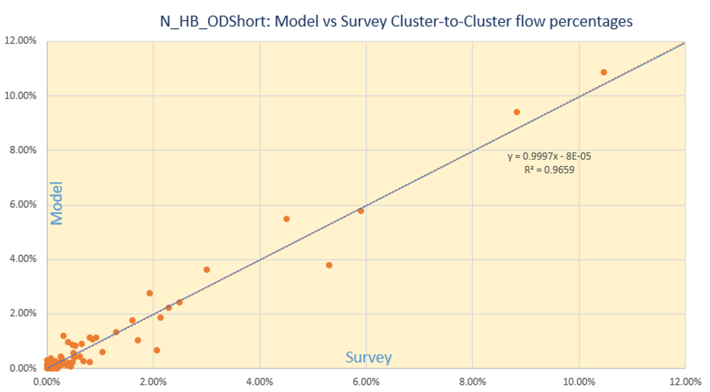
```

#### N_HB_OD_Long

```{r, fig.align='center', out.width="100%"}
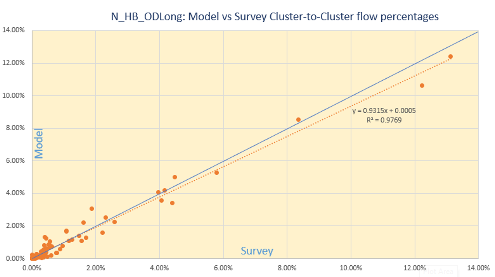
```

All the above graphs indicate that the cluster-to-cluster patterns revealed by
the survey are adhered to in the model (with only a minimal set of adjustments),
which in turn makes the more robust and inspires confidence in the model’s
predictive capability.

### NHB Trip Types

The NHB trips are split by mode and consists of NHB trips on work tours
(designated as W_NH) and NHB trips on non-work tours (designated as N_NH). The
table below shows the comparison of model and survey trip lengths by purpose and
mode.

```{r, fig.align='center', out.width="100%"}
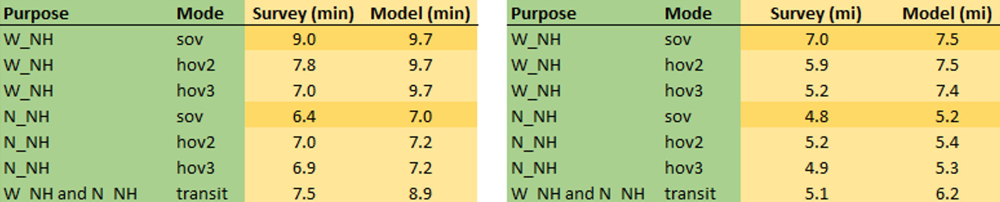
```

A large percentage of these trips are SOV trips (> 85%), for which the model
compares very favorably with the survey.

Although HOV2 and HOV3 trips show a larger discrepancy for NHB trips on work
tours, these make up only 12% of the auto NHB trips on work tours. Likewise, the
transit trips are only a fraction of the overall NHB trips. For these modes, the
confidence in the survey numbers is also not high due to small sample sizes.


## References

1. J. Newman (2021) “Larch: The Logit Architect.” URL: https://github.com/jpn--/larch, Accessed September 1, 2021.
