```{r setup, include=FALSE}
knitr::opts_chunk$set(echo = FALSE)
options(dplyr.summarise.inform = FALSE)
options(scipen = 999)

library(tidyverse)
library(knitr)
library(kableExtra)
```

This document summarizes the mode choice (MC) models estimated using travel
survey and other data from the Triangle region. These are nested logit models
that predict which modes of travel will be used based on factors like travel
time, transit fare, and transit headway. Mode choice models play a crucial role
in the system of travel demand models, not only directly but also through
logsums that are then used to inform destination choices. For more information
on mode choice models, click [here](https://tfresource.org/topics/Mode_choice.html).

## Key Considerations

One of the key modeling requirements for the Triangle region is the focus on
transit usage and ability to analyze the congestion mitigation potential of
future transit projects. To that end, a detailed transit mode choice component
is warranted. In addition to the household travel survey, Caliper had access to
a transit onboard survey. While the proportion of transit trips in the household
survey is in accordance with regional shares, this data alone was not sufficient
to estimate parameters for transit sub-modes. Rather than combine the onboard
survey with the household survey (for various reasons including inconsistency
between trip type), Caliper estimated detailed transit sub-mode models
conditional on the main transit choice using the onboard survey, while the main
mode choice was estimated from the household survey. This is illustrated in
later sections.

A second consideration was the need to measure future transit modes such as bus
rapid transit, light rail, and commuter rail. These modes do not exist today, so
Caliper leaned on FTA/STOPS guidance to develop parameters for these modes as
discussed below.

A key mode identified during exploratory analysis was the Non-HH Auto mode, that
is comprised of ride sharing and rental cars (classified together as AutoPay)
and borrowed cars (e.g. a friend's car and classified as OtherAuto).

Parking was a major consideration for the auto modes, especially in designated
parking districts in the CBD/downtown/university areas of cities in the Triangle
region, where parking space is limited.  The parking submodel is documented on
its own [page](parking.html). 

For Non-Home Based (NHB) trips, the trip mode is conditional based on the mode
of the home-based leg of the tour. Hence mode choice models were not estimated
for these trips. For more information, see the documentation for [Non-Home-Based
Trips](nhb.html).

## Approach

The initial determination was whether to combine the household travel survey
with the on-board survey and subsequently estimate a model using the entire set
of modes (including the transit sub-modes). This would entail potential
re-calculation of the survey weights.

The alternate approach was to estimate conditional transit sub-mode models using
the onboard survey and then estimate a nested mode choice model using the
household survey but fixing the transit sub-mode utility coefficients as
appropriate. Essentially, the logsum computed from the transit nest would be the
key utility component for the main transit alternative. The transit sub-mode
model can also be viewed as a model that predicts transit sub-mode shares
conditional on the main mode being chosen as transit.

A closer look at the onboard survey revealed that while the data regarding the
transit sub-mode was rich, the information regarding the tour type was not
available. Whether trips are work, other or shopping related could be ascertained
from the onboard survey but there was no information regarding tour types or the
overall travel pattern of the individual respondent. Given that the trip
purposes in TRMG2 are designed based on tour type and trip type, records from
the onboard survey could not be matched directly to the TRM trip purpose
definitions. Therefore, the alternate approach of estimating transit sub-models
from the onboard survey was chosen.

Given the above, the mode choice estimation approach for the TRM followed a
two-stage process:

### Stage 1

Estimate transit sub-mode models (nest) for three main trip types (Work, Shop and
Other) from the onboard survey. The transit nest is organized by access mode and
transit mode, which was revealed by the estimation process and is consistent
with the nesting in STOPS. The three access modes are walk, park & ride (PNR)
and kiss & ride (KNR). The modes in the base year include local bus (LB) and
express bus (EB), and these are the only modes with estimated coefficients.

### Stage 2

Estimate a nested model for each trip purpose in TRMG2. The top-level choices
are the main modes namely Auto, Non-HH Auto and Transit. The Auto nest includes
the sub-modes SOV, HOV2 and HOV3. The Non-HH Auto nest includes the modes
AutoPay and OtherAuto.  The appropriate Transit nest is stitched by keeping the
utilities and the coefficients from the transit nest models fixed (essentially
fixing the logsums). For some trip purposes, certain transit access modes were
dropped if there were no observations in the survey. The parameters of the
utility function of the various auto modes, ASCs and nest coefficients for the
top-level alternatives are estimated during the process. Certain key utility
terms common to a particular nest (e.g., Transit) were added to the appropriate
nest alternative (e.g., to the Transit alternative) to capture the fundamental
choice of the main mode. A weighted estimation was performed using the trip
final weights.

The conceptual figure of a typical nested model is presented in the figure. Note
that the utility coefficients and structure for the Transit come from the
estimations in Stage 1 described above. For instance, for the w_hb_w purpose,
where the tour type is work and the trip type is work, the transit nest for the
work transit purpose is used in the final mode choice specification.

```{r, fig.align='center', out.width="90%"}
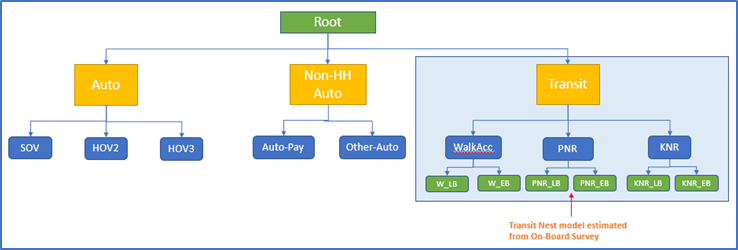
```

In the following sections, the three Transit nest models are first described,
followed by the completed models for each of the TRM trip purposes.

# Transit Submodels

## Trips on Work Tours

- W_HB_W
- W_HB_O

This model is estimated from the onboard survey for work trips. All six
combinations of transit and access mode are considered, and the estimated model
has the structure below, nested by access mode and then by transit mode.
The estimation process indicated that this nesting structure (rather than main
mode first followed by access mode), was more appropriate for the Triangle. This
reflects the large differences in behavior between households with and without
autos. For most people, they must first determine if driving is an option. If it
isn't, they can only take transit if they can walk to it.

```{r, fig.align='center', out.width="100%"}
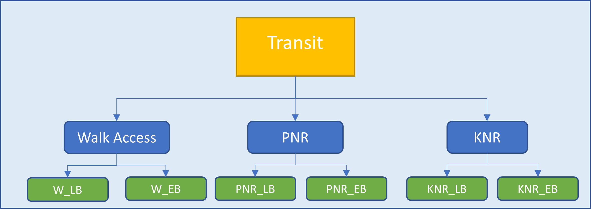
```

### Utility specification

The utility specification mainly comprises of the level of service transit
variables and auto sufficiency market segmentation terms. The utility equations
are shown in the first table below where the letter ‘X’ indicates that the
variable is included in the utility equation for the appropriate alternative
(column). The alternative-specific constant (ASC) row shows the estimated
constant values with the corresponding t-statistics within the brackets. The
three nest coefficients are also shown with their t-statistics.

```{r, fig.align='center', out.width="100%"}

```

```{r, fig.align='center', out.width="100%"}
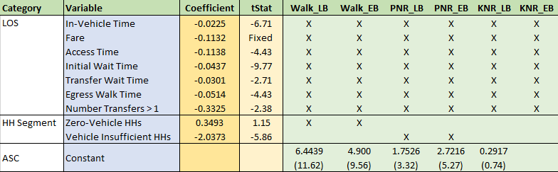
```

```{r, fig.align='center', out.width="50%"}
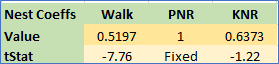
```

```{r, fig.align='center', out.width="50%"}
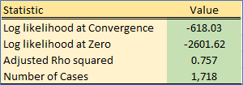
```

As expected, transit LOS variables are significant. A fare coefficient could not
be directly estimated. Instead, a value of time of $11.90 per hour was used to
convert the fare to equivalent time and a time coefficient was estimated. This
ensures that the model is sensitive to changes in fare policy.

The solution to nested logit estimation is known to be non-unique and is
influenced by the starting values of the nest coefficients. This implies that
potentially several estimations must be run with a different set of starting
nest coefficients. After a wide range of experiments on the TRM data, it was
necessary to fix the PNR nest coefficient to 1 (implying that PNR_LB and PNR_EB
are treated as top-level modes).

As expected, households with zero vehicles tend to prefer walk access to transit
options. Similarly, vehicle insufficient households prefer not to use PNR since
that would presumably make the vehicle unusable while in the parking lot.

## Other

- N_HB_OD_Long
- N_HB_OD_Short
- N_HB_OMED
- N_HB_K12

The transit sub-model estimated for the other purpose has the same nesting
structure as the work purpose transit submodel.

### Utility specification
The utility functions were likewise similar to the work purpose model. 

```{r, fig.align='center', out.width="100%"}
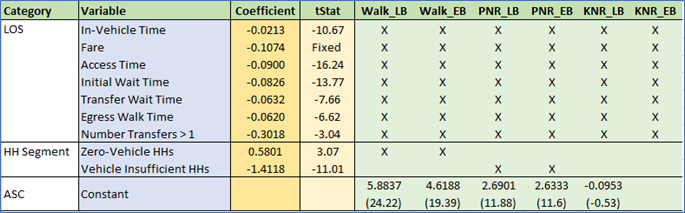
```

```{r, fig.align='center', out.width="50%"}
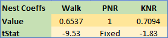
```

```{r, fig.align='center', out.width="50%"}
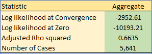
```

As in the work model, a value of time of $11.90 per hour was used to obtain the
fare coefficient. Again, the PNR nest coefficient had to be constrained to 1,
and similar, intuitively plausible effects were observed for level-of-service
variables and vehicle ownership.

## Shop

- N_HB_OME

The onboard survey revealed that it is very unlikely that shop trips use PNR and
KNR, which is intuitive. If a household has access to a car with which to make a
PNR/KNR trip, they would prefer to simply drive directly to the store and have
an easy way to transport groceries or other purchases. As a result, the transit
alternatives consist only of the walk access modes.

### Utility specification

```{r, fig.align='center', out.width="100%"}
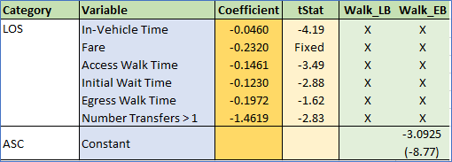
```

```{r, fig.align='center', out.width="50%"}
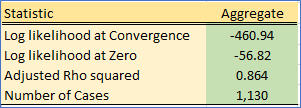
```

### Notes

As with the other submodels, a value of time of $11.90 per hour was used to
obtain the fare coefficient. 

# Home-based Trips on Work Tours

## W_HB_W

These are trips on a work tour with one end being home and the other being work.
During the estimation process, the full nesting structure including all modes in
the transit sub-nest were specified. The utility equations from the work transit
nest model along with their coefficients were retained (and fixed), except the
transit sub-mode ASCs. These were allowed to be determined by the estimation.
This was done to enable the estimation to adjust the constants of the transit
mode to fit the top-level shares from the household travel survey. A weighted
estimation using the trip weights was performed.

The utility spec for the combined data is shown below. Note that the transit
sub-mode utilities are not shown in the table (see above).

### Utility specification

```{r, fig.align='center', out.width="100%"}
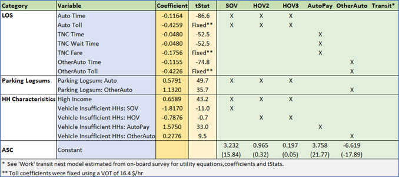
```

```{r, fig.align='center', out.width="50%"}
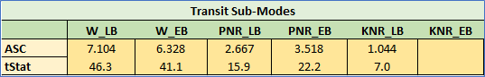
```

```{r, fig.align='center', out.width="50%"}
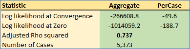
```

```{r, fig.align='center', out.width="50%"}
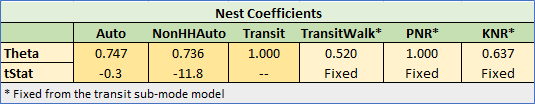
```

As expected, the time coefficients are highly significant. The time coefficient
for Transit Network Companies (TNCs) is deemed less onerous than other auto
modes, which is an intuitive result given that you don’t have to drive and can
relax (e.g. read a book).

Toll coefficients for the auto modes could not be estimated and were therefore
computed using the time coefficient and a value of time of $16.40 per hour, which
is higher than transit riders as expected.

The nest structure for the NonHHAuto is justified, given the tStat of the nest
coefficient of -11.8. The (household) Auto nest coefficient is similar and
reasonable and therefore also retained despite the nest coefficient having a low
t-statistic.

Parking logsums have a significant effect on the SOV and HOV modes as well as
the OtherAuto mode. As parking conditions deteriorate, trips shift to the
Transit and AutoPay modes.

High Income has a positive effect on the SOV and HOV modes. Similarly, vehicle
insufficient households have a higher tendency to prefer AutoPay and OtherAuto
modes as opposed to SOV and HOV modes.

During application, the model is applied to five market segments and four time periods
(20 combinations). The segments are Zero Autos (v0)); Low-Income and High-Income
vehicle insufficient HHs (ilvi and ihvi); and Low-Income and High-Income vehicle
sufficient HHs (ilvs and ihvs). The coefficients of the high income and vehicle
insufficient utility terms are enforced depending on the segment.

TNC wait times and fares are used as utility variables for the AutoPay mode and
the computation of these variables is described in the section below.

## W_HB_O

The survey revealed that nearly all the transit trips for this type are walk
access. Therefore, the PNR and KNR branches were removed from the transit nest
in the final specification. The Transit node only has the walk-local and
walk-express alternatives. The appropriate utility equations and coefficients
(except the ASCs) for the walk-local and walk-express modes from the work
transit sub-nest model are fixed based on the transit submodel estimation. The
final nesting structure is shown below.

### Utility specification

```{r, fig.align='center', out.width="100%"}
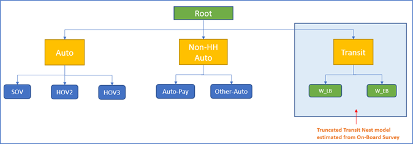
```

```{r, fig.align='center', out.width="100%"}
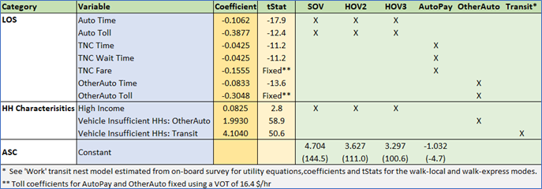
```

```{r, fig.align='center', out.width="50%"}
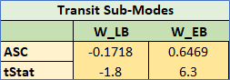
```

```{r, fig.align='center', out.width="50%"}
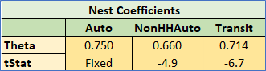
```

```{r, fig.align='center', out.width="50%"}
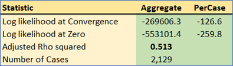
```

As with W_HB_W, the time coefficients are highly significant in this model. The
Auto toll coefficient was able to be estimated in this case and the implied
value of time computed from the time and cost estimates is $16.44/hr, which is
very close to the desired value of time of $16.40/hr.

Although a nest coefficient for the Auto mode could not be estimated, this
coefficient was set to 0.75 to match the estimated value from the w_hb_w model.
Since this purpose consists of short errands on the work tour, parking logsums
for work were not found to be significant.

Other similarities to W_HB_W included the positive effect of high income on auto
modes and the relative preference of vehicle insufficient households
to use OtherAuto and Transit modes.

## W_HB_EK12

These are school pick up and drop off trips and the survey indicates that the
two predominant modes were HOV2 and HOV3. Rather than estimate a mode choice
model, a simple probability split of 50.4% for HOV2 and 49.6% for HOV3 was used
(calculated directly from the household survey).

# Home-based Trips on Non-work Tours

The purposes N_HB_OME, N_HB_ODShort, N_HB_ODLong, N_HB_OMED and N_HB_K12 fall
under this category. Typically, transit PNR and KNR modes are seldom used for
these purposes. The tree structure for these purposes is shown below.

```{r, fig.align='center', out.width="100%"}

```

N_HB_K12 is the one exception to the above graphic, as it includes a SchoolBus
mode rather than walk to express bus.

## N_HB_OME

These are home based trips on non-work tours that involve shopping, eating out
and other maintenance or cash spending activities. Therefore, the transit nest
model for the shop purpose (with the walk-local and walk-express alternatives)
is used. This is the only model where the ‘Shop’ transit sub-nest coefficients
are used. As expected, for trips such as shopping, PNR and KNR modes were not
chosen. If a person has access to a car, they will use it to buy groceries rather
than carry them on the bus.

### Utility specification

```{r, fig.align='center', out.width="100%"}
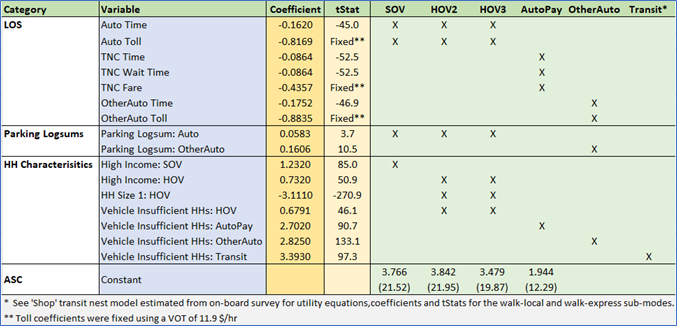
```

```{r, fig.align='center', out.width="50%"}
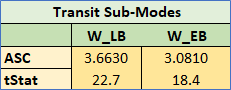
```

```{r, fig.align='center', out.width="50%"}
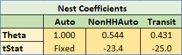
```

```{r, fig.align='center', out.width="50%"}
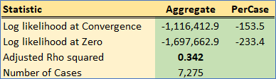
```


Parking logsums have an important effect on choice of auto modes, which makes
sense. For work trips, travelers have to park near their job and parking is less
of a consideration. For non-mandatory trips like shopping, people are more
sensitive to parking cost and availability.

High income has a positive effect on HOV and an even larger positive effect on
SOV trips. At the same time, the HH Size 1 coefficient is highly negative for
HOV trips (which is intuitive). Vehicle sufficiency plays a significant role in
choice of SOV and other modes (with varying effects).

Because estimation is done on disaggregate survey records, the high-income
housing variable was either 1 or 0. During model application, which is
aggregate, the percent of the home zone that is high income is used. This can
take values between 0 and 1.

## N_HB_OD_Short

These are home based other trips with a short duration that are part of a
non-work tour. The walk access branch (with the walk-local and walk-express
alternatives) from the ‘Other’ transit nest model is used.

### Utility specification

```{r, fig.align='center', out.width="100%"}
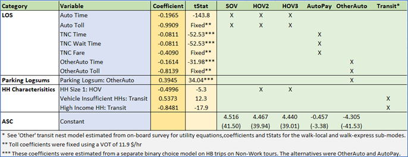
```

```{r, fig.align='center', out.width="50%"}
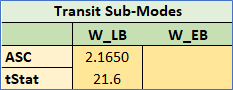
```

```{r, fig.align='center', out.width="50%"}
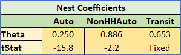
```

```{r, fig.align='center', out.width="50%"}
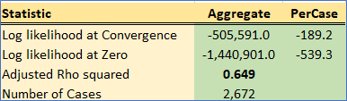
```

The coefficients for the Non-HHAuto modes during the estimation had incorrect
signs and were generally not significant. Therefore, a sequential approach to
estimation was used, similar to that in which the transit submodel was estimated
first and then used in the main model estimation. In this case, a binary choice
model was estimated for the Non-HHAuto submodel. Only trips that chose these two
alternatives were used in the estimation, but all home-based trips on non-work
tours were used to estimate the model. This increased sample size allowed
Caliper to estimate a reasonable submodel, and then holding this submodel fixed
in the main model estimation, achieve appropriate alternative specific
constants.

Coefficients match similar patterns shown by other purposes and are logical.


## N_HB_OD_Long

These are home based other trips with a long duration that are part of a
non-work tour. The walk access branch (with the walk-local and walk-express
alternatives) from the ‘Other’ transit nest model is used.

### Utility specification

```{r, fig.align='center', out.width="100%"}
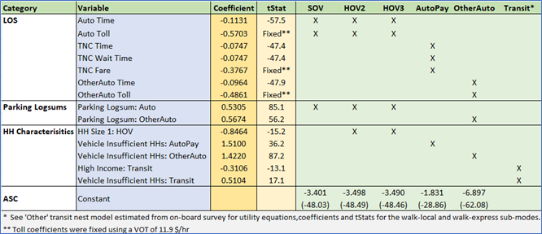
```

```{r, fig.align='center', out.width="50%"}
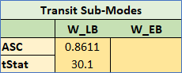
```

```{r, fig.align='center', out.width="50%"}
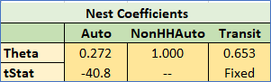
```

```{r, fig.align='center', out.width="50%"}
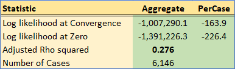
```

All coefficients are intuitive as seen in other models. For example, time
coefficients are significant and parking logsums indicate correct model
response to parking variables.

## N_HB_OMED

These are home based medical related trips (including pharmacies) that are part
of a non-work tour. The walk access branch (with the walk-local and walk-express
alternatives) from the ‘Shop’ transit nest model is used.

### Utility specification

```{r, fig.align='center', out.width="100%"}
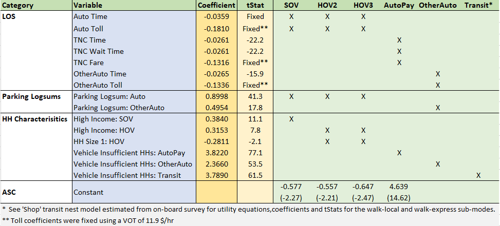
```

```{r, fig.align='center', out.width="50%"}
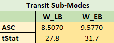
```

```{r, fig.align='center', out.width="50%"}
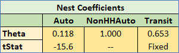
```

```{r, fig.align='center', out.width="50%"}
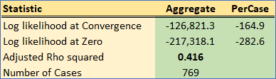
```

Likely due to small sample size, during the initial estimation, the time
coefficient (along with an asserted toll coefficient derived from the time
coefficient) for the auto modes had a positive sign. A model without the toll
coefficient however yielded a feasible value for the time coefficient. This
value was fixed in the final estimation along with the asserted toll coefficient
using the value of time of $11.90 per hour.

The model is sensitive to parking cost and availability, but less so than most
other non-work trips.  This stands to reason since, like for work, the
destination is fixed.

Other coefficients follow the same logical patterns as other purposes.

## N_HB_K12

These are home based school related trips that are part of a non-work tour and
include school trips made by kids and drop off trips made by adults. The survey
indicated that walk-to-local bus was the only transit mode used. AutoPay was
also not used. Therefore, a simple MNL model with the modes SOV, HOV2, HOV3,
OtherAuto, Walk-Local transit, and SchoolBus was estimated. The utility equation
for the walk local transit was borrowed from the ‘Other’ transit sub-mode model.

### Utility specification

```{r, fig.align='center', out.width="100%"}
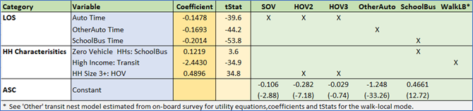
```

```{r, fig.align='center', out.width="50%"}
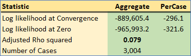
```

### Notes

The time coefficients are significant as expected, and the school bus time is
actually more onerous compared to driving kids to school. This is an amusing
result that is nevertheless intuitive for anyone who rode the bus as a child.

The survey revealed that rarger HHs prefer school pickup/drop-offs compared to 
riding the bus.

Choice of mode for this purpose is probably determined by several other factors
specific to individual households and are thus not adequately captured by a
choice model. Nevertheless, a choice model helps fix the shares of the primary
modes for this purpose, namely SchoolBus and HOV.

# Calibration

Mode choice ASCs were calibrated to match the adjusted targets shown below. The
mode choice targets are generated from the survey for each combination of trip
purpose and HH market segment. Note that target shares are not split by transit
sub-mode due to the lack of transit trips in the survey. The shares vary
significantly by market segment, especially for the zero-auto segment as
expected. Further, during the transit ridership validation, the survey transit
targets were scaled down to match transit boardings.

The additional ASC adjustments were not large, which increased confidence in the
estimated coefficients.

```{r, fig.align='center', out.width="85%"}
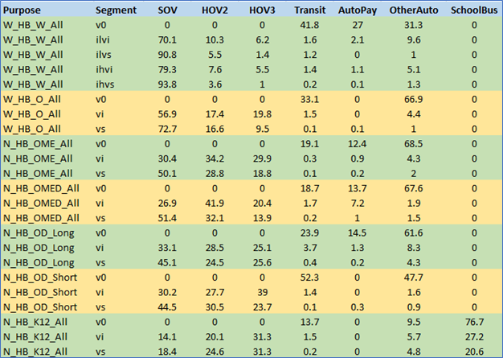
```

# Application

As mentioned, the mode choice output shares can only be applied after the
destination choice model has been run. However, the destination choice model
requires mode choice logsums by mode, period, purpose and segment. To facilitate
this, the mode choice models are run first and the probability matrices and
logsums are calculated and stored. After the destination choice model is
complete, the stored probability matrices are used to split the appropriate PA
matrices by mode. The following rules are used during the mode choice
application for a specific purpose, segment and time period.

- For the zero-vehicle segment, SOV, HOV2 and HOV3 are made unavailable.
- The appropriate skims are used depending on the time period.
- Transit modes are automatically dropped for zone-to-zone pairs with missing 
transit skim values.

# Rail and BRT

Rail and Bus Rapid Transit (BRT) do not exist in the Triangle in 2020; however,
the region is actively studying these modes for the future. As a result, Caliper
asserted mode choice nests for Light Rail (LR), Commuter Rail (CR), and BRT.
This assertion combined modal data from the on-board survey (just as
value of time coefficients) and guidelines provided by FTA and used in the STOPS
model
([link1](https://www.transit.dot.gov/funding/grant-programs/capital-investments/stops-workshop-atlantic-city-may-17-2015)
[link2](https://www.fsutmsonline.net/images/uploads/Task_1_Guidebook_for_Florida_STOPS_Application.pdf)).

The first FTA factor to consider is what they call "Visibility". In short, as
more of the service operates on fixed guideway, the higher this factor goes
(bounded between 0 and 1).

```{r, fig.align='center', out.width="90%"}
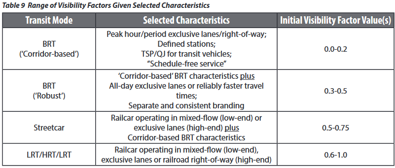
```

For TRMG2, the following visibility factors were assumed:

- BRT: 0.25
- LRT: 0.50
- CRT: 1.00

Additionally, the graphic below shows the FTA guidance on path-based constants.
These are presented as penalties added to bus, but Caliper instead applied them as
bonuses for rail and BRT.

```{r, fig.align='center', out.width="90%"}
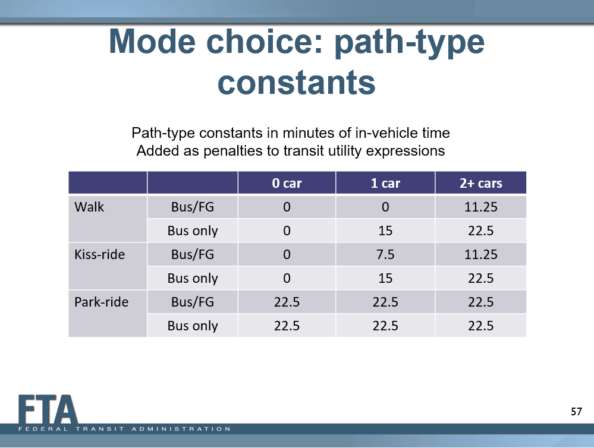
```

TRMG2 market segmentation does not match the above chart exactly. Caliper made
the following assumptions about equivalency:

- zero-vehicle segment (v0): 0 vehicle households
- vehicle insufficient segment (vi): 1 vehicle households
- vehicle sufficient segment (vs): 2+ vehicle households

Additionally, the cost coefficients from estimation (generally around .022) were
within the FTA guidance of .02 - .03. Caliper applied the following discounts
to in-vehicle time (adjusted based on our assumed visibility scores):

- BRT: 5%
- LRT: 10%
- CRT: 20%

The table below is a concrete example of how LRT was modified for the
N_HB_OD_Short purpose. In the gray cells, the numbers in blue show the
modifications. The IVTT time is discounted and the mode is given bonus path type
constants based on visibility, market segment, and scaled by G2s cost
coefficient.

```{r, fig.align='center', out.width="100%"}
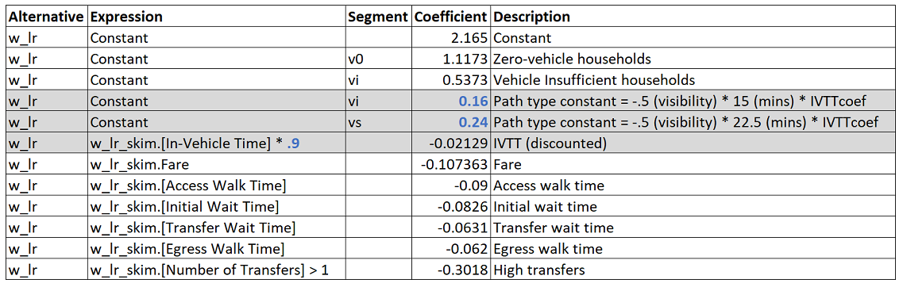
```

Additionally, Caliper compared these adjustments to the existing TRMV6.2 model.
In that model, a single premium mode exists with the following adjustments:

- IVTT discount of 15%
- 30 bonus minutes added to the constant

All else equal, TRMG2s smaller discounts and bonuses should lead to more
conservative ridership estimates. However, during planning analysis, the region
can adjust the visibility factors to reflect the actual service being planned.
For example, if planned BRT service operates fully inside reserved right of
way, the visibility factor should be increased.

# TNC Variables

For mode choice it was necessary to estimate fare and wait time for AutoPay mode
(e.g., Uber, Lyft, taxis). Given the small number of these trips in the
household survey, it was necessary to partially assert these models based on the
literature.

Fare is generally modeled as a flat fee and per mile and per minute
components. The flat fee and per minute parameters were constrained based on the
literature, but doing so allowed the per mile component to be estimated from the
survey.

$$Fare = 4.00 + 0.70 * length + 0.25 * time$$

Where:

$Fare$: Fare ($)  
$length$: Trip distance (mi)  
$time$: Trip time (min)

```{r, out.width="75%", fig.show='hold',fig.align='center'}
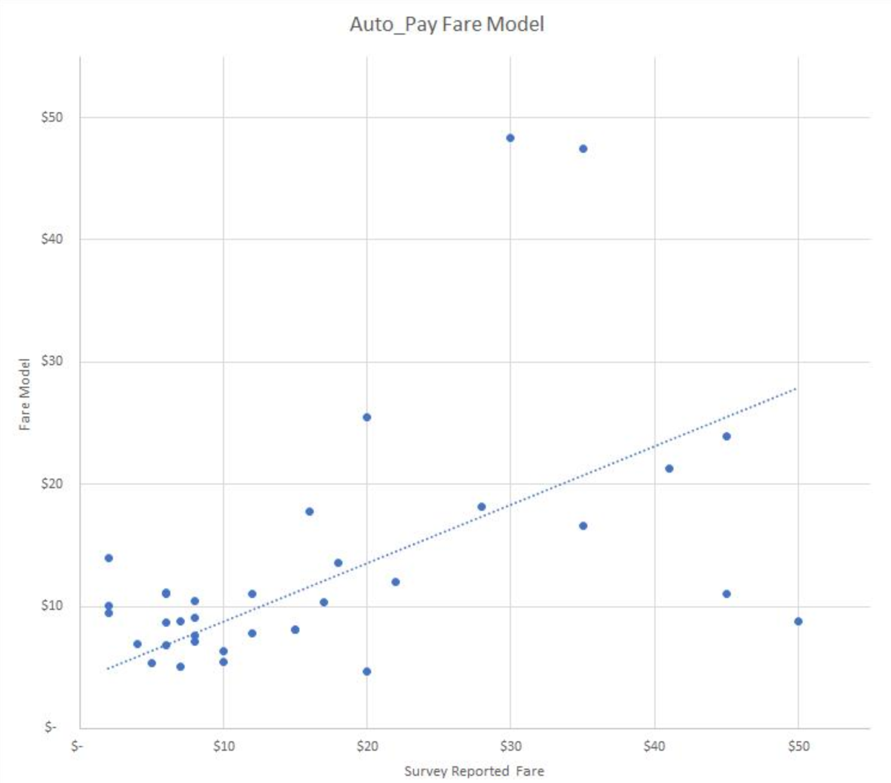
```

The wait time (shown in a map above), was adapted from a published model for
Austin, TX, and recast using the TRM's general accessibility variable.  

$$Wait_{OP} = 45.10 - 1534.4 / A_g + 13030.36 / A_g^2$$

Where:

$Wait_{op}$: Off-peak period wait time (min)  
$A_g$: General accessibility

In the peak period, 3.5 minutes are added to the wait time.  The model produces
reasonable wait times ranging from 2.5 minutes in downtown Raleigh (off-peak) up
to 30 minutes in the model's rural fringe areas.