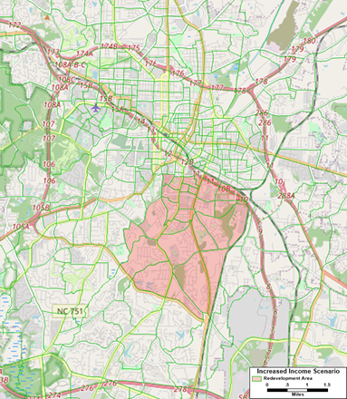
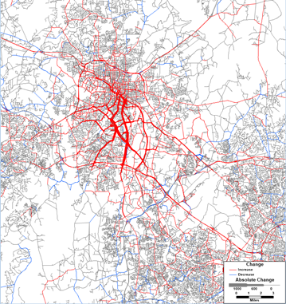
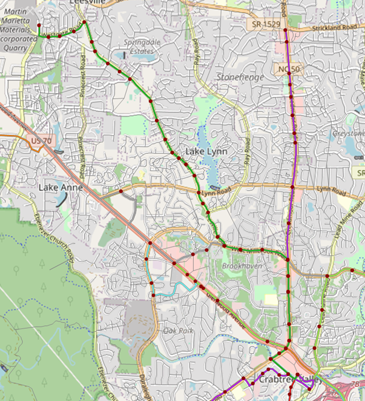
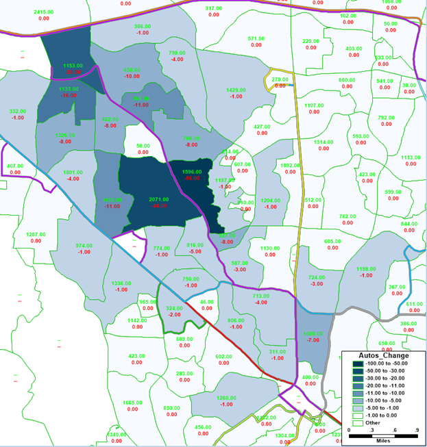
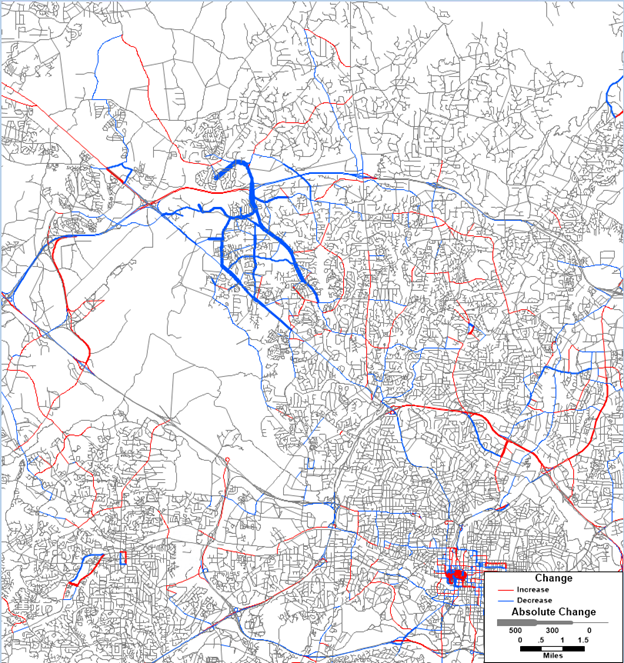
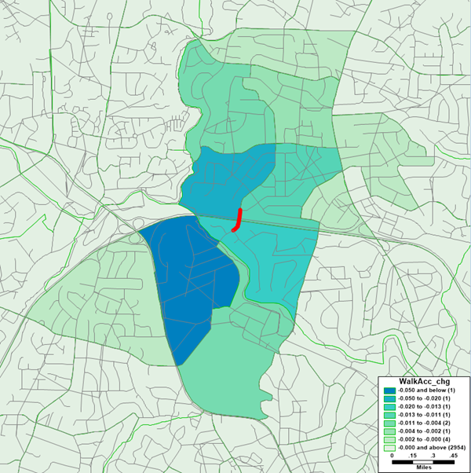
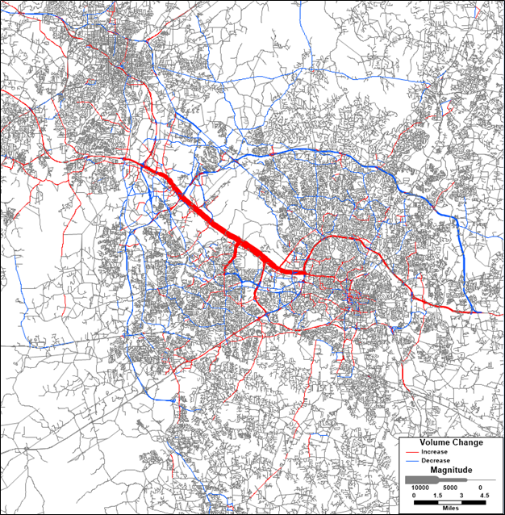

```{r setup, include=FALSE}
knitr::opts_chunk$set(echo = FALSE)
options(dplyr.summarise.inform = FALSE)
options(scipen = 999)

library(tidyverse)
library(knitr)
library(kableExtra)
```

## Intro

As part of the model validation and testing, Caliper performed a number of
sensitivity tests to ensure that the model responds reasonably to changes in
inputs.  Changes were made to income, the transit network, the all-streets
non-motorized network, highway network capacities and tolls, and parking supply
and cost. All these tests indicate that the model is responding reasonably to
input changes and is appropriately sensitive.  Each of the tests conducted are 
documented below. 

## Increased Income

No build scenario:    2020 Base Year

Build scenario:       2020 Base Year + increased income in south Durham

In this scenario, Caliper tested a simple increase of income in the area of
south Durham highlighted in the map below.  The household income for this whole
area was increased to $120,000, and the percentage of high income workers was
adjusted to 70%. The resulting increases in auto ownership, trip-making, auto
and particularly SOV mode shares, and VMT and VHT were reasonable.

```{r, out.width="50%", fig.align='center'}

```

### Auto Ownership Changes
The first change resulting from the increased income was an increase in
automobile ownership.  The total automobiles owned in these zones increased by
2,544 from 11,477 to 14,021.  This equates to an increase in average auto
ownership from 1.38 cars/household to 1.68 cars/household in these zones.

### HB Trip Production Changes
In response to the direct effect of income and the indirect effect of auto
ownership, trip production increased for every trip type.  The total number of
work trips (W_HB_W) increased the least (since the number of workers did not
increase, just their income) and long activity discretionary activities
(N_HB_OD_Long) increased the most.  The total home-based trips in the affected
zones increased by 14.7% from 48,986 to 56,169.

### Non-Motorized Changes
Despite the overall increase in HB trips, the increase in income and
consequently vehicle ownership led to a slight (2.5%) decrease in home-based
(HB) non-motorized trips from 5,429 to 5,293.  The overall increase in
trip-making was large enough for some purposes (such as discretionary) that
non-motorized trips increased slightly for these purposes (although they
decreased as a mode share), but this was more than offset primarily by less
people walking for shopping, eating out (OME), and work.  The increase in
overall HB trips also led to an increase in NHB trips, including non-motorized
trips.  The increase of 127 non-home-based non-motorized trips results in a net
loss of only 29 total non-motorized trips.

### Mode Choice Changes
The increases in income and auto ownership also led to HB mode shifts.  Transit
trips decreased by slightly more than half from 1,726 to 814.  Auto trips
increased overall and also shifted towards SOV comprising 46% of HB trips for
the subarea in the base case and 50% in the scenario, resulting in more vehicle
trips from the subarea.

### NHB Trip Changes
The increase of HB auto trips also led to an increase in non-home-based (NHB)
auto trips of 4,270 trips.  However, NHB auto_pay trips decreased by 53 trips,
and transit NHB trips decreased by 368 trips.

### Highway Assignment Changes
The increased vehicle trips resulted in an increase of 59,071 VMT (0.10%
regional increase), 1,551 VHT (0.12% regional increase), and 170 more vehicle
hours of delay (0.38% increase).  As can be seen in the following map, the
increases were largest in the area of south Durham with the increased income,
but most all of Durham saw increased traffic and some increases reached as far
as Raleigh.

```{r, out.width="75%", fig.align='center'}

```

## New Bus Route
No Build Scenario: 2020 Base Year

Build Scenario: 2020 Base Year + added bus route 

In this scenario, Caliper tested adding a new bus route.  A route was added in
north Raleigh from the Crabtree Valley mall up Creedmoor, Millbrook, and
Leesville roads and ending at a large quarry.  The new route can be seen in
bright green in the map below.  30- and 60-minute headways were assumed for peak
and off-peak periods respectively.

```{r, out.width="75%", fig.align='center'}

```

The model’s results were reasonable, predicting a daily ridership on the new
route of 509 passengers similar to the ridership of existing GoRaleigh route 23L
which is similar in length with one end at Crabtree Valley Mall.

### Auto Ownership Changes
The first change in the model in response to the new bus route is a decrease in
auto ownership near the route.  The auto ownership in the zones affected by the
new route decreased from 1.635 cars/household to 1.625 cars/household, a 0.6%
decrease in autos owned in the corridor.

```{r, out.width="65%", fig.align='center'}

```

### HB Trip Production Changes
In response to the decrease auto ownership, home-based (HB) trip-making
decreased by a total of 299 trips or 0.2% from 146,328 to 146,029.

### Non-Motorized Changes
Despite the overall decrease in trip-making, there was a small increase in HB
non-motorized trips, but the increase was only 35 trips (0.12% in the area
affected).  The increase in transit and non-motorized HB trips also led to an
increase of 17 non-motorized NHB trips, for a total increase of 52 non-motorized
trips.

### Mode Choice Changes
Despite the overall decrease in HB trips, there was an increase of 234 transit
trips or an increase in transit mode share in the affected zones from 0.7% to
0.9%.  Between the decrease in trip-making and shift to transit, HB auto trips
decreased by 528.

### NHB Trip Changes
The increase in transit HB trips and decrease in auto HB trips resulted in
concomitant changes in non-home-based (NHB) trips.  NHB auto trips decreased by
208, while NHB transit trips increased by 186.

### Transit Assignment Changes
From the above it can be seen that total transit trips increased by 420.  The
difference of 89 trips from the total route ridership of 509 were thus the
result of shifts in existing transit trips from other routes to the new route.

### Highway Assignment Changes
The decreased auto trips resulted in a decrease of 4,436 VMT (0.01% of the
regional total), 111 VHT (0.01% of the regional total), and 14 less vehicle
hours of delay (0.03%).  As can be seen in the following map the decreases are
focused around the new bus route corridor, particularly on Leesville Rd. on
which the new route runs but also decreasing parallel route US 70.  Even with a
relative gap of 0.00001, there is still evidence of noise in the assignment
convergence at this small scale (changes of less than 500 vpd), seen primarily
in downtown Raleigh.  That said, the real project impacts dominate the
assignment results, and the model appears to be appropriately sensitive even at
this fine scale.

```{r, out.width="75%", fig.align='center'}

```

## Pedestrian Infrastructure 
No Build Scenario: 2020 Base Year

Build Scenario: 2020 Base Year – pedestrian overpass  

In this scenario, Caliper tested the removal of the pedestrian overpass over
I-440 at Yadkin Dr.  The model results are reasonable.  The largest impact the
model predicts is change in destination (at least 43 trips), followed by change
in mode (9 trips), followed by change in auto ownership (4 cars), followed by
change in trip-making (2 trips).

### Walk Accessibility
The map below shows the location of the pedestrian overpass removed, and
resulting decreases in Walk Access.

```{r, out.width="75%", fig.align='center'}

```

### Auto Ownership Changes
The reductions in walk accessibilities resulted in the model predicting an
additional 4 household vehicles, a 0.07% change in the affected zones increasing
average automobile ownership in the zones from 1.610 to 1.612 vehicles per
household.  It is unclear if the addition or removal of a pedestrian overpass
would actually result in any change in vehicle ownership, but it may on the
margin and the change is small enough and in the correct direction to be
plausible.

### HB Trip Production Changes
The very small increase in vehicle ownership resulted in a very small increase
of two HB trips.  This implies that half the time or every other day having an
additional car resulted in an additional tour.  Even at this micro scale the
model’s response seems reasonable.

### Non-Motorized Changes
Although total trips increased by two, total daily HB non-motorized trips
decreased by seven and motorized trips increased by nine.  Thus, the mode shift
was more significant than trip suppression/induction which stands to reason.

### NHB Trip Changes
The decrease in HB nonmotorized trips led to a further decrease of two NHB
nonmotorized trips daily, making the total decrease in non-motorized trips nine.
This implies that roughly a quarter of the nonmotorized tours eliminated had
more than one stop which seems eminently plausible.

### Destination Choice Changes
Although the model does not assign non-motorized trips, it is possible to
compare the trips between the zones north of I-440 near the pedestrian bridge
and those south of I-440 near the pedestrian bridge.  It would make sense that
many of these trips would use the pedestrian bridge to cross I-440, although
given the size of the zones, many of these trips are also likely served by
Lassiter Mill Rd. and the Greenway’s crossings.  In the base case there are 253
pedestrian trips crossing I-440 in this vicinity.  With the removal of the
pedestrian bridge this number decreases to 201.  Since only nine of these trips
shifted to auto, this implies that the remaining 43 were diverted to
destinations on the same side of I-440.  It also suggests that in the base case
there are at least 52 daily trips on the pedestrian bridge that change either
mode or destination to avoid a pedestrian crossing of I-440 without the bridge.
However, the total number of trips utilizing the bridge is likely larger in the
base case since some of the trips affected by the removal of the pedestrian
bridge presumably just change routes and cross instead at Lassiter Mill Rd. or
using the Greenway.  In summary, it is possible that the largest impact of
removing the pedestrian bridge would be route changes, but without a
non-motorized assignment the model cannot tell us.  The largest impact the model
predicts is change in destination (at least 43 trips), followed by change in
mode (9 trips), followed by change in auto ownership (4 cars), followed by
change in trip-making (2 trips).  This makes sense.  The presence or absence of
the pedestrian bridge does not have much impact on trip-making.  It mainly
changes the routes and destinations of people’s non-motorized trips, but a small
number of important trips shift to auto and an even smaller number of people on
the margin might buy a car.

## Highway Capacity 

No Build Scenario: 2016 Base Year

Build Scenario: 2016 Base Year + added travel lanes on I-40

In this scenario Caliper tested adding an additional lane of travel in each
direction on I-40 from the Triangle Parkway to Wade Ave and along Wade Ave to
I-440.

The model results are reasonable.  The increased capacity on I-40 has a
meaningful impact on reducing regional delay and decreases regional VHT, but at
the cost of some induced VMT.  The majority of the induced VMT comes from
destination choice where overall resident trip lengths increased by less than
two hundredths of a mile.  The remainder of the induced VMT was primarily people
choosing longer but now faster routes in assignment, with a very small amount of
induced VMT from mode shift.

```{r, include=FALSE}
HwyCapChg <- read_csv("data/input/sensitivity/HwyCapacityImpacts.csv")
```


```{r}
colnames(HwyCapChg) <- c('', 'VMT', 'VHT', 'Delay')
HwyCapChg %>%
  kable(format.args = c("big.mark" = ","), align = "lrrr") %>%
  kable_styling(full_width = FALSE)
```

There were no changes in auto ownership or trip-making as the result of
increased highway capacity.

### Assignment Changes
Route choice in assignment was the primary change in link level volumes, with
I-40 attracting more flow and diverting it from competing routes, most notably
I-540, but also the Triangle Parkway, NC 54, NC 55, etc.  Some facilities
feeding I-40 also saw increased volume, most notably I-440 north and east of
Wade Ave.

```{r, out.width="75%", fig.align='center'}

```

### Mode Choice Changes
As expected, the mode shift is small, but towards auto modes with most of the
shift coming from transit.

```{r, include=FALSE}
HwyCapMS <- read_csv("data/input/sensitivity/HwyCapModeShift.csv")
```
```{r, warning=FALSE}
HwyCapMS %>%
  kable(format.args = c("big.mark" = ","), align = "lr") %>%
  kable_styling(full_width = FALSE)
```

### Destination Choice Changes
The increased capacity of I-40 does cause a modest shift of destinations,
increasing destinations along the corridor and decreasing destinations primarily
along competing corridors, most notably the Triangle Parkway, but also I-540.
The map below shows the change in AM destinations from the base scenario.  The
changes ranged from -8.4 to +14.6, but the vast majority of destinations were
essentially unchanged.  The net effect, however, was an increase in average trip
lengths from 7.169 miles in the base to 7.185 in the build scenario since
travelers were able to travel further in the same amount of time due to
decreased congestion on I-40.

```{r, out.width="75%", fig.align='center'}
knitr::include_graphics("img/sensitivity/HwyCapDest.png")
```

## Highway Tolling

## Parking
