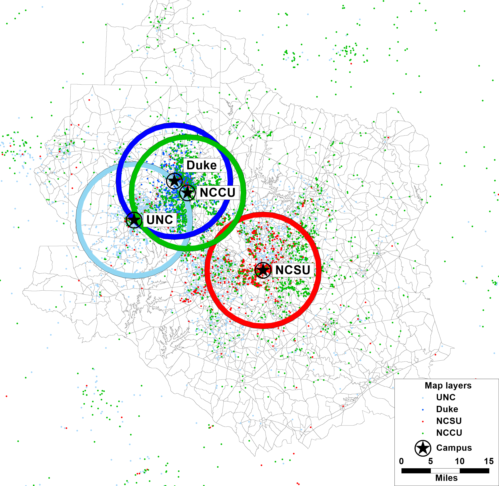

```{r setup, include=FALSE}
knitr::opts_chunk$set(echo = FALSE)
options(dplyr.summarise.inform = FALSE)
options(scipen = 999)

library(tidyverse)
library(sf)
library(leaflet)
library(ggplot2)
library(knitr)
library(kableExtra)
```

## TAZ Boundary Updates

The zonal system for TRMG2 was inherited from the existing model, and Caliper
performed a brief review and recommended additional zone splits. These
recommendations were focused on addressing two concerns:

1. Breaking up zones with large employment and households (in base or future).
2. Adding granularity for universities to improve modeling of non-auto modes.

Large zones can create traffic loading problems by generating lots of trips and
loading them on the network in a small number of locations. Breaking these into
smaller zones allows for more-even loading of traffic and avoids spikes in
congestion.

A major concern for universities at the outset is getting transit loading
correct. Larger zones capture more trips as "intra-zonal" meaning they never
leave the zone and load onto the network. For universities, where trips between
classes have a significant impact on transit ridership, it is important that
these trips travel between zones. In addition, the added granularity gives more
accurate measurements of non-motorized travel times, which is important for the
university market.

Caliper made several presentations of proposed changes and took feedback from
the stakeholders concerning zone edits. The map below shows the final edits.
Scroll/Zoom the map below to review them, and use the layers control box
to turn the old and new zone layers off.

**Existing and Split Zones**
```{r}
taz_old <- sf::read_sf("data/input/tazs/tazs 2020-11-02.shp") %>%
  st_transform(crs = st_crs('+proj=longlat +datum=WGS84'))
taz_new <- sf::read_sf("data/input/tazs/tazs 2020-12-08.shp") %>%
  st_transform(crs = st_crs('+proj=longlat +datum=WGS84'))
```

```{r}
leaflet() %>%
  addProviderTiles("Stamen.TonerLite") %>%
  addPolygons(
    data = taz_new,
    weight = 2,
    fill = FALSE,
    color = "gold",
    group = "New"
  ) %>%
  addPolygons(
    data = taz_old,
    weight = 2,
    fill = FALSE,
    group = "Old",
    color = "royalblue"
  ) %>%
  addLegend(
    "bottomright", 
    colors =c("gold", "royalblue"),
    labels= c("New", "Old"),
    title= "Legend",
    opacity = 1
  ) %>%
  addLayersControl(overlayGroups = c("New", "Old")) %>%
  setView(-78.672682, 35.784927, zoom = 12)
```

### Network updates

For each new TAZ, a corresponding centroid node and appropriate centroid
connectors were added to the roadway network.
  
### Allocating existing SE data

*Placeholder*

For now, the SE data is allocated into the new zones using the percent area.

```{r}
se_data <- read_csv(
  "data/input/se_data/se_2016.csv",
  col_types = cols(
    .default = col_double(),
    County = col_character(),
    TRM_6.2_Fill = col_logical()
  )
)

calc_percents <- se_data %>%
  left_join(taz_new %>% st_drop_geometry(), by = c("TAZ_NG" = "ORIG_ID")) %>%
  group_by(TAZ_NG) %>%
  mutate(pct = AREA / sum(AREA)) %>%
  mutate(across(
    c(HH, HH_POP, Stud_GQ:Retail),
    ~round(.x * pct, 0)
  )) %>%
  mutate(
    TAZ_NG = ifelse(is.na(ID), TAZ_NG, ID),
    County = ifelse(County == "External", "External", "Internal")
  ) %>%
  select(
    TAZ = TAZ_NG, Type = County, HH:Retail, K12 = ENROLLMENT,
    ParkCostW = PrkCosW1, ParkCostO = PrkCosO1, ParkCostU = PrkCosU1, 
    ADT:PCTCVEE
  ) %>%
  arrange(TAZ)

# Throw error if total households are off by more than rounding error
hh_ratio = sum(calc_percents$HH, na.rm = TRUE) / 
  sum(se_data$HH, na.rm = TRUE)
if (abs(hh_ratio - 1) > .01) stop(
  "Disaggregation caused significant change in total households"
)
```

## SE Data Updates

Caliper added several new variables to the SE data:

- Median income
- Workers
- Age (percent children and seniors)
- Percent high earning jobs (>$40k)
- Off-campus students

### Income

```{r load census data, include=FALSE}
source("R/load_census_data.R")
shapes <- load_census_data()

acs_bg <- shapes$acs_bg
acs_tract <- shapes$acs_tract
# dec_bg <- shapes$dec_bg

taz <- st_transform(taz_new, st_crs(acs_bg)) %>% st_make_valid()
```

```{r, include=FALSE}
# regional median income
# source: https://data.census.gov/cedsci/table?q=median%20income&g=0500000US37063,37135,37183&tid=ACSST1Y2019.S1901&hidePreview=true
reg_med_inc <- 65317

# Tract and county median incomes
county_med_inc <- get_acs(
  geography = "county", state = "NC", year = 2018,
  county = unique(taz$COUNTY), variables = c("B19013_001")
) %>%
  mutate(NAME = word(NAME, 1, 1)) %>%
  select(COUNTY = NAME, county_med_inc = estimate)
tract_med_inc <- get_acs(
  geography = "tract", state = "NC", year = 2018,
  county = unique(taz$COUNTY), variables = c("B19013_001"),
  geometry = TRUE
) %>%
  rename(tract_med_inc = estimate)

inc_centroids <- taz %>%
  st_point_on_surface() %>%
  st_join(acs_bg %>% select(bg_med_inc = inc_med)) %>%
  st_join(tract_med_inc %>% select(tract_med_inc)) %>%
  st_drop_geometry() %>%
  select(ID, bg_med_inc, tract_med_inc)
  
num_missing <- nrow(inc_centroids %>% filter(is.na(bg_med_inc)))
add_income_taz <- taz %>%
  left_join(inc_centroids, by = "ID") %>%
  left_join(county_med_inc, by = "COUNTY") %>%
  mutate(Median_Inc = case_when(
    !is.na(bg_med_inc) ~ bg_med_inc,
    !is.na(tract_med_inc) ~ tract_med_inc,
    TRUE ~ county_med_inc
  ))

add_income_se <- calc_percents %>%
  left_join(
    add_income_taz %>%
      select(ID, Median_Inc) %>%
      st_drop_geometry(),
    by = c("TAZ" = "ID")
  ) %>%
  relocate(Median_Inc, .before = MEANINC) %>%
  select(-MEANINC)
```

Due to the skewed nature of income distributions, median income is a better
approximation of the average than the mean. This information was appended to the
socio-economic (SE) data from the Census, but income information is only
available at the block group geography level. As a result, all TAZs within a
block group have the same median income. In addition, income measures were
suppressed by the Census for `r num_missing` block groups. For TAZs in these
block groups, tract median income was used. If tract was also missing, then the
county median was used (shown below). This information is stored in the
`Median_Inc` field of the SE table.

```{r}
county_med_inc %>%
  mutate(county_med_inc = paste0(
    "$", format(county_med_inc, big.mark = ",")
  )) %>%
  rename(County = COUNTY, `Median Income` = county_med_inc) %>%
  kable(align = "lr") %>%
  kable_styling(full_width = FALSE)
```

### Workers

```{r, include=FALSE}
calc_tot_workers <- acs_tract %>%
  group_by(County) %>%
  mutate(
    county_wrk_tot = sum(wrk1, na.rm = TRUE) + 2 * sum(wrk2, na.rm = TRUE) + 
      3.1 * sum(wrk3, na.rm = TRUE),
    county_hh_pop = sum(hh_pop, na.rm = TRUE),
    county_pct_wrk = round(county_wrk_tot / county_hh_pop * 100, 0)
  ) %>%
  ungroup() %>%
  mutate(
    # 3.1 acknowledges that 3+worker households have an average higher than 3,
    # but the exact average is unknown.
    wrk_tot = wrk1 + 2 * wrk2 + 3.1 * wrk3,
    Pct_Worker = ifelse(
      hh_tot == 0, county_pct_wrk, round(wrk_tot / hh_pop * 100, 0)
    )
  )

wrk_centroids <- taz %>%
  st_point_on_surface() %>%
  st_join(calc_tot_workers %>% select(Pct_Worker)) %>%
  as.data.frame() %>%
  select(ID, Pct_Worker)
  
add_workers_taz <- add_income_taz %>%
  left_join(wrk_centroids, by = "ID")

add_workers_se <- add_income_se %>%
  left_join(
    add_workers_taz %>%
      select(ID, Pct_Worker) %>%
      st_drop_geometry(),
    by = c("TAZ" = "ID")    
  ) %>%
  relocate(Pct_Worker, .after = Median_Inc)
```

Estimates of workers are only available from the ACS at the tract level. It is
also important to note that ACS tables that count total workers cannot be used,
because they include workers living in group quarters. Instead, total workers in
households must be imputed from tables that count households by number of
workers.

Without more-disaggregate data to inform the process, the following steps were
taken to assign workers to TAZs:

  1. Calculate the percentage of workers for the ACS tract.
  2. Use that percentage for each TAZ within the tract.
  
This information is contained in the `Pct_Worker` field of the SE data table.

```{r vehicles, include=FALSE}
# Vehicles are not added to the SE data table, because we have an auto-ownership
# model to determine that information. Instead, this info is used to validate
# that model.

reg_avg_veh <- sum(acs_bg$veh_tot, na.rm = TRUE) / sum(acs_bg$hh_tot, na.rm = TRUE)

acs_bg <- acs_bg %>%
  mutate(avg_veh = veh_tot / hh_tot)

veh_centroids <- taz %>%
  st_point_on_surface() %>%
  st_join(acs_bg %>% select(avg_veh)) %>%
  as.data.frame() %>%
  select(ID, avg_veh)

add_veh_taz <- add_workers_taz %>%
  left_join(veh_centroids, by = "ID") %>%
  mutate(
    avg_veh = ifelse(is.na(avg_veh), reg_avg_veh, avg_veh)
  )
  
veh_validation_tbl <- add_workers_se %>%
  left_join(
    add_veh_taz %>%
      select(ID, avg_veh) %>%
      st_drop_geometry(),
    by = c("TAZ" = "ID")    
  ) %>%
  mutate(
    Vehicles = round(HH * avg_veh, 0)
  ) %>%
  select(TAZ, Vehicles, avg_veh)
```

### Age 

Like income, age data is available from the ACS at the block group level. For
each blockgroup, Caliper computed the percentage of children and seniors.

- Child: Under 18
- Senior: 65 or older

The ACSs data on age is provided for total population and not population in
households. This means that some block groups with high group quarters
populations could have extreme values for children and seniors. The histogram
below shows the count of block groups by percent children and seniors.

```{r}
calc_age_pct <- acs_bg %>%
  select(GEOID, County, hh_pop, hh_child, hh_senior) %>%
  group_by(County) %>%
  mutate(
    adults_in_hhs = hh_pop - hh_child - hh_senior,
    cnty_tot = sum(hh_pop, na.rm = TRUE),
    cnty_children = sum(hh_child, na.rm = TRUE),
    cnty_seniors = sum(hh_senior, na.rm = TRUE),
    cnty_pct_child = round(cnty_children / cnty_tot * 100, 0),
    cnty_pct_senior = round(cnty_seniors / cnty_tot * 100, 0)
  ) %>%
  mutate(tract = substr(GEOID, 1, 11)) %>%
  group_by(tract) %>%
  mutate(
    tract_tot = sum(hh_pop, na.rm = TRUE),
    tract_children = sum(hh_child, na.rm = TRUE),
    tract_seniors = sum(hh_senior, na.rm = TRUE),
    tract_pct_child = ifelse(
      tract_tot == 0, 0, round(tract_children / tract_tot * 100, 0)),
    tract_pct_senior = ifelse(
      tract_tot == 0, 0, round(tract_seniors / tract_tot * 100, 0))
  ) %>%
  mutate(
    Pct_Child = case_when(
      hh_pop > 50 ~ round(hh_child / hh_pop * 100, 1),
      tract_tot > 200 ~ tract_pct_child,
      TRUE ~ cnty_pct_child
    ),
    # Pct_Child = ifelse(Pct_Child < 5, 5, Pct_Child),
    Pct_Senior = case_when(
      hh_pop > 50 ~ round(hh_senior / hh_pop * 100, 1),
      tract_tot > 200 ~ tract_pct_senior,
      TRUE ~ cnty_pct_senior
    )
    # Pct_Senior = ifelse(Pct_Senior < 5, 5, Pct_Senior),
  )

pct_tbl <- calc_age_pct %>%
  st_drop_geometry() %>%
  select(tract, Children = Pct_Child, Seniors = Pct_Senior) %>%
  pivot_longer(cols = Children:Seniors)

ggplot(data = pct_tbl) +
  geom_histogram(aes(x = value, fill = name), bins = 30) +
  facet_wrap(~name) +
  labs(
    title = "Percentage of Children and Seniors by Block Group",
    x = "Percentage",
    y = "Count"
  ) +
  theme(
    plot.title = element_text(hjust = .5),
    legend.position = "none"
  )
```

```{r}
# Based on these distributions, Caliper set 5% as the minimum for children and
# seniors per TAZ. Seniors are also capped at 50%.

# cap_age <- calc_age_pct %>%
#   mutate(
#     Pct_Child = max(5, Pct_Child),
#     Pct_Senior = max(5, Pct_Senior),
#     Pct_Senior = min(50, Pct_Senior),
#   )
```

Next, each TAZ within a block group was assigned the same percentages. Age
information was available for all block groups with population, and no TAZs
needed to use a tract or county data. This information can be found in the SE
data table in the fields `Pct_Child` and `Pct_Senior`.

```{r, include=FALSE}
age_centroids <- taz %>%
  st_point_on_surface() %>%
  st_join(calc_age_pct %>% select(Pct_Child, Pct_Senior)) %>%
  st_drop_geometry() %>%
  select(TAZ = ID, Pct_Child, Pct_Senior)
  
add_age <- add_workers_se %>%
  left_join(age_centroids, by = "TAZ") %>%
  relocate(Pct_Child:Pct_Senior, .after = Pct_Worker)
```

### Percent high earnings

The LEHD Origin-Destination Employment Statistics
([LODES](https://lehd.ces.census.gov/data/)) provides many valuable attributes
including a breakdown of jobs by earnings group at the block level. Caliper
aggregated these block statistics to TRM TAZs in order to calculate the percent
of high- and low-earning jobs in each. For this purpose, and due to the limited
breakpoints available in the LODES data, the following category definitions were
used:

  * High earning: >= $3,333 per month (~\$40,000 per year)
  * Low earning: < $3,333 per months

For TAZs with low employment (<30 jobs), the tract percentage was used. This
information was added to the SE data table in the field `PctHighEarn`.

```{r, include=FALSE}
lehd <- read_csv("data/input/lehd/trm_lodes_blocks.csv")
```

```{r}
calc_high_pct <- lehd %>%
  select(tract = trm_tract, trm_taz, low = CE01, med = CE02, high = CE03) %>%
  pivot_longer(low:high, names_to = "earn") %>%
  mutate(
    earn = ifelse(earn == "med", "low", earn),
    value = ifelse(is.na(value), 0, value)
  )

taz_pct <- calc_high_pct %>%
  group_by(trm_taz, earn) %>%
  summarize(
    count = sum(value)
  ) %>%
  mutate(
    taz_total = sum(count),
    taz_pct = ifelse(taz_total == 0, 0, round(count / taz_total * 100, 0))
  ) %>%
  select(-count)

tract_pct <- calc_high_pct %>%
  group_by(tract, earn) %>%
  summarize(
    count = sum(value)
  ) %>%
  mutate(
    tract_total = sum(count),
    tract_pct = ifelse(tract_total == 0, 0, round(count / tract_total * 100, 0))
  ) %>%
  select(-count)

final_pct <- calc_high_pct %>%
  group_by(tract, trm_taz, earn) %>%
  summarize() %>%
  left_join(taz_pct, by = c("trm_taz", "earn")) %>%
  left_join(tract_pct, by = c("tract", "earn")) %>%
  mutate(final_pct = ifelse(taz_total >= 30, taz_pct, tract_pct)) %>%
  ungroup() %>%
  select(TAZ = trm_taz, earn, final_pct) %>%
  pivot_wider(names_from = "earn", values_from = "final_pct")

add_earn_pct <- add_age %>%
  left_join(
    final_pct %>%
      select(TAZ, PctHighEarn = high),
    by = "TAZ"
  ) %>%
  relocate(PctHighEarn, .after = Retail) %>%
  relocate(Industry:PctHighEarn, .after = Total_POP)
```

### Student housing (off-campus)

The TRMG2 model requires off-campus student housing information as input in the
SE data. Total enrollment statistics were collected for the following
universities:

  * North Carolina State University ([source](https://oirp.ncsu.edu/facts-figures/the-basics/student-statistics/))
  * University of North Carolina at Chapel Hill ([source](https://oira.unc.edu/reports/))
  * Duke University ([source](https://finance.provost.duke.edu/sites/default/files/documents/CDS_2016-2017.pdf))
  * North Carolina Central University ([source](https://legacy.nccu.edu/formsdocs/proxy.cfm?file_id=4073))

The TRM stakeholders provided counts of students living in dorms for each
campus, which allowed Caliper to calculate the total number of off-campus
students as shown in the table below.

```{r, include=FALSE}
ncsu <- st_read("data/input/university/ncsu_off_stud.shp") %>%
  st_transform(crs = st_crs('+proj=longlat +datum=WGS84'))
unc <- st_read("data/input/university/unc_off_stud.shp") %>%
  st_transform(crs = st_crs('+proj=longlat +datum=WGS84'))
duke <- st_read("data/input/university/duke_off_stud.shp") %>%
  st_transform(crs = st_crs('+proj=longlat +datum=WGS84'))
nccu <- st_read("data/input/university/nccu_off_stud.shp") %>%
  st_transform(crs = st_crs('+proj=longlat +datum=WGS84'))
```

```{r}
# ncsu: https://oirp.ncsu.edu/facts-figures/the-basics/student-statistics/
# total enrollment for students taking on-campus classes (not distance ed)
ncsu_tot <- 31008
ncsu_gq <- sum(add_earn_pct$StudGQ_NCSU, na.rm = TRUE)
ncsu_off <- ncsu_tot - ncsu_gq

# UNC: https://oira.unc.edu/reports/
unc_tot <- 29468
unc_gq <- sum(add_earn_pct$StudGQ_UNC, na.rm = TRUE)
unc_off <- unc_tot - unc_gq

# Duke: https://finance.provost.duke.edu/sites/default/files/documents/CDS_2016-2017.pdf
duke_tot <- 15928
duke_gq <- sum(add_earn_pct$StudGQ_DUKE, na.rm = TRUE)
duke_off <- duke_tot - duke_gq

# NCCU: https://legacy.nccu.edu/formsdocs/proxy.cfm?file_id=4073
nccu_tot <- 8096
nccu_gq <- sum(add_earn_pct$StudGQ_NCCU, na.rm = TRUE)
nccu_off <- nccu_tot - nccu_gq


```

```{r}
tibble(
  School = c("NCSU", "UNC", "Duke", "NCCU"),
  `Total Enrollment` = c(ncsu_tot, unc_tot, duke_tot, nccu_tot),
  `In Dorms` = c(ncsu_gq, unc_gq, duke_gq, nccu_gq),
  `Implied Off-Campus` = c(ncsu_off, unc_off, duke_off, nccu_off)
) %>%
  kable(format.args = list(big.mark = ",")) %>%
  kable_styling(full_width = FALSE)
```

Stakeholders provided Caliper with off-campus student addresses from the same
four universities. The NCSU, UNC, and NCCU data sets contained student addresses
from all over the country (and world). These addresses are a mix of local
students living off campus, distance ed students, and billing addresses (often
parent addresses) as shown in the map below.


The histograms below show the number of address points for each university in
one-mile bands around the campus. The intensity drops off drastically beyond
10 miles.

```{r}
df1 <- ncsu %>%
  st_drop_geometry() %>%
  select(DIST_TO_CA) %>%
  mutate(School = "NCSU")
df2 <- unc %>%
  st_drop_geometry() %>%
  select(DIST_TO_CA) %>%
  mutate(School = "UNC")
df3 <- duke %>%
  st_drop_geometry() %>%
  select(DIST_TO_CA) %>%
  mutate(School = "Duke")
df4 <- nccu %>%
  st_drop_geometry() %>%
  select(DIST_TO_CA) %>%
  mutate(School = "NCCU")

df <- bind_rows(df1, df2, df3, df4)

ggplot(data = df, aes(x = DIST_TO_CA, fill = School)) +
  geom_histogram(bins = 10) +
  facet_wrap(~School, ncol = 1, scales = "free_y") +
  xlab("Distance to Campus (miles)")
```

For each school, Caliper ignored address points outside 10 miles as shown below.



Finally, the weight of each point within the buffer was factored up to match the
total off-campus enrollment for each university. These weights were aggregated
by TAZ and added to the SE data table. This information is contained in the
SE data table in fields `StudOff_NCSU`, `StudOff_UNC`, `StudOff_Duke`, and
`StudOff_NCCU`.

```{r, include=FALSE}
ncsu_agg <- ncsu %>%
  st_join(
    taz_new %>% select(TAZ = ID)
  ) %>%
  st_drop_geometry() %>%
  group_by(TAZ) %>%
  summarize(StudOff_NCSU = n()) %>%
  mutate(
    StudOff_NCSU = (ncsu_off / sum(StudOff_NCSU)) * StudOff_NCSU,
    StudOff_NCSU = round(StudOff_NCSU, 0)
  )

unc_agg <- unc %>%
  st_join(
    taz_new %>% select(TAZ = ID)
  ) %>%
  st_drop_geometry() %>%
  group_by(TAZ) %>%
  summarize(StudOff_UNC = n()) %>%
  mutate(
    StudOff_UNC = (unc_off / sum(StudOff_UNC)) * StudOff_UNC,
    StudOff_UNC = round(StudOff_UNC, 0)
  )

duke_agg <- duke %>%
  st_join(
    taz_new %>% select(TAZ = ID)
  ) %>%
  st_drop_geometry() %>%
  group_by(TAZ) %>%
  summarize(StudOff_DUKE = n()) %>%
  mutate(
    StudOff_DUKE = (duke_off / sum(StudOff_DUKE)) * StudOff_DUKE,
    StudOff_DUKE = round(StudOff_DUKE, 0)
  )

nccu_agg <- nccu %>%
  st_join(
    taz_new %>% select(TAZ = ID)
  ) %>%
  st_drop_geometry() %>%
  group_by(TAZ) %>%
  summarize(StudOff_NCCU = n()) %>%
  mutate(
    StudOff_NCCU = (nccu_off / sum(StudOff_NCCU)) * StudOff_NCCU,
    StudOff_NCCU = round(StudOff_NCCU, 0)
  )

add_studoff <- add_earn_pct %>%
  left_join(ncsu_agg, by = "TAZ") %>%
  left_join(unc_agg, by = "TAZ") %>%
  left_join(duke_agg, by = "TAZ") %>%
  left_join(nccu_agg, by = "TAZ") %>%
  relocate(StudOff_NCSU:StudOff_NCCU, .after = StudGQ_NCCU)
```

```{r, eval=FALSE}
write_csv(
  add_studoff, "data/output/se_data/se_2016.csv",
  na = "0"
)

write_csv(
  veh_validation_tbl, "data/output/se_data/vehicle_validation.csv",
  na = "0"
)
```