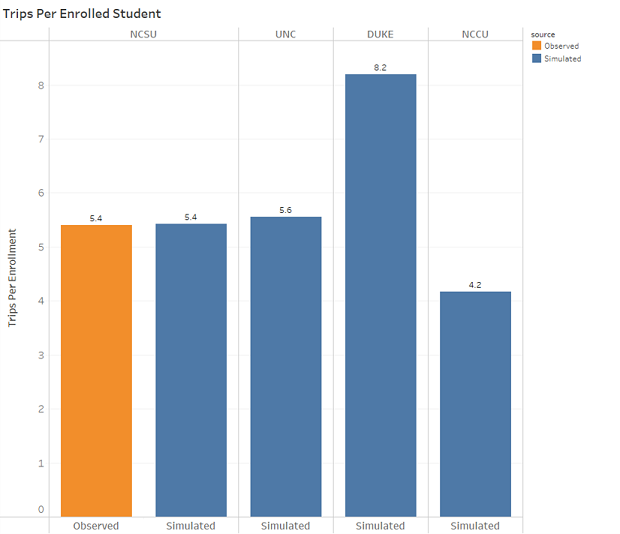
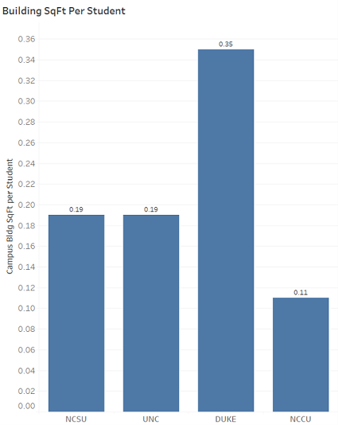
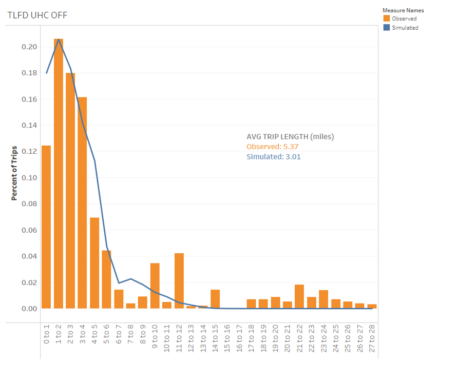
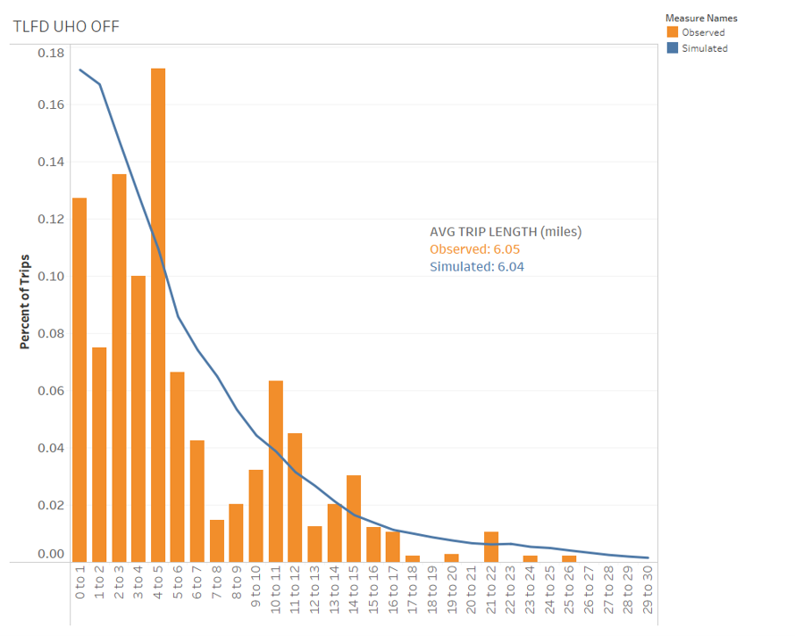
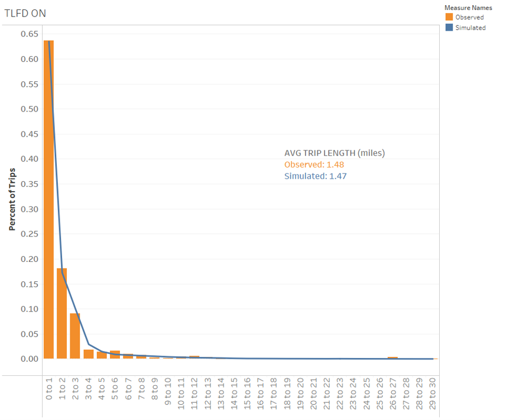
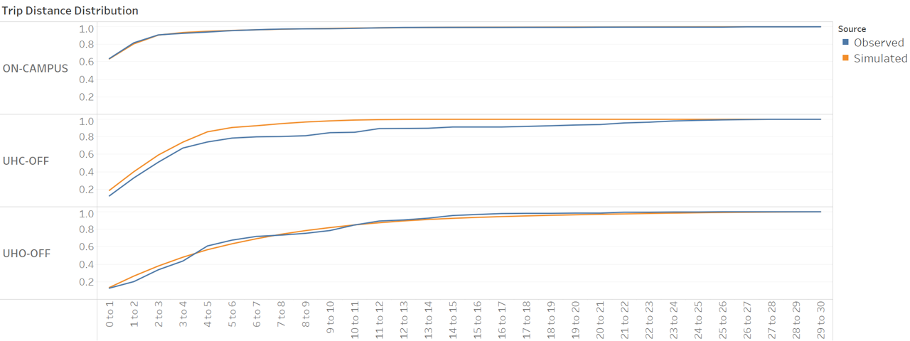
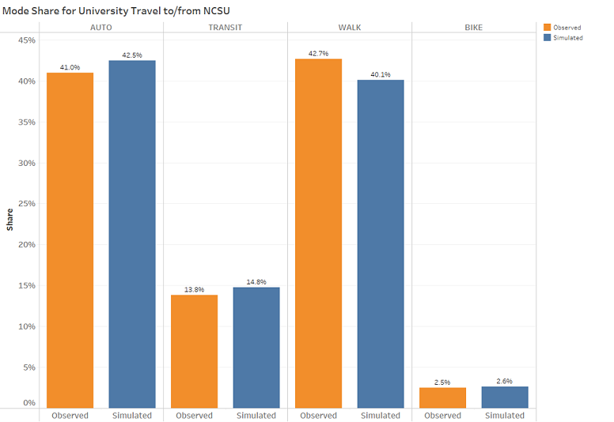
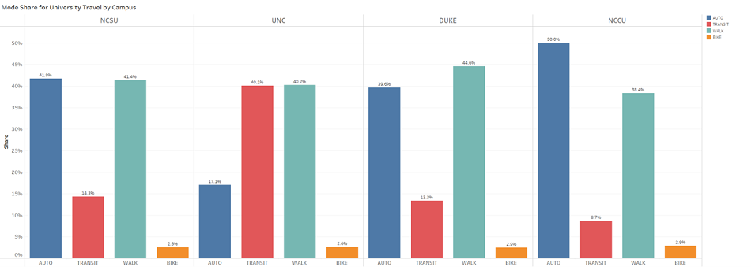

```{r setup, include=FALSE}
# renv::restore()
library(tidyverse)
source("R/university_productions.R")
source("R/university_attractions.R")
source("R/university_survey_TLD.R")
source("R/university_survey_MC.R")

knitr::opts_chunk$set(echo = FALSE)
options(dplyr.summarise.inform = FALSE)
options(scipen = 999, digits = 2)
```

## Introduction  
The development of a sub-model for University travel is important to the Triangle region given the impact that North Carolina State University (NCSU), University of North Carolina at Chapel Hill (UNC), Duke University (Duke), and North Carolina Central University (NCCU) have on the transportation system. 

The TRM University Model simulates the on- and off-campus travel of students of the Triangle Region's four large universities. It relies on socio-economic data inputs from the TAZ layer that designates the locations of the student population as well as the building locations on the various campuses to allocate the university trips. 

For student travel, the most important distinction between students is whether they live on or off campus. On-campus students are expected to make more trips, given their ability to easily travel back and forth to their dorm/apartment rooms between classes/lunch. In addition, many of those trips are expected to start and end on campus, thus likely producing shorter trip lengths. The typical student demographic is On-campus students are more likely to be undergraduate students who are enrolled at the university full-time, with more classes. Graduate students are more likely to reside off-campus and have different travel patterns than their on-campus counterparts.Therefore, the market segmentation for the university model is stratified by on-campus and off-campus students as well as by trip purpose.

For the university model, trip generation estimates the number of university trips by market segment (on-campus and off-campus students at the 4 main universities) and purpose (6 purposes, as explained later) as a function of observed/available land use characteristics. Trip distribution uses a gravity formulation with distance as the measure of impedance and a multinomial logit mode choice model is then used to segment trips by travel mode. Time of day or “diurnal” factors are used to segment trips by time and day and convert the outcomes from production-attraction to origin-destination format. The university trips are then combined with trips from other model components prior to carrying out highway and transit assignments.

The balance of this document specifies each model component, presenting empirical evidence for each specification. In cases where insufficient data is available for the statistical estimation of model coefficients, coefficients are asserted, based on evidence for other travel purposes. For these asserted models, calibration targets were developed from the available university survey data as described here to guide the adjustment of constants to match observed outcomes.

```{r enrollment,echo=FALSE}
enrollment_NCSU <- socioecon2_df %>% 
  filter(!is.na(StudGQ_NCSU),!is.na(StudOff_NCSU)) %>% 
  summarize(total=sum(StudGQ_NCSU,StudOff_NCSU)) %>% 
  pull(total)

enrollment_UNC <- socioecon2_df %>% 
  filter(!is.na(StudGQ_UNC),!is.na(StudOff_UNC)) %>% 
  summarize(total=sum(StudGQ_UNC,StudOff_UNC)) %>% 
  pull(total)

enrollment_Duke <- socioecon2_df %>% 
  filter(!is.na(StudGQ_DUKE),!is.na(StudOff_DUKE)) %>% 
  summarize(total=sum(StudGQ_DUKE,StudOff_DUKE)) %>%
  pull(total)

enrollment_NCCU <- socioecon2_df %>% 
  filter(!is.na(StudGQ_NCCU),!is.na(StudOff_NCCU)) %>% 
  summarize(total=sum(StudGQ_NCCU,StudOff_NCCU)) %>%
  pull(total)

enrollment_total <- enrollment_NCSU + enrollment_UNC + enrollment_Duke + enrollment_NCCU
```

```{r survey_overview, echo = FALSE}
Respondents_On_campus <- surveyRespondents_ResidenceClass_df %>%
  group_by(On_campus) %>%
  filter(On_campus==1) %>%
  summarize (sum=sum(n)) %>%
  pull()
Respondents_Off_campus <- surveyRespondents_ResidenceClass_df %>%
  group_by(On_campus) %>%
  filter(On_campus==0) %>%
  summarize (sum=sum(n)) %>%
  pull()
Respondents_Total <- surveyRespondents_ResidenceClass_df %>%
  summarize (sum=sum(n)) %>%
  pull()

Respondent_Off_Campus_Weighted <- SurveyRespondent_Residence_Weighted_df %>%
  filter(On_campus==0)%>%
  pull()  
Respondent_On_Campus_Weighted <- SurveyRespondent_Residence_Weighted_df %>%
  filter(On_campus==1)%>%
  pull()

Survey_Total_Trips <- Trip_subset_df %>% 
  filter(!is.na(Weight)) %>% 
  summarize(n())

Survey_Total_Weighted_Trips <- Trip_subset_df %>% 
  filter(!is.na(Weight)) %>% 
  summarize(sum(Weight))

Overall_Trip_Avg <- Survey_Total_Weighted_Trips/enrollment_NCSU
```

## University Model Sources
Although the Triangle region is home to several large universities, the data availability for university travel at each campus is limited. in 2016, these four universities had a combined enrollment of `r prettyNum(enrollment_total, big.mark = ",")`, with `r prettyNum(enrollment_NCSU, big.mark = ",")` students at NCSU; `r prettyNum(enrollment_UNC, big.mark = ",")` at UNC; `r prettyNum(enrollment_Duke, big.mark = ",")` at Duke; and `r prettyNum(enrollment_NCCU, big.mark = ",")` at NCCU.

Only NCSU had a travel survey in the region, therefore the development of the university sub-model relies solely on the 2014 survey of NCSU students conducted by ITRE on behalf of the NC Department of Transportation. Unfortunately, the NCSU survey only represented a 1% sample of student trips at NCSU.  

It is important to consider that when using the NCSU dataset to represent all travel, that the available survey records amount to a 0.4% sample of all four universities(`r Respondents_Total` cleaned samples / `r prettyNum(enrollment_total, big.mark = ",")` students), thus making it difficult to assure student patterns are accurately represented at all four locations.

However, since survey records exist for NCSU students only in the dataset, it was assumed that the travel behavior of students attending NCSU is sufficiently representative of NCCU, Duke, and UNC students.^[It is recognized that each university has a unique setting, mode choice and other differences but given data availability NCSU data had to be assumed as transferable.]

### NCSU Student Travel Survey
The raw NCSU dataset had 922 student records in the sample but many of them were incomplete records. Most of the cleanup involved removing respondents who did not finish the survey (for various reasons) and respondents with a mismatch of more than one between their stated number of trips and the number of trips for which they provided a logical description(purpose/location).

A total of `r Respondents_Total` records remained after processing, including `r Respondents_On_campus` students who reside on campus students and `r Respondents_Off_campus` students who reside off campus. This ultimately represents an approximate 1% sample of NCSU university travel.   The breakdown by graduate and undergraduate students is presented in the table below to provide additional perspectives on the dataset.


```{r survey overview2,echo=FALSE}
surveyRespondents_ResidenceClass_df %>%
  mutate(On_campus = if_else(On_campus == 0, "Off-campus", "On-campus")) %>%
  mutate(Graduate = if_else(Graduate == 0, "Undergraduate", "Graduate")) %>%
  rename(`Home Location` = On_campus, `Class Status` = Graduate, Count = n) %>%
  mutate(Share = paste0(sprintf("%2.1f", 100.0 * Count / sum(Count)), "%")) %>%
  arrange(-Count) %>%
  kable(digits = 2) %>%
  kable_styling(full_width = FALSE)
```

For the NCSU survey after cleaning, the `r Respondents_On_campus` on-campus students and `r Respondents_Off_campus` off-campus students who participated in the survey reported `r Survey_Total_Trips` trips combined.The NCSU dataset includes person weights, which were developed by ITRE based on residential locations (on-campus vs. off-campus), credit hours (full-time vs. part-time) and class status (undergraduate vs. graduate). A total of `r Respondents_On_campus` on-campus and `r Respondents_Off_campus` off-campus records were assigned a weight from the original dataset. Based on the survey, the NCSU student population made a total of `r prettyNum(Survey_Total_Weighted_Trips,big.mark =",")` trips.

###  Virginia Universities Student Travel Surveys
As summarized in Khattak et al. (2012)^[Khattak A., X. Wang, S. Son, A. Hayes, and T. Vandecar-Burdin, Comparative Analysis of Virginia University Student Travel Surveys, Final report submitted to Transportation & Mobility Planning Division, Virginia
Department of Transportation, Richmond, VA, 2012.], student travel behavior surveys were conducted at four universities in Virginia in 2009 and repeated for two of the universities in 2010. The first round of surveys obtained a sample size of 2,784. The first and second rounds of surveys obtained a sample size of 2,784 and 2,596, respectively.  These surveys represented a 5% sample size and allowed for comparison and calibration for each of the campuses in Virginia.  These surveys asked students detailed travel questions unlike the NCSU survey, therefore, only high level statistics like trip rates and trip lengths and some mode split percentages could be utilized for comparisons.

## Model Structure

Guided by the Virginia dataset and its documentation,  the NCSU dataset was reviewed for samples and trip purposes that could mimic other regions.  The desire was for the university model to understand potential differences in travel for on-campus and off-campus students so that it is better able to predict behavior for individual markets than it would be for all students combined.

Review of the remaining samples and based on typical university trip definitions the following model segmentation was determined:

The model structure segments trips into the following purposes:

* **Home-Based-Campus (Home-Campus or UHC)**: from off-campus home locations to buildings on campus or from on-campus dorms to buildings on campus
* **Home-Based-Other (Home-Other or UHO)**: from off-campus home locations to other locations not on campus or from on-campus dorms to locations not on campus
* **Campus-Based-Other (Campus-Other or UCO)**: from campus to locations off campus
* **On-Campus (On-campus or UC1)**: to and from locations on the SAME campus
* **Inter-Campus (Campus-to-Campus or UCC)**: to and from different campus locations (i.e., main to centennial or vet school)
* **University student Other-Other (Other-to-Other or UOO)**: from and to locations not associated to a campus

The structure segments the home-based trip purposes, Home-Campus and Home-Other, by on- and off-campus students. On-campus students are expected to make more trips, with many of those trips expected to start and end on campus. On-campus students are more likely to be undergraduate students who are enrolled at the university full-time. Graduate students are more likely to reside off-campus.

The first model step is [trip generation](https://tfresource.org/topics/Trip_Generation.html), which estimates the number of trips by market segment and purpose as a function of observed land use characteristics. The second model step is trip distribution, which uses a common [gravity formulation](https://tfresource.org/topics/Trip_distribution.html) with distance as the measure of impedance. A [multinomial logit mode choice model](https://tfresource.org/topics/Mode_choice.html) is then used to segment trips by travel mode. Time of day or "diurnal" factors are used to segment trips by time and day and convert the outcomes from production-attraction to origin-destination format. The university trips are then combined with trips from other model components prior to carrying out roadway and transit assignment. 

An innovative feature of the model design is the generation step for the Other-to-Other trip purpose. To maintain consistency across travel model, these trips are generated directly from the Home-based Other and Campus-based Other trip ends. The generation step is mode specific. For example, if all the Home-based Other and Campus-based Other trips select automobile, then only automobile Other-to-Other trips will be generated. 

## Trip Generation  
The first step in the model development process is to create trip production and attraction models for the six university trip purposes previously described.The trip production rates were developed based on the NCSU survey and were compared for reasonableness to the Virginia based university surveys.

### Trip Productions
The NCSU data was used to estimate production rates for each of the six purposes included in the model. Depending on the trip purpose, the production end of the trip is either home, campus or other as shown in the table below.

```{r}
production_end_df <- tibble(code = c("UHC", "UHO", "UCO", "UC1", "UCC", "UOO"),
                         name = c("Home-Campus",
                                  "Home-Other",
                                  "Campus-Other",
                                  "On-campus",
                                  "Campus-to-campus",
                                  "Other-to-other"),
                         production_end = c("Home", "Home","Campus","Campus","Origin","Origin"))

production_end_df %>%
  select(name,production_end)%>%
  rename(`Trip Purpose`=name,`Production end`=production_end)%>%
  kable(digits = 2) %>% 
  kable_styling(full_width = FALSE)
```


Figure 1 shows the average number of trips per student per day for the two home-based trip purposes for students residing on-campus and off-campus, based on the raw NCSU survey data. Figure 2 shows the average number of trips per student for the three campus-based trip purposes. For most trip purposes, the distribution is skewed to the right, with most students making few trips and a few students making many trips. Trip rates tend to be higher for on-campus trips than for other trip purposes. On-campus trips also tend to be shorter than trips made for other purposes as shown in the trip distribution section. 

```{r histogram,echo=FALSE}

Triprates_histogram1 + labs(title = "Figure 1 - Home-based trips per student, by purpose and by home location", 
                           caption = ("Source: NCSU survey (unweighted)"))
Triprates_histogram2 + labs(title = "Figure 2 - Campus-based trips per student, by purpose", 
                           caption = ("Source: NCSU survey (unweighted)"))
```


As is typical, a cross-classification technique was utilized for trip productions.The daily trips per student reported in the NCSU survey were classified by trip purpose but also stratified in the following manner:

*Home-based trips (Home-Campus, Home-Other) are segmented based on student place of residence (on-campus and off-campus).
*Other-to-Other trips are segmented by mode (walk, bicycle, transit and auto)

Production rates were developed based on the weighted and unweighted data, as a check on the influence of the weighting. We found that the rates based on the weighted data are very similar to the rates based on the unweighted data.  

The average daily trip rate, using the weighted data, is `r w_avg_trips_df[,"avg_trips"]`.  On-campus students make an average of `r w_avg_trips_byresidence_df[2,"avg_trips"]` trips per day, while off-campus students make an average of `r w_avg_trips_byresidence_df[1,"avg_trips"]` trips per day. The NCSU rates by trip purpose show that on-campus students make more on-campus trips than off-campus students but make fewer off-campus trips. Given that on campus students are close to their dorm locations, they are more likely to go back and forth to their dorm before making other trips like lunch or between classes.  Off-campus students are less likely to leave campus once they arrive and therefore make less trips , which matches expectations.

A check on reasonableness,the production rates selected for the Triangle Model were compared to the Virginia surveys are somewhat higher.  During first round of surveys at Old Dominion (ODU), Virginia Tech (VT), University of Virginia and Virginia Commonwealth, daily trip rates ranged from 4.4 to 4.9.  For the second round of surveys, the survey instruments were revised to reduce the survey response burden and a larger sample size was obtained. Based on the second round, daily trip rates were 5.3 at ODU and 5.6 at VT. These average rates from the second round of surveys seem to suggest that the NCSU surveys are reasonable.

The selected production rates for five of the six trip purposes (all except Other-to-other) are presented in the table below. For home-based trip purposes, separate rates are presented based on student home location (on- or off-campus). The production rates for home-based trips are trips per student. For campus-based trips, the production rates are per 1000 square feet of campus building space.


```{r Prates,echo=FALSE}
purpose_map_df <- tibble(code = c("UHC", "UHO", "UCO", "UC1", "UCC", "UOO"),
                         name = c("Home-Campus",
                                  "Home-Other",
                                  "Campus-Other",
                                  "On-campus",
                                  "Campus-to-campus",
                                  "Other-to-other"),
                         unit = c("Student",
                                  "Student",
                                  "Campus Building SF (in 000s)",
                                  "Campus Building SF (in 000s)",
                                  "Campus Building SF (in 000s)",
                                  ""
                                  ))

P_rates_df %>%
  left_join(., purpose_map_df, by = c("Trip_Purpose" = "code")) %>%
  mutate(segment = str_replace(segment, " Students", "")) %>%
  mutate(segment = str_replace(segment, "_", "-")) %>%
  select(`Home Location` = segment, `Trip Purpose` = name, `Production Rate`, `Unit` = unit, `Sample Size`) %>%
  kable(digits = 2) %>%
  kable_styling(full_width = FALSE)
```

Therefore, the trip production rates by mode were used to estimate productions for Other-to-other trips only. More specifically, the Other-to-other productions, as described previously, were a function of Home-based Other and Campus-to-Other attractions. Like the resident models, this approach ensures consistency between the “Other” trip ends by mode, i.e., it is not possible to have only automobile Home-Other and Campus-Other movements and only bicycle Other-to-other movements. The choice to generate trips by mode for this purpose was driven by the desire to maintain model consistency/process with the resident models.

The table below summarizes the Home-Other and Campus-Other trips by mode: (1) Auto, which includes both drive and carpool; (2) Transit; (3) Walk; and (4) Bicycle. The NCSU survey sample did not include any Other-to-other trips by bicycle. 


```{r UHOUO combined P-rates, echo=FALSE}
w_avg_trips_UHOUCO_df %>%
   mutate(purpose = 'Home-Other and Campus-Other')%>%
  select('Trip Purpose' = purpose, Mode = mode, `Trip Rate` = avg_trips) %>%
  arrange(-`Trip Rate`)%>%
  kable(digits = 2) %>%
  kable_styling(full_width = FALSE)
```

The ratios between the production rates for Other-to-other trips and the production rates for Home-Other and Campus-Other trips are `r w_cartrips_ratioUOOtoUHOUCO` for car trips and `r w_non_cartrips_ratioUOOtoUHOUCO` for non-car trips.  The small sample sizes prevent further segmentation by mode. Other-to-other trips by auto are estimated to equal `r w_cartrips_ratioUOOtoUHOUCO` times the number of Home-Other and Home-Campus auto trips.  For each of the three non-auto modes, the Other-to-other trips are estimated by multiplying the Home-Other and Home-Campus trips made with that mode by `r w_non_cartrips_ratioUOOtoUHOUCO`. The resulting Other-to-other production rates are in the table below.

```{r UOO P-rates, echo=FALSE}
UOO_rates_df %>%
  arrange(-`Trip Rate`)%>%
  kable(digits = 2) %>%
  kable_styling(full_width = FALSE)
```

A summary of the productions across universities is presented in the table below.
```{r summary productions}
Summary_Productions_df %>%
  separate(., Segments, into = c("remove", "code", "home", "remove_2", "school"), sep = "_", remove = TRUE) %>%
  mutate(`Home Location` = if_else(home == "On", "On-campus", if_else(home == "All", "On- and Off-campus", "Off-campus"))) %>%
  left_join(., purpose_map_df, by = c("code")) %>%
  select(`Home Location`, Purpose = name, University = school, Productions) %>%
  pivot_wider(., id_cols = c(`Home Location`, Purpose), names_from = University, values_from = Productions) %>%
  kable(digits = 0,format.args = list(big.mark = ",")) %>%
  kable_styling(full_width = FALSE)
```


###  Trip Attractions
As with the trip production rates, trip attraction rates for off-campus attractions (Home- Other and Campus-Other) were developed based on the survey of NCSU students. 

For on-campus attractions (Home-based Campus, Campus-to-campus), the attractions are distributed among campus zones proportional to the distribution of the square footage of university buildings. 

The analysis begins with correlations between the university attractions and land use characteristics at the TAZ level. For trip attractions by on-campus students, the  off-campus student population and the number of retail jobs have the highest correlation coefficients. For trips by off-campus students, off-campus student population has the highest correlation coefficient.  
```{r correlations,echo=FALSE}
correlations_df %>% 
  filter(str_count(term, "Students") == 0) %>%
  arrange(-AllStudents_Trips) %>%
  select(`TAZ Data Variable` = term, `Attractions` = AllStudents_Trips) %>%
  kable(digits = 3) %>%
  kable_styling(full_width = FALSE)

```

#### Regression Models
The regression models were estimated for each purpose using a dataset that includes all TAZs for which the survey included trip attractions, of any purpose.  The TAZs that do not have any trip attractions in the survey were excluded from the dataset used for model estimation.
```{r print function, echo=FALSE}
print_model <- function(model) {
  df <- tibble(variable = colnames(model$model),
               estimate = model$coefficients,
               statistic = coef(summary(model))[, "t value"],
               p.value = coef(summary(model))[, "Pr(>|t|)"]) %>%
    mutate(variable = if_else(str_count(variable, "Trips") > 0, "_intercept_", variable)) %>%
    arrange(variable) %>%
    bind_rows(., tibble(variable = c("Adjusted R-squared"),
                        estimate = summary(model)$adj.r.squared,
                        statistic = as.double(NA),
                        p.value = as.double(NA))) %>%
    kable(digits = 3) %>%
    kable_styling(full_width = FALSE)
  
  return(df)
  
}
```

The  Campus-other attraction model explains the number of trip attractions at the TAZ level based on the number of the students residing in the TAZ and the number of retail jobs in the TAZ. The coefficients have the correct expected signs. 

##### Campus-Other Trip Attractions
```{r, echo=FALSE}
print_model(Model_UCO_2)
```

As Campus-other trips by on-campus students, Home-Other trips by on-campus students are trips between the campus and off-campus location. The model explains the number of trips based on the number of off-campus students residing in the TAZ and the number of retail jobs. 

##### Home-Other Trip Attractions, On-Campus students
```{r,echo=FALSE}
print_model(Model_Oncampus_UHO_1)
```

#####  Home-Other Trip Attractions, Off-Campus students
Home-Other trips by off-campus students have two off-campus trip ends. The model explains UHO trips by off-campus students based on the off- campus student population and the number of retail jobs. 

```{r, echo=FALSE}
print_model(Model_Offcampus_UHO_2)
```
## Trip Distribution  
The second step of the University Model development process is to develop a trip distribution model.  In this step, the TAZ level productions and attractions estimated in the trip generation step are allocated to TAZ pairs. The allocation is based on a gravity model that takes into account the distance between each of the TAZ pairs. 

A distance-based gravity model is used to distribute the university trips from production zones to attraction zones. The specification of a gravity model is shown below: 

$T_{ij} = (P_i × A_j) / F_{ij} $

where T_ij denote the trips from production zone i to attraction zone j, P represents the trip productions, A represents the trip attractions, F is a measure of the separation between the production and attraction zones called a friction factor.

Following standard practice, it was assumed that the friction factors are a function of highway travel distance and that they follow a gamma distribution, as below:

F(d) = α × d^(-β) × e^(-θd)

```{r}
df <- tibble(
  Purpose = c("Home-Campus - Off-campus students","Home-Other- Off-campus students","All other"),
  a = c(5, 5, 5),
  b = c(.8, .9, 1.15),
  c = c(.1, .1, .1)
)

df  %>%
  kable(digits = 1) %>%
  kable_styling(full_width = FALSE)
```


The NCSU survey provides information about the length of existing home-based and campus-based trips by NCSU students. The trip start and end location information from the survey was mapped to the model's TAZs. The trip lengths presented in Figures 3 through 5 represent the distance between the centroids of the origin TAZ and the destination TAZ based on the highway skims.  

### Trip length distribution from the NCSU survey
Figure 3 shows that most Home-Campus trips have relatively short distance.  The figure also highlights that there are a small number of off-campus students who live further away from campus.  Figure 3 also displays for on-campus students making a home to campus trip that some trip lengths are over 10 miles, which could be an issue in geo-coding or a few students traveling to remote campuses/farms for coursework. Because of the relatively small sample, these anomalies were left in the analysis. 
```{r,echo=FALSE}
zonetozonedistance_bypurposeHB_histogram + labs(title = "Figure 3 - Trip Length Distribution, Home-based Trips", 
                                              caption = ("Source: NCSU survey (unweighted)"))
```
Figure 4 shows that campus-based trips tend to be relatively short distance as well. Figure 4 also displays that, as expected, Campus-Other trips are longer than Campus-to-campus trips. 
```{r,echo=FALSE}
zonetozonedistance_bypurposeCB_histogram + labs(title = "Figure 4 - Trip Length Distribution, Campus-based Trips", 
                                              caption = ("Source: NCSU survey (unweighted)"))
```
Figure 5 shows that many On-campus trips have both ends within the same TAZ or within TAZs that are very near to each other. As expected, the .5 to 1 mile range dominates the on-campus trip lengths.

```{r,echo=FALSE}
zonetozonedistance_UC1_histogram + labs(title = "Figure 5 - Trip Length Distribution, On-campus Trips", 
                                        caption = ("Source: NCSU survey (unweighted)"))
```


#### Average trip length from the NCSU survey by trip purpose
An overview of the trip length distribution from the NCSU survey by trip purpose is displayed in tabular format. The trip length patterns for on- and off-campus students follow logical and anticipated patterns. On average, home-based trips by off-campus students are longer than home-based trip by on-campus students, which is expected. These observed trip lengths were used to validate the trip length produced with the gravity model as discussed below in the calibration section.
```{r,echo=FALSE}

avgdistance_HB_df %>%  
  kable(digits = 2) %>%
  kable_styling(full_width = FALSE)
avgdistance_NHB_df %>% 
  kable(digits = 2) %>%
  kable_styling(full_width = FALSE)
```

## Mode Choice
The third step in the University Model development process is the mode choice model.  During the mode choice step, trips by zonal pair are distributed across available modes. A multinomial mode choice model was used to split trips between the University Model's four modes - walk, bike, transit and car based on time, cost and modal preferences.

The NCSU survey provides insight into the existing mode choice of NCSU students. Because the dataset was too limited to be used to estimate a mode choice model, time and cost coefficients were asserted. The asserted coefficients reflect typical sensitivities to time and cost for travelers with average incomes. The NCSU survey data was used to develop the calibration target for the mode choice model for all four universities. 

### Mode split from NCSU survey
Figure 6 below shows the number of trips reported by the NCSU survey respondents for five of the model's trip purposes. The modes are grouped into car, which is drive alone and carpool; bus; walk; bicycle and other. While drive alone is the most common mode, the graph shows relatively large numbers of bus trips (for Home-Campus and Campus-to-campus) and of walk trips (for Home-Campus and Campus-Other). The graph does not include same campus trips (UC1), which are mostly walk trips. 

#### Sample overview
```{r oncampus_modesplit plot, echo = FALSE}
trips_bypurpose_plot + labs(title = "Figure 6 - Mode Split by Purpose (except On-campus)", 
                                     caption = ("Source: NCSU survey (unweighted)"))
```

The tables below show the mode split for campus-based trips, home-based trips by students residing on-campus and home-based trips by students residing off-campus. The tables combine drive alone and carpool into auto. The tables show that transit is the most common mode for Campus-to-campus trips, with 74 percent of trips being made by transit. Transit is the second most common mode for Home-Campus trips by students residing off-campus, with 29 percent of transit trips and 55 percent of auto trips. Home-campus trips by students residing on-campus are most likely to be walk trips (62 percent), followed by transit trips (19 percent). On-campus trips are mostly walk trips (90 percent). There are very few trips made with modes classified as "other".

#### Campus-based trips mode split
```{r,campusbased_modesplit table, echo = FALSE}
modesplit_bypurpose_campusbasedtrips_df %>% 
  kable(digits = 2) %>%
  kable_styling(full_width = FALSE)
```

#### Home-based trips mode split, On-Campus students
```{r,oncampus_modesplit table, echo = FALSE}
modesplit_bypurpose_oncampus_2_df %>% 
  kable(digits = 2) %>%
  kable_styling(full_width = FALSE)
```

#### Home-based trips mode split, Off-Campus students
```{r,offcampus_modesplit table, echo = FALSE}
modesplit_bypurpose_offcampus_2_df %>% 
  kable(digits = 2) %>%
  kable_styling(full_width = FALSE)
```

### Mode split calibration targets

The calibration targets were developed based on the mode split from the NCSU survey summarized by the four modes of the model: walk, bicycle, transit and auto. The relatively large targets for transit for Campus-to-campus and Home-Campus trips contribute positively to the transit ridership forecast. 

#### Campus-based trips mode split calibration targets
```{r,echo=FALSE}
calibrationtargets_bypurpose_campusbasedtrips_df%>% 
  kable(digits = 2) %>%
  kable_styling(full_width = FALSE)
```
#### Home-based trips mode split calibration targets, On-Campus students
```{r,echo=FALSE}
calibrationtargets_bypurpose_oncampus_df %>% 
  kable(digits = 2) %>%
  kable_styling(full_width = FALSE)
```

#### Home-based trips mode split calibration targets, Off-Campus students
```{r,echo=FALSE}
calibrationtargets_bypurpose_offcampus_df %>% 
  kable(digits = 2) %>%
  kable_styling(full_width = FALSE)
```

### Mode choice coefficients
The mode choice coefficients were asserted because the NCSU survey dataset was not sufficient to estimate a mode choice model. The implied value of time (VOT) for walk time, bike time, transit time and drive time is $12 per hour, which is a reasonable average for students. For transit access time, the implied VOT is $18 per hour, which is also reasonable. 
```{r} 
G_IVTT_Coeff <-  -0.04
G_OVTT_Coeff <- G_IVTT_Coeff * 1.5
G_Cost_Coeff <-  -0.2  

tibble(Coefficient =c("IVTT","OVTT","Cost"),Value = c(G_IVTT_Coeff,G_OVTT_Coeff,G_Cost_Coeff))%>% 
  kable(digits = 2) %>%
  kable_styling(full_width = FALSE)
```

## Calibration
Calibration of the University Model is solely dependent upon the small sample size from the NCSU survey, as well as logic check reviews from local knowledge. This calibration section compares different summaries of the University Model outputs to the observed data from the NCSU survey.

### Trip Generation
Trip generation results compared with the survey are within acceptable parameters as shown by the model's trips per enrollment results. As expected, the NCSU results match the survey data and UNC's trip rate is similar to NCSU's. Given the similarities of campus structure for UNC and NCSU, this is logical. Duke and NCCU display differences in trips per enrollment from the NCSU survey.

The trips per enrollment for each university are displayed in the figure below.




As noted, the model shows a higher rate (trips per student) for Duke than for NCSU. This is because for some of the university trip purposes, the trip production model is a function of campus building square feet in the TAZ. The average campus building square feet per student at Duke is higher than at NCSU (see below), resulting in the higher overall trip rate per student. Conversely, NCCU has a lower average campus building square feet per student than NCSU, resulting in a lower overall trip rate per student.




### Trip Distribution
Simulated vs observed data shows similar patterns for NCSU as shown below. The other universities display a similar pattern.  

#### Average Trip Length
The average trip length compares extremely well for simulated versus observed data for NCSU except for the home-campus trips for off-campus students. The home to campus for off-campus simulated average trip length doesn’t match well when compared with the observed data because of the unique estimation of the definition of off-campus housing that restricts it to address points within 10 miles. ([source](https://caliper-corporation.github.io/TRMG2/tazs_and_se_data.html#Student_housing_(off-campus))).








The figure below compares the distance distribution for different types of university trips:



### Mode Choice

The final simulated mode split for NCSU trips closely matches the observed mode split as shown below. 



A comparison of mode share for university trips follows logical patterns. Note that the mode shares for UNC were adjusted to reduce auto and increase non-motorized and transit  because UNC doesn’t allow parking on campus for students and therefore students have to walk or take transit. UNC transit is also one of the highest in the state per capita. 



Our model was adjusted to match as close as possible the observed mode share from a UNC survey that was performed internally by UNC. Data for this source is not available for use but the chart available online was used to adjust the UNC model. ([source](https://move.unc.edu/about/publications/commuter-survey/survey-results/)): 


The UNC specific adjustment was done by adding a negative utility for auto mode and positive utility for transit mode for university trips that are destined to UNC zones. UNC zones are those with either  campus buildings/facilities (SE data field BuildingS_UNC>0) or on-campus students (SE data field StudGQ_UNC>0) . The map below shows the identified zones for UNC mode share adjustment.


## Validation

Comparing the model volumes to traffic counts revealed over-assignments around
all university campuses. As a result, the trip production rates were reduced by
10%.

```{r, eval=FALSE}
write_csv(tod_factors, "../master/university/university_tod.csv")
```