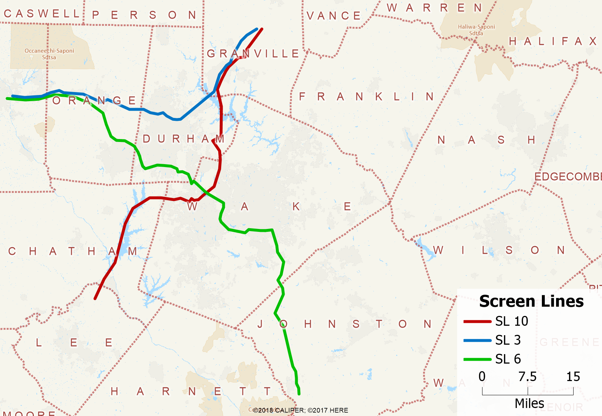

```{r setup, include=FALSE}
knitr::opts_chunk$set(echo = FALSE)
options(dplyr.summarise.inform = FALSE)
options(scipen = 999)

library(tidyverse)
library(knitr)
library(kableExtra)
```

## Intro

This document presents various model validation statistics. These compare
model results with observed data not used in estimation including counts of both
roadway volumes and transit ridership. While sensitivity testing focuses on the
model's response to changes in inputs, validation measures the ability of an
appropriately-sensitive model to accurately predict known conditions in the base
year.

## Roadway

```{r, include=FALSE}
factype <- read_csv("data/input/validation/count_comparison_by_fac_type.csv")
ftat <- read_csv("data/input/validation/count_comparison_by_ft_and_at.csv")
volgroup <- read_csv("data/input/validation/count_comparison_by_vol_group.csv")
cutline <- read_csv("data/input/validation/count_comparison_by_cutline.csv")
screenline <- read_csv("data/input/validation/count_comparison_by_screenline.csv")
```

The primary outputs of a travel demand model are roadway volume predictions. To help establish model validity, a prediction is made on a base year scenario for which traffic count data are collected. Tube counts and other methods for collecting roadway volumes have well-established error rates, so matching counts exactly is not the goal. Instead, target error thresholds have evolved over time for metrics like percentage difference and percentage root-mean-square-error (RMSE) between counts and volumes. 

Importantly, target error rates fall as roadway volumes increase. Count error rates are lower for larger facilities, but additionally, regional travel models are best suited to measure flows on large facilities. Consequently, they are expected to perform best on large freeways and worst on local streets. As a point of fact, regional travel models should not be used to predict local street volumes).

The table below contains two measures of error:

1.	Percent Difference
2.	Percent Root-Mean-Square-Error

Percent difference is a straight-forward measure:

$PctDiff = \frac{(\sum \hat{Y}_i - \sum Y_i)}{\sum Y_i} * 100$

where:

$\hat{Y_i}$ Estimated volume on link i (model)  
$Y_i$ Observed volume on link i (traffic count)

%RMSE is calculated as follows:

$PRMSE = \frac{\sqrt{\frac{1}{N}\sum_{i=1}^N(\hat{Y_i}-Y_i)^2}}{\frac{1}{N}\sum_{i=1}^NY_i} * 100$

The errors on each link between the model and traffic count are

- Squared
- Then averaged (mean)
- Then the root is taken

This provides the RMSE, which is then divided by the average (mean) of all
counts. The table below shows these two metrics by volume group and for the
model overall. Different models have a different mix of counts by volume group.
For example, model regions with limited counts will have a higher percentage of
counts on high-volume roads like freeways. The Triangle boasts excellent count
coverage, which means many more observations on smaller streets are collected.
These differences are one of many reasons why overall model %RMSE can’t be used
as a single measure of model quality. %RMSE by volume group is better, but still
contains no information about model sensitivity.

With these caveats in place, the table below shows that the TRMG2 model is
matching observed counts well. The overall % RMSE of 34.6 is particularly
impressive given the large percentage of counts are less than or equal to
10,000 in volume.

```{r, warning=FALSE}
volgroup %>%
  mutate(
    TotalVolume = round(TotalVolume, 0),
    PctDiff = round(PctDiff, 1),
    PRMSE = round(PRMSE, 1)
  ) %>%
  rename(
    `Volume Group` = VolumeGroup,
    `Total Count` = TotalCount,
    `Total Volume` = TotalVolume,
    `% Difference` = PctDiff,
    `% RMSE` = PRMSE
  ) %>%
  kable(
    format.args = c("big.mark" = ","),
  ) %>%
  kable_styling(full_width = FALSE)
```

In addition to evaluation by volume group, the model is also evaluated by
facility type. All links with the same facility type share important
characteristics like volume-delay function (VDF) parameters, free-flow speed
adjustments, and other attributes. Problems in this table would indicate the
model’s facility type parameters (like VDF coefficients) may be biased.

```{r, warning=FALSE}
factypes <- c(
  "Freeway", "MLHighway", "TLHighway", "MajorArterial", "Arterial",
  "MajorCollector", "Collector", "Local", "All"
)

factype %>%
  mutate(
    HCMType = factor(HCMType, levels = factypes, ordered = TRUE),
    TotalVolume = round(TotalVolume, 0),
    PctDiff = round(PctDiff, 1),
    PRMSE = round(PRMSE, 1)
  ) %>%
  arrange(HCMType) %>%
  rename(
    `Total Count` = TotalCount,
    `Total Volume` = TotalVolume,
    `% Difference` = PctDiff,
    `% RMSE` = PRMSE
  ) %>%
  kable(
    format.args = c("big.mark" = ","),
  ) %>%
  kable_styling(full_width = FALSE)
```

The following table shows the same statistics by facility type and area type. It
is shown for completeness, but many of the combinations have few observations.

```{r, warning=FALSE}
area_types <- c("Downtown", "Urban", "Suburban", "Rural")

ftat %>%
  mutate(
    HCMType = factor(HCMType, levels = factypes, ordered = TRUE),
    AreaType = factor(AreaType, levels = area_types, ordered = TRUE),
    TotalVolume = round(TotalVolume, 0),
    PctDiff = round(PctDiff, 1),
    PRMSE = round(PRMSE, 1)
  ) %>%
  arrange(HCMType, AreaType) %>%
  rename(
    `Total Count` = TotalCount,
    `Total Volume` = TotalVolume,
    `% Difference` = PctDiff,
    `% RMSE` = PRMSE
  ) %>%
  kable(
    format.args = c("big.mark" = ","),
  ) %>%
  kable_styling(full_width = FALSE)
```

Another important check for the model is that aggregate regional flows are
correct. These are checked using screen and cut lines, which aggregate counts
based on geography. The map below shows the geographic locations of the screen
lines used for TRMG2 validation. The odd shape of the lines is to ensure that,
to the extent possible, the lines only cross links with counts on them. In this
way, we can capture all flow across the line and compare it with matching count
info.

```{r, fig.align='center', out.width="90%"}

```

The table below shows the comparison between model volumes and counts.

```{r, warning=FALSE}
screenline %>%
  filter(screenline != 4) %>%
  mutate(
    TotalVolume = round(TotalVolume, 0),
    PctDiff = round(PctDiff, 1),
    PRMSE = round(PRMSE, 1)
  ) %>%
  rename(
    `Total Count` = TotalCount,
    `Total Volume` = TotalVolume,
    `% Difference` = PctDiff,
    `% RMSE` = PRMSE
  ) %>%
  kable(
    format.args = c("big.mark" = ","),
  ) %>%
  kable_styling(full_width = FALSE)
```

Screen line 3 is lower than desired, but given the relatively low total volume
(for a screen line), it is still acceptable.

The map below shows the cut lines used to validate TRMG2.

```{r, fig.align='center', out.width="90%"}
knitr::include_graphics("img/validation/cutlines.png")
```

The table shows count validation aggregated by cut line. Only cut line 18
shows any cause for concern. This is the cutline between Orange and Alamance
counties. The model only contains a small piece of Alamance county and instead
relies heavily on the external models for flow in this region. It is possible
that improved external flow data could improve model performance in this area,
but to truly get it right, the model would need to be expanded westward.
(Caliper is not recommending this action.)

```{r, warning=FALSE}
cutline %>%
  mutate(
    TotalVolume = round(TotalVolume, 0),
    PctDiff = round(PctDiff, 1),
    PRMSE = round(PRMSE, 1)
  ) %>%
  rename(
    `Total Count` = TotalCount,
    `Total Volume` = TotalVolume,
    `% Difference` = PctDiff,
    `% RMSE` = PRMSE
  ) %>%
  kable(
    format.args = c("big.mark" = ","),
  ) %>%
  kable_styling(full_width = FALSE)
```

## Transit

Observed transit boarding data was incomplete for 2020. Instead, Caliper
validated the transit ridership using the 2016 scenario and observed data.
This is shown in the table below by agency. (DATA)

```{r, include=FALSE}
transit <- read_csv("data/input/validation/transit.csv")
```

```{r, warning=FALSE}
transit %>%
  kable(format.args = c("big.mark" = ",")) %>%
  kable_styling(full_width = FALSE)
```

Overall, ridership is close to observed and the model performs well by agency.

For reference, the model predicts 119,000 riders in the 2020 base year scenario.
Compared to 2016, the 2020 scenario has a higher population and increased
slightly better transit service, which makes the 119,000 estimate reasonable.